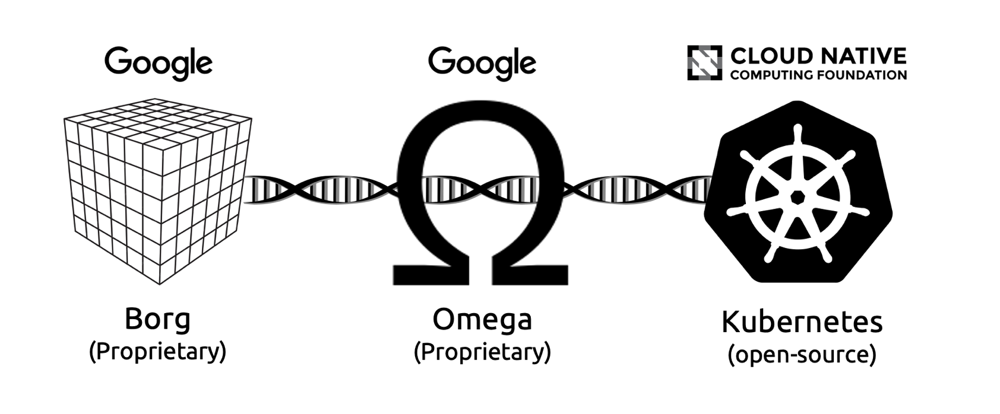

# مقدمة عن Kubernetes

هذا الفصل سيساعدك على فهم الأساسيات والخلفية المتعلقة بـ Kubernetes وينقسم إلى ما يلي:

- Important Kubernetes background 
- Kubernetes: the Operating System of the cloud-

## Important Kubernetes background

Kubernetes هو منظم (orchestrator) لتطبيقات الميكروسيرفيس (microservices) السحابية المعتمدة على continers (containerized). هذا مصطلح مزدحم، لذا دعنا نشرح الأمور.

### (Orchestration)

المنظم (orchestrator) هو نظام أو منصة تقوم بعمل deploy للتطبيقات والاستجابة ديناميكيًا للتغيرات. على سبيل المثال، يمكن لـ Kubernetes:

1. • Deploy applications

2. • Scale them up and down based on demand

3. • Self-heal them when things break

4. • Perform zero-downtime rolling updates and rollbacks

5. • والكثير من ذلك 

   أفضل جزء هو أنه يقوم بكل هذا دون الحاجة لتدخل منك. تحتاج إلى  configure بعض الأمور في البداية، ولكن بمجرد القيام بذلك، يمكنك الاسترخاء وترك Kubernetes يعمل سحره.

## continers (Containerization)

continers  بشكل مختصر هي عبارة عن عملية packaging  او تغليف للــ application  اذا كان web server على سبيل المثال او database  مع الـ application  يكون هناك كل dependencies  اللازمة لتشغيل الــ application  من ضمنها kernal  الخاص بالــ os  وتحويل كل هذا الى docker image بهدف تشغيله كا container 
يمكنك اعتبار اذا كنت جديد في عالم الــ container  ان  الــ container  جيل جديد من VM  كلاهما يُعتبر طرق packaging  وتشغيل الـ applications  ولكن container  لديه عدة مزايا

- **أصغر حجمًا**: تميل continers إلى أن يكون لها حجم أصغر من الآلات الافتراضية.
- **أسرع**: يمكن أن تبدأ continers أسرع بكثير من الآلات الافتراضية التقليدية.
- **أكثر قابلية للنقل**: يمكن تشغيل continers بسهولة على أي بيئة تدعم continers، بغض النظر عن البنية التحتية الأساسية.

على الرغم من هذه المزايا، إلا أن continers لم تحل محل VMs، ومن الشائع أن تعمل جنبًا إلى جنب في معظم cloud-native environments . ومع ذلك، غالبًا ما تكون continers هي الخيار الأول لمعظم التطبيقات الجديدة.

> [!TIP]
>
> التطبيقات cloud native تستفيد بخصائص cloud مثل auto scalling، وself healing، والتحديثات التلقائية، والتراجع (عن التحديثات) والمزيد.  
> تشغيل تطبيق عادي في  cloud لا يجعله تطبيقًا cloud native 

## Cloud vs. Cloud Native:

### الحوسبة السحابية (Cloud Computing)
الحوسبة السحابية ليست مجرد وسيلة لتوفير الموارد عبر الإنترنت، بل هي تحول جذري في كيفية استخدام التكنولوجيا. إليك بعض النقاط الإضافية:

1. **التوفير في التكاليف**: بدلاً من الاستثمار في أجهزة وخوادم باهظة الثمن، يمكن للشركات استخدام الموارد السحابية ودفع تكاليفها بناءً على الاستخدام الفعلي.
2. **المرونة والسرعة**: يمكن للشركات زيادة أو تقليل الموارد بسرعة بناءً على احتياجاتها، مما يتيح لها الاستجابة بسرعة للتغيرات في السوق.
3. **الأمان**: توفر مزودي الخدمات السحابية مستويات عالية من الأمان، بما في ذلك التشفير وإدارة الهوية والوصول، مما يساعد في حماية البيانات الحساسة.
4. **التعاون**: يمكن للفرق العمل معًا بسهولة أكبر باستخدام أدوات التعاون السحابية، مما يعزز الإنتاجية والكفاءة.

### الحوسبة cloud native (Cloud Native)
الحوسبة cloud native تتجاوز مجرد استخدام السحابة؛ إنها تتعلق بتصميم التطبيقات بطريقة تستفيد بالكامل من بيئة السحابة. إليك بعض التفاصيل الإضافية:

1. **continers (Containers)**: continers تتيح تشغيل التطبيقات بشكل متسق عبر بيئات مختلفة، مما يسهل عملية التطوير والنشر. Docker هو مثال شائع على تقنية continers.
2. **الخدمات المصغرة (Microservices)**: بدلاً من بناء تطبيق واحد كبير، يتم تقسيم التطبيق إلى خدمات صغيرة ومستقلة. هذا يسمح بتطوير ونشر كل خدمة بشكل مستقل، مما يزيد من المرونة ويقلل من وقت التعطل.
3. **البنية التحتية كرمز (Infrastructure as Code)**: باستخدام أدوات مثل Terraform وAnsible، يمكن للمطورين إدارة البنية التحتية بنفس الطريقة التي يديرون بها الكود البرمجي، مما يسهل التكرار والتوسع.
4. **التنظيم الآلي (Orchestration)**: Kubernetes هو مثال على أداة تنظيم آلي تُستخدم لإدارة continers وتنسيقها، مما يضمن تشغيل التطبيقات بشكل سلس وموثوق.

### لماذا سميت "Cloud Native"؟
التسمية "Cloud Native" تعكس الفكرة أن هذه التطبيقات "مولودة" في السحابة وتستفيد من جميع ميزاتها. التطبيقات cloud native مصممة لتكون:

1. **مرنة**: يمكن تعديلها بسرعة لتلبية احتياجات العمل المتغيرة.
2. **قابلة للتوسع**: يمكن توسيعها بسهولة لتلبية زيادة الطلب.
3. **متاحة دائمًا**: مصممة لتكون متاحة حتى في حالة فشل بعض المكونات.
4. **كفؤة**: تستخدم الموارد بشكل فعال لتقليل التكاليف التشغيلية.

### أمثلة على الحوسبة cloud native
1. **Netflix**: تستخدم بنية الخدمات المصغرة وcontiners لتقديم محتوى الفيديو لملايين المستخدمين حول العالم.
2. **Uber**: تعتمد على الحوسبة cloud native لتقديم خدمات النقل والتوصيل بشكل موثوق وسريع.
3. **Spotify**: تستخدم الحوسبة cloud native لتقديم خدمة بث الموسيقى لملايين المستخدمين مع الحفاظ على الأداء العالي.

التطبيقات المبنية على **Microservices** تتكون من العديد من الأجزاء الصغيرة، المتخصصة، والمستقلة التي تعمل معًا لتشكيل تطبيق مفيد.

فكر في تطبيق للتجارة الإلكترونية يحتوي على الميزات الست التالية:
Web front-end
Catalog
Shopping cart
Authentication
Logging
Store

لجعل هذا التطبيق يعتمد على **Microservices**، , you design, develop, deploy, and manage each feature  كأنها تطبيق صغير خاص بها. نطلق على كل من هذه التطبيقات الصغيرة اسم **microservice**، مما يعني أن هذا التطبيق سيحتوي على ستة **microservices**.

هذا التصميم يوفر مرونة كبيرة من خلال السماح لكل **microservice** بأن يكون له فريق تطوير صغير خاص به release cycles  مستقلة. كما يتيح لك توسيع وتحديث كل واحدة منها بشكل مستقل.

النمط الأكثر شيوعًا هو نشر كل **microservice** في حاويته (container) الخاصة. وهذا يعني وجود حاويات front-end  ، وحاويات catalog ، وحاويات shopping cart ، وما إلى ذلك. Scaling أي جزء من التطبيق يتم ببساطة عن طريق إضافة أو إزالة containers.

جملة “Kubernetes is an orchestrator of containerized cloud-native
microservices apps.” نحن نعلم ان Kubernetes يقوم بعمل deploy و manage للـapps التى يتم وضعها قى container وانه يكون قادر على عمل easily sacle و ايضا self-heal
و ايضا update 

يجب أن يكون هذا قد وضح بعض المصطلحات الشائعة في الصناعة. ولكن لا تقلق إذا كان لا يزال هناك بعض الأمور التي تحتاج إلى مزيد من التوضيح؛ سنغطي كل شيء مرة أخرى بمزيد من التفصيل خلال الكتاب.

## Where did Kubernetes come from

تم تطوير نظام Kubernetes من قبل مهندسين جوجل كاستجابة للتنافس مع خدمات amazon و docker حيث كانوا يسعون لتطوير حل يمكن ان يسحن ادارة container فى  cloud envirnments

غيرت AWS العالم عندما اخترعت cloud computing الحديثة، وكان على الجميع مواكبة التطور.

كانت Google إحدى الشركات التي تلحق بالركب. لقد قاموا ببناء سحابة خاصة بهم ولكنهم كانوا بحاجة إلى طريقة للاستفادة من قيمة AWS وتسهيل انتقال العملاء من AWS إلى سحابتهم قدر الإمكان. كما أنهم كانوا يشغلون تطبيقات الإنتاج، مثل البحث وGmail، على مليارات continers أسبوعياً.

وفي الوقت نفسه، كانت Docker تجتاح العالم في الوقت نفسه، وكان المستخدمون بحاجة إلى المساعدة في إدارة النمو الهائل containers.

بينما كان كل هذا يحدث، استفاد مجموعة من مهندسي Google من الدروس التي تعلموها باستخدام أدوات إدارة containers الداخلية الخاصة بهم وأنشأوا أداة جديدة تسمى Kubernetes.

وفي عام 2014، أطلقوا Kubernetes وتبرعوا بها Cloud Native Computing Foundation (CNCF) التي تم تشكيلها حديثًا1.

في وقت كتابة هذا النص، بلغ عمر Kubernetes 10 سنوات وشهد نموًا واعتمادًا هائلين. ومع ذلك، في جوهره، لا يزال يقوم بالوظيفتين الأساسيتين اللتين صممتهما Google من أجلهما.
إليك شرحًا مفصلًا للنقطتين:

### 1. **تجريد البنية التحتية (مثل AWS)**:
   - Kubernetes يقوم بإخفاء التفاصيل المعقدة للبنية التحتية التي تعمل عليها التطبيقات. على سبيل المثال، إذا كنت تستخدم AWS أو أي مزود آخر للخدمات السحابية، فإن Kubernetes يساعدك على إدارة التطبيقات دون الحاجة إلى القلق بشأن التفاصيل الدقيقة مثل كيفية إدارة الخوادم، التخزين، أو الشبكات. Kubernetes يقوم بتوحيد وإخفاء هذه الطبقات السفلية، مما يجعل البنية التحتية تبدو وكأنها طبقة واحدة سهلة التعامل معها، بغض النظر عن مكان تشغيل التطبيق.

### 2. **تسهيل نقل التطبيقات بين السحابات**:
   - واحدة من أكبر مزايا Kubernetes هي قدرته على تسهيل نقل التطبيقات من بيئة سحابية إلى أخرى. إذا كنت تدير تطبيقًا على AWS وتريد نقله إلى Google Cloud أو أي منصة أخرى، فإن Kubernetes يجعل هذه العملية أكثر سلاسة. لأنه يوفر منصة موحدة لإدارة التطبيقات بغض النظر عن السحابة التي تعمل عليها. هذا يعني أن الشركات يمكنها توزيع تطبيقاتها على سحابات مختلفة أو تغيير المزود السحابي دون الحاجة إلى تغييرات كبيرة في بنية التطبيق.

## Kubernetes وDocker

كانت جميع الإصدارات الأولى من Kubernetes تأتي مع Docker وتستخدمه كبيئة التشغيل. وهذا يعني أن Kubernetes استخدم Docker للمهام منخفضة المستوى مثل إنشاء وبدء وإيقاف containers. ومع ذلك، حدثت أمران:

1. **تضخم Docker**: 
   - مع مرور الوقت، أصبحت Docker أكثر تعقيدًا وثقلاً، مما أدى إلى زيادة حجمها وصعوبة استخدامها. هذا التضخم جعل بعض المستخدمين يبحثون عن بدائل أكثر خفة وسرعة.

2. **ظهور العديد من البدائل لـ Docker**: 
   - نتيجةً لتضخم Docker، بدأ العديد من المطورين بإنشاء بدائل أخرى تتنافس معها. هذه البدائل قد توفر ميزات أو أداء أفضل في بعض الحالات، مما أدى إلى تنوع أكبر في خيارات تشغيل containers.
   بسبب هذين العاملين، تطورت Kubernetes لتصبح أكثر مرونة، حيث يمكنها العمل مع عدة بيئات تشغيل للحاويات وليس فقط Docker، مما يمنح المطورين خيارات أكبر في كيفية إدارة وتشغيل التطبيقات.

نتيجةً للتحديات المرتبطة بتعقيد Docker وظهور بدائل أخرى، قام مشروع Kubernetes بإنشاء Container Runtime Interface (CRI) لتسهيل عملية تشغيل containers من بيئات مختلفه سواء من docker او غيره . :

1. **ما هي واجهة تشغيل containers (CRI)؟**
- **تعريف**: CRI هي واجهة تسمح لـ Kubernetes بالتفاعل مع بيئات تشغيل containers المختلفة. 
- **وظيفتها**: تُمكّن CRI Kubernetes من إدارة containers بدون الارتباط ببيئة تشغيل معينة مثل Docker. يمكن استخدامها مع أي بيئة تشغيل تتوافق مع هذه الواجهة.

1. **المرونة في اختيار بيئات التشغيل**:
- **اختيار بيئة التشغيل المناسبة**: بفضل CRI، يمكن لمطوري التطبيقات اختيار أفضل بيئة تشغيل تلبي احتياجاتهم. 
- **مثال**: 
  - بعض بيئات التشغيل قد تكون مصممة لتوفير مستوى عالٍ من العزل، مما يعني أنها تفصل بين containers بشكل أفضل، مما يزيد من الأمان.
  - بينما قد تقدم بيئات تشغيل أخرى أداءً أفضل، مما يعني أنها قد تكون أسرع في تشغيل التطبيقات، ولكن قد يكون هناك تنازلات في مجال الأمان أو العزل.

1. **فوائد CRI**:
- **تحسين الأداء**: يمكن اختيار بيئات التشغيل التي توفر أداءً أفضل حسب احتياجات التطبيق، مما يؤدي إلى تحسين الأداء العام للنظام.
- **التوافق مع معايير Open Container Initiative (OCI)**: تضمن CRI أن جميع بيئات التشغيل المتوافقة معها تدعم المعايير المحددة، مما يسهل نقل containers والتطبيقات بين البيئات المختلفة.

1. **النتيجة النهائية**:
بفضل CRI، أصبح بإمكان Kubernetes أن يكون أكثر مرونة وقوة في إدارة containers، مما يسمح بتطبيقات متنوعة ومتعددة تعتمد على أفضل بيئات التشغيل التي تناسب احتياجاتها. 

هذه المرونة في الاختيار تعزز من إمكانية تحسين التطبيقات وتوافقها مع احتياجات الأعمال المتغيرة، مما يساهم في تحقيق كفاءة أكبر في بيئات العمل السحابية.

في الإصدار 1.24 من Kubernetes، تمت إزالة دعم Docker كبيئة تشغيل أخيرًا لأنه كان مفرطًا ومعقدًا لما تحتاجه Kubernetes. ومنذ ذلك الحين، تأتي معظم مجموعات Kubernetes الجديدة مع containerd (الذي يُنطق "container dee") كبيئة التشغيل الافتراضية. لحسن الحظ، فإن containerd هو إصدار مخفف من Docker تم تحسينه ليتناسب مع Kubernetes، ويدعم بالكامل التطبيقات التي تم تعبئتها باستخدام Docker. في الواقع، يعمل Docker وcontainerd وKubernetes جميعها مع images وcontainers التي تتوافق مع معايير مبادرة containers المفتوحة (OCI). `Open Container Initiative`

لا حظ ان كل node تحتوي على container runtime خاص بها تُعتبر الإعدادات مثل هذه مدعومة بالكامل وأصبحت شائعة بشكل متزايد.

container runtime هو النظام المسؤل عن ادارة حياة ال containers من ايقاف الى تشغيل الى تنفيذ وما الى ذلك ,عندما تقوم بنشر تطبيق WebAssembly (Wasm) على Kubernetes.

## what about docker swarm 

ماذا عن Docker Swarm؟ في عامي 2016 و2017، تنافست Docker Swarm وMesosphere DCOS وKubernetes لتصبح standard container orchestrator للحاوية. لكن Kubernetes انتصرت. ومع ذلك، لا يزال Docker Swarm تحت التطوير النشط ويظل شائعًا بين الشركات الصغيرة التي ترغب في الحصول على بديل بسيط لـ Kubernetes.

## **Kubernetes وBorg: المقاومة بلا جدوى!**
لقد ذكرنا سابقًا أن Google تدير الحاويات على نطاق واسع منذ فترة طويلة. حسناً، أدوات التشغيل التي كانت تدير هذه المليارات من الحاويات كانت تُسمى **Borg** و**Omega**. لذلك، من السهل أن نرى العلاقة مع **Kubernetes** — حيث إن جميعها تدير الحاويات على نطاق واسع، وجميعها مرتبطة بـ Google.

لا يمكن اعتبار kubernetes  نسخة مفتوحة المصدر من omega او brog  ولكن kubernaete صحيح ان هناك تشابه فى بعض الاساليب الموجودة داخل الاثنين نظرا لان kubernetes بني باستخدام الخبرة المكتسبة من كلا الاداتين وكما يقول الكتاب هم اقارب بينهم DNA بطريقة ساخرة 

كوبيرنيتس هو مشروع مفتوح المصدر مملوك لمؤسسة Cloud Native Computing Foundation (CNCF). يتم ترخيصه بموجب ترخيص أباتشي 2.0، وتم إصدار النسخة 1.0 في يوليو 2015. وفي وقت كتابة هذه السطور، نحن بالفعل في النسخة 1.29 بمعدل ثلاث إصدارات جديدة في السنة.

## Kubernetes — what’s in the name

معظم الناس ينطقون كلمة **Kubernetes** كـ "koo-ber-net-eez"، لكن المجتمع ودود للغاية  (في موسم حصاد المشمش )، ولن يهتم الناس إذا نطقتها بشكل مختلف. تأتي كلمة **Kubernetes** من الكلمة اليونانية التي تعني "helmsman" أو الشخص الذي يوجه السفينة. يمكنك رؤية هذا في الشعار، الذي يظهر عجلة السفينة.

بعض المهندسين المؤسسين أرادوا تسمية **Kubernetes** بـ "Seven of Nine" نسبةً إلى الطائرة الشهيرة من سلسلة التلفزيون 
**Star Trek Voyager**. لكن قوانين حقوق الطبع والنشر لم تسمح بذلك، لذا أضافوا سبع  مساند يد  في الشعار كمرجع غير مباشر لـ "Seven of Nine".
هناك شيء أخير يتعلق بالاسم. ستجد غالبًا أن الاسم يُختصر إلى **K8s** وينطق كـ "كيتس". الرقم 8 يستبدل بالثمانية أحرف بين حرف "K" و "s".

## Kubernetes: the operating system of the cloud
**Kubernetes** هو المنصة الافتراضية لتطبيقات cloud native، وغالبًا ما يُشار إليه كـ "نظام التشغيل (OS) للسحابة". السبب وراء ذلك هو أن **Kubernetes**  يمحو  الفروقات بين منصات السحابة مثل (azure , aws,.. ) ويقدم وجه تقوم من خلالها بأدارت دورة حياة container و بنفس الطريقة التي تقوم بها أنظمة التشغيل مثل **Linux** و**Windows** في تجريد الفروقات بين الخوادم بحيث انه توزع الموارد على العمليات .
- **Linux** و**Windows** يجردان موارد الخادم ويجدولان عمليات التطبيقات.
- **Kubernetes** يجرد cloud resources  ويجدول التطبيقات(microservices).

كمثال سريع، يمكنك جدولة التطبيقات على **Kubernetes** دون الحاجة للقلق بشأن ما إذا كانت تعمل على **AWS** أو **Azure** أو **Civo Cloud** أو **GCP** أو في مركز البيانات الخاص بك. وهذا يجعل **Kubernetes** عنصرًا أساسيًا ل:
- Hybrid cloud
    هي نموذج سحابي يجمع بين السحابة العامة والسحابة الخاصة. يتيح هذا النموذج للمؤسسات الاستفادة من مزايا كلا النوعين
- Multi-cloud
    شير إلى استخدام خدمات سحابية من مزودين مختلفين (مثل AWS وAzure وGoogle Cloud) في نفس الوقت
- Cloud migrations
    ترحيل السحابة هو عملية نقل البيانات، التطبيقات، والخدمات من  on-premises environment إلى بيئة سحابية أو بين السحابات المختلفة.
    Types of Migration:
    Data-only Migration: نقل البيانات إلى السحابة مع الاحتفاظ بالتطبيقات المحلية.
    Application Migration: نقل التطبيقات والبيانات إلى السحابة.
    Full Migration: كل شئ, بما فيهم  applications, data, and infrastructure.

## Application scheduling

إحدى المهام الرئيسية التي يقوم بها نظام التشغيل هي تبسيط جدولة عمل tasks. 
تعتبر أجهزة الكمبيوتر مجموعات معقدة من الموارد المادية مثل وحدة المعالجة المركزية (CPU)، والذاكرة، والتخزين، والشبكات. ولحسن الحظ، تخفي أنظمة التشغيل الحديثة معظم هذه التعقيدات وتجعل عالم تطوير التطبيقات مكانًا أكثر ودية. على سبيل المثال، كم عدد المطورين الذين يحتاجون إلى القلق بشأن أي نواة CPU، أو شريحة ذاكرة (DIMM)، أو رقاقة فلاش يستخدمها كودهم؟ في معظم الأوقات، نترك الأمر لنظام التشغيل

يقوم Kubernetes بعمل مشابه مع السحب ومراكز البيانات.

من مستوى عالٍ، تعتبر السحابة أو مركز البيانات مجموعة معقدة من الموارد والخدمات. يمكن لـ Kubernetes تسهيل استخدام الكثير من هذه الموارد وجعلها أسهل في الاستخدام بمعنى نزع التعقيدات والتفصيل التي بلا داعي، كم مرة تحتاج إلى القلق بشأن أي node أو أي Failuare zone، أو أي volume   تستخدمها تطبيقاتك؟ في معظم الأوقات، نكون سعداء بترك Kubernetes يتخذ القرار.

