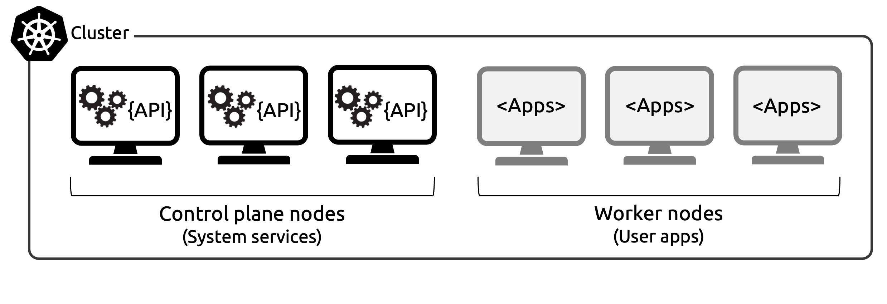
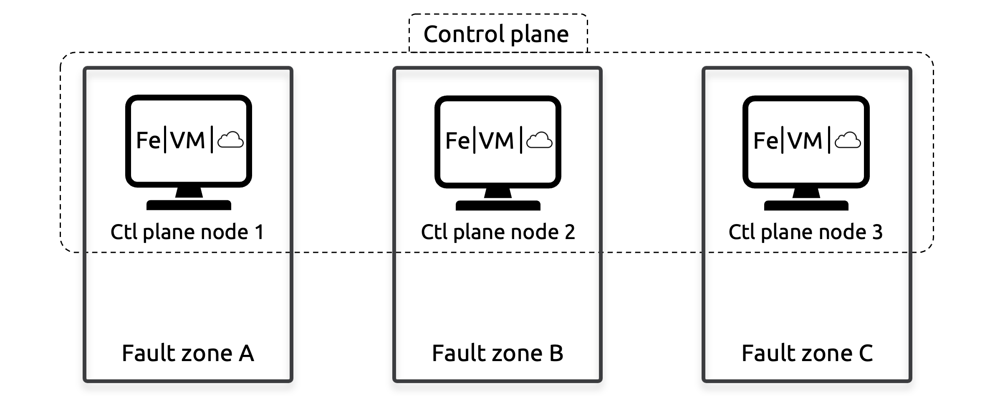
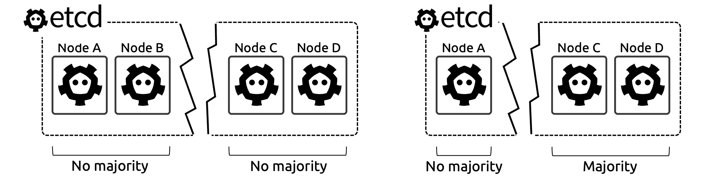
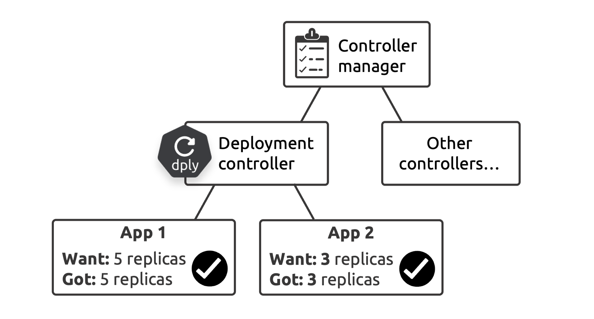
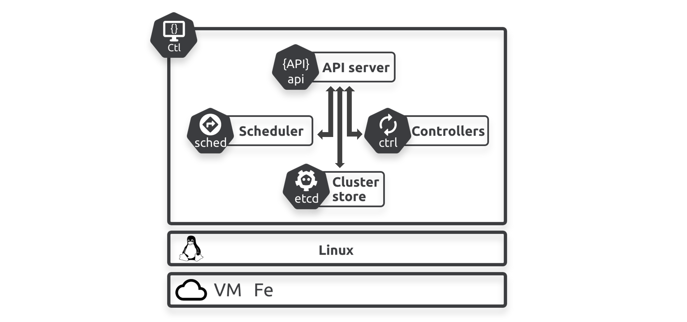
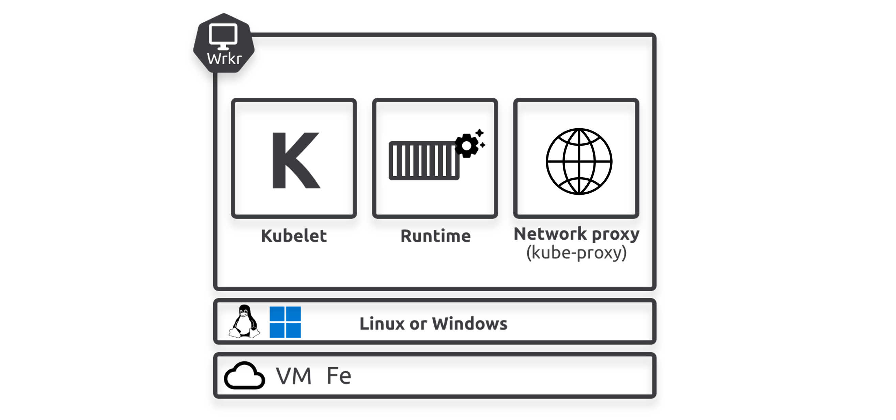
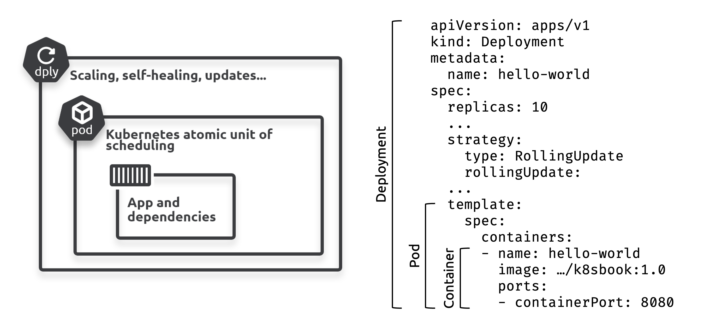

# 2: مبادئ تشغيل Kubernetes  

يُقدّم هذا الفصل التقنيات الأساسية في Kubernetes ويُعِدُّك للفصول القادمة. لا يُتوقع منك أن تكون خبيراً في نهاية هذا الفصل. سنغطي كل ما يلي:

سوف نغطى فى هذا الفصل المواضيع التالية 
- Kubernetes from 40K feet
- Control plane nodes and worker nodes
- Packaging apps for Kubernetes
- The declarative model and desired state
- Pods
- Deployments
- Service

## Kubernetes from 40K feet
Kubernetes هو كلا الأمرين التاليين:  
- **مجموعة (Cluster)**  
- **منسق (Orchestrator)**  

### Kubernetes: Cluster
يتكون Kubernetes cluster من Node واحدة او مجموعة من Nodes لكل node مجموعة من الموارد مثل ram , cpu وغيرهم من الموارد التى تستخدمهم التطبيقات 

يدعم kubernetes نوعين من Nodes

- control panel node
- worker node

من ممكن ايكون كلا النوعين من node عبارة عن physical servers او virtual machines او cloud instances وايضا يمكن ان يعمل كلاهما على معماريات معالج ARM او AMD64/x86-64  ولكن من حيث انظمة التشيغل هنا يقع الاختلاف تعمل فقط control plane nodes على linux ام worker nodes من الممكن ان تكون windows او linux

Control plane nodes هو الجزء الذكي من نظام kubernetes بمعني هو المسؤل عن عملية ادارة cluster  وايضا تقوم بعمل schdule للعمليات  ونشر (deploy) التطبيقات على worker nodes وايضا يمتد دورها الى مراقبة اداء وصحة النظام صحة النظام بمعنى هل النظام يؤدي عمله بشكل جيد 
- الذكاء فى kubernees 
يشمل تخطيط الموارد او توزيعه معرفة متى يجب تشغيل تطبيق معين واين يجب تشغيله وايضا كيفية التعامل مع الاخطاء السياسات التى يتبعه النظام فى حالة حدوث خطاء 
- يجب ان يكون فى كل cluster على الاقل control panel node واحدة فقط فى حالة فقدان كل control panel nodes فانك تفقد السيطرة على cluster ولن يعود cluster قادر على تنفيذ اي من سياساته يفضل بان يكون لديك 3 او 5 control panel nodes قد سبق وشرحنا لماذا فى swarm ويسمى هذا بـ high availability

من الشائع تشغيل تطبيقات المستخدمين على عقد التحكم (control plane nodes) في بيئات التطوير والاختبار. ومع ذلك، فإن العديد من بيئات الإنتاج تقيد تشغيل تطبيقات المستخدمين على عقد العمال (worker nodes) بحيث تركز control plane nodes  بشكل كامل على عمليات إدارة الكلاستر (cluster). يمكن control plane nodes  تشغيل تطبيقات المستخدمين أيضًا، ولكن من الأفضل في بيئات الإنتاج إجبار تطبيقات المستخدمين على التشغيل على worker nodes. هذا يسمح control plane nodes على إدارة الكلاستر.

## Kubernetes: Orchestrator
الأوركستريتور هو مصطلح تقني يشير إلى نظام يقوم deploys  و manages للـapps. هو industry-standard orchestrator ، حيث يمكنه  deploy التطبيقات بشكل ذكي عبر nodes وfailure zone لضمان الأداء الأمثل و availability. كما يمكنه إصلاح التطبيقات عند تعطلها، وتوسيع نطاقها عند تغير الطلب، وإدارة التحديثات في zero down time

## الفرق بين   (Availability Zones)  , (Failure Zones)

### ** availbility zone (Availability Zones)**

 availbility zone هي مواقع مادية مستقلة داخل منطقة جغرافية أكبر تُستخدم في خدمات الحوسبة السحابية مثل AWS. كل منطقة توافر تحتوي على عدة مراكز بيانات، وكل مركز بيانات مزود بنظام طاقة وتبريد وشبكات مستقل، مما يقلل من تأثير الأعطال في المناطق الأخرى. الهدف الرئيسي من هذه التصميمات هو ضمان **التوفر العالي** و**الاستمرارية** في تقديم الخدمات حتى في حالة حدوث أعطال في أحد المراكز[1][4].

### **فشل النظام (Failure Zones)**

فشل النظام يشير إلى المناطق أو الظروف التي يمكن أن تؤدي إلى انقطاع الخدمة أو تعطل النظام. هذه المناطق ليست مصممة بشكل خاص لتحمل الأعطال، بل تعكس نقاط الضعف المحتملة في النظام. على سبيل المثال، إذا كان نظام يعتمد على مركز بيانات واحد فقط، فإن أي فشل في هذا المركز سيؤدي إلى توقف النظام بالكامل. الفشل هنا يعني عدم القدرة على تقديم الخدمة بسبب مشاكل مثل انقطاع الطاقة أو أعطال الأجهزة[2][5].

### **الاختلافات الرئيسية**

| **الميزة**          | ** availbility zone**                                     | **فشل النظام**                                  |
| ------------------- | ----------------------------------------------------- | ----------------------------------------------- |
| **التصميم**         | مصممة لضمان الاستمرارية والتوفر العالي                | تعكس نقاط الضعف المحتملة التي قد تؤدي إلى الفشل |
| **الاستجابة للفشل** | توفر آليات للتعافي السريع من الأعطال                  | لا توجد آليات مخصصة للتعافي                     |
| **المرونة**         | توفر مرونة عالية من خلال توزيع الموارد                | تعتمد على نقطة واحدة وقد تؤدي إلى توقف الخدمة   |
| **التطبيقات**       | تستخدم في التطبيقات الحيوية التي تحتاج إلى توفر مستمر | تتعلق بالمشكلات العامة التي قد تؤثر على الأداء  |

## الـ Control Plane و Worker Nodes
لقد ذكرنا سابقًا أن عنقود Kubernetes يتكون من عقد التحكم (Control Plane) وعقد العمل (Worker Nodes). يجب أن تكون Control Plane تعمل بنظام Linux، بينما يمكن أن تكون Worker Nodes إما Linux أو Windows.
غالبية (Cloud-Native Apps) تعمل على نظام Linux، وبالتالي ستعمل على عقد العمل التي تستخدم Linux. ومع ذلك، إذا كانت لديك Cloud-Native Apps تعمل على Windows، فستحتاج إلى واحدة أو أكثر من عقد العمل التي تعمل بنظام Windows.
لحسن الحظ، يمكن  Kubernetes cluster أن يحتوي على مزيج من Worker Nodes التي تعمل بنظام Linux و Windows، وKubernetes ذكي بما يكفي لتوزيع التطبيقات على الـnodes الصحيحة وفقًا للنظام الذي تحتاجه التطبيقات.

### Control Plane

The control plane  هي مجموعة من system services  التي تمثل عقل Kubernetes. تقوم هذه control plane nodes بتوفير واجهة برمجة التطبيقات (API)، وتوزيع المهام، وتنفيذ عمليات self-healing ، وإدارة عمليات scaling ، وغيرها من الوظائف.
في أبسط الإعدادات، يمكن تشغيل node  واحدة من control plane، وهي مناسبة بشكل أفضل للاستخدام في labs وtests. ومع ذلك، كما تم ذكره سابقًا، يجب تشغيل ثلاث أو خمس  control plane nodes في بيئات الإنتاج وتوزيعها 
عبر (Availability Zones) لضمان high availability ، كما هو موضح في الشكل 

تقوم معظم clusters بتشغيل جميع خدمات control plane node  على كل node تحكم لضمان التوافر العالي (HA) من خلال عدة استراتيجيات.

الشرح 
نعم، الصورة التي أرسلتها تتطابق مع ما ورد في النص حول **مستوى التحكم (Control Plane)** في نظام **Kubernetes**، وهو الجزء الذي يعتبر "عقل" النظام.

### شرح النص والصورة بالتفصيل:

1. **ما هو Control Plane؟**
- **Control Plane** في Kubernetes هو مجموعة من الخدمات النظامية التي تتحكم في العمليات الأساسية في النظام. هذه الخدمات تشمل:
  - **API Server**: واجهة برمجية (API) تسمح بالتفاعل مع النظام وإرسال الطلبات.
  - **Scheduler**: يقوم بتحديد الـnodes التي ستشغل التطبيقات.
  - **Controller Manager**: يقوم بتنفيذ العمليات التلقائية مثل التعافي الذاتي (self-healing) عند فشل التطبيقات.
  - **Etcd**: قاعدة بيانات تقوم بتخزين الحالة العامة للنظام.

2. **وظائف Control Plane الأساسية:**
- **إدارة جداول المهام** (Task Scheduling): تعيين أي التطبيقات يجب أن تعمل وأين.
- **التعافي الذاتي** (Self-healing): عند حدوث فشل في تطبيق ما، يقوم النظام بإعادة تشغيله أو نقله إلى عقدة أخرى.
- **إدارة التوسع** (Scaling): يتعامل مع زيادة أو تقليل عدد نسخ التطبيقات بناءً على الطلبات.

3. **إعدادات Control Plane:**
- **إعدادات بسيطة**: يتم تشغيل عقدة واحدة فقط في بيئات الاختبار والمختبرات. هذا النوع من الإعدادات يكون مناسبًا للتجربة ولكن ليس للإنتاج.
  
- **إعدادات الإنتاج (Production Environments)**: يجب أن يتكون مستوى التحكم من 3 أو 5 عقد (Control Plane Nodes) موزعة عبر مناطق توفر مختلفة (Availability Zones) لضمان استمرارية العمل في حالة حدوث فشل في إحدى الـnodes.

4. **الصورة التي أرسلتها توضح نظام الإنتاج**:
- كما هو موضح في الصورة، هناك **ثلاث عقد تحكم (Control Plane Nodes)**، كل واحدة موزعة في منطقة فشل (Fault Zone) منفصلة:
  - **Ctl plane node 1** في **Fault zone A**.
  - **Ctl plane node 2** في **Fault zone B**.
  - **Ctl plane node 3** في **Fault zone C**.

5. **مفهوم التكرار والموثوقية (High Availability):**
- في البيئات الإنتاجية، من المهم أن يكون النظام مستعدًا للتعامل مع أي فشل في control node واحدة. إذا تعطلت إحدى الـnodes يمكن للعقد الأخرى مواصلة العمل بدون مشاكل.
- لهذا السبب يتم توزيع الـnodes في **failure zone مختلفة**، مما يعني أنه في حالة حدوث مشكلة في منطقة معينة (مثل انقطاع التيار الكهربائي أو تعطل الشبكة)، تبقى الـnodes الأخرى تعمل وتدير النظام.

6. **العمل على   (Worker Nodes):**
- يتم تشغيل التطبيقات الخاصة بالمستخدمين على **  (Worker Nodes)**، مما يتيح لعقد **Control Plane** تخصيص جميع مواردها لإدارة العمليات المتعلقة بالمجموعة (cluster).
- هذا يسمح للنظام بأن يكون أكثر كفاءة واستجابة للأحداث مثل التوسع التلقائي أو إعادة تشغيل التطبيقات الفاشلة.

7. **كيفية توزيع الخدمات في الإنتاج:**
- في معظم الأنظمة الإنتاجية، يتم تشغيل كل خدمة من خدمات **Control Plane** على كل عقدة من الـnodes الثلاث لضمان التكرار والموثوقية. على سبيل المثال:
  - **API Server** موجود على كل عقدة.
  - **Scheduler** و **Controller Manager** كذلك موزعين على جميع الـnodes.
  
8. **أهمية هذا التوزيع:**
- إذا فشلت أي control node (مثل **Ctl plane node 1** في **Fault zone A**)، سيستمر النظام في العمل بسلاسة لأن الـnodes الأخرى (**Ctl plane node 2** و **Ctl plane node 3**) ستقوم بتشغيل الخدمات المطلوبة.

 الهدف الأساسي:
هذا التصميم يضمن أن النظام يبقى متاحًا وredundancy في جميع الأوقات، حتى في حالة حدوث أعطال كبيرة في أحد أجزاء النظام. الفكرة هي أنه يمكن للنظام التعافي تلقائيًا وتوزيع المهام بين الـnodes المختلفة لضمان استمرارية العمل.

### **مخزن الكلاستر (Cluster Store):**

- **Cluster Store** هو المكان الذي يحتفظ بالحالة المطلوبة لجميع التطبيقات ومكونات الكلاستر، وهو الجزء الوحيد الذي يتم تخزينه بشكل دائم في الـ **Control Plane**.
  
- يعتمد على قاعدة بيانات موزعة تُدعى **etcd**. في معظم إعدادات Kubernetes، يتم تشغيل نسخة مكررة من **etcd** على كل **Control Plane Node** لضمان التوافر العالي (**High Availability - HA**).

- مع ذلك، بالنسبة للكلاسترات الكبيرة التي تتعرض لتغييرات متكررة، قد يتم تشغيل مجموعة مستقلة من **etcd** لتحسين الأداء.

- من المهم أن تدرك أن توافر **Cluster Store** بشكل عالي لا يغني عن الحاجة إلى النسخ الاحتياطي والاستعادة. يجب دائمًا وجود آليات كافية لاستعادة **Cluster Store** عند حدوث أي مشكلة.

- (Split-Brain): يحدث عندما تتعطل الشبكة بين هذه الأجهزة (Nodes)، فتفقد القدرة على التواصل مع بعضها. في هذه الحالة، لا تعرف الأجهزة ما إذا كانت تمتلك النصاب القانوني أو الأغلبية (quorum). هذا قد يؤدي إلى أن يحاول كل جزء العمل بشكل مستقل، مما يسبب تضاربًا في البيانات.

عدد النسخ الفردي: لتجنب مشكلة الانقسام الدماغي، يُفضل أن يكون عدد نسخ etcd فرديًا (مثل 3 أو 5). لماذا؟ لأنه عندما يحدث انقسام في الشبكة، سيكون من السهل تحديد أي جزء من الأجهزة يمتلك الأغلبية ويستمر في العمل، بينما الجزء الآخر يعرف أنه لا يمتلك الأغلبية فيتوقف عن العمل.

مثال بسيط:
تخيل أنك تملك 4 أجهزة لتخزين البيانات. إذا انقسمت الشبكة، فقد يتواجد جهازان في كل جانب. في هذه الحالة، كلا الجانبين يعتقد أنه قد يمتلك البيانات الصحيحة، وبالتالي يحدث تضارب (مشكلة Split-Brain).

لكن، إذا كان لديك 3 أجهزة فقط، وعندما يحدث انقسام في الشبكة، سيكون من السهل معرفة أن جانبًا واحدًا يمتلك الأغلبية (2 أجهزة مقابل 1)، فيستمر هذا الجانب في العمل بينما يتوقف الجهاز الآخر لأنه لا يمتلك الأغلبية.

الشكل فى :
الشكل يوضح حالتين:
الحالة الأولى (الكلاستر على اليسار) لديها 4 أجهزة، ويحدث الانقسام الدماغي حيث لا يستطيع أي جانب أن يعرف من يمتلك النصاب القانوني.
الحالة الثانية (الكلاستر على اليمين) لديها 3 أجهزة، ومع الانقسام تستطيع العقدتان B و C الاستمرار لأنهما يعرفان أنهما الأغلبية، بينما العقدة A تتوقف لأنها تعلم أنها الأقلية.

عندما يحدث الانقسام الدماغي (Split-Brain) في مجموعة etcd، تنتقل قاعدة بيانات etcd إلى الوضع للقراءة فقط، مما يمنع إجراء أي تحديثات على الكلاستر. وهذا يعني:

أن التطبيقات التي يستخدمها المستخدم ستستمر في العمل كالمعتاد.
لكن لن تتمكن من إجراء أي تحديثات على الكلاستر، مثل إضافة أو تعديل التطبيقات والخدمات.
يهدف هذا السلوك إلى الحفاظ على اتساق البيانات حتى في حالة حدوث تقسيم في الشبكة.

لماذا الوضع للقراءة فقط؟
في حالة حدوث انقسام دماغي، يفقد الكلاستر القدرة على تحديد النصاب القانوني (Quorum)، وبالتالي يجب إيقاف عمليات الكتابة لضمان عدم حدوث تعارض في البيانات.

أهمية الاتساق في قواعد البيانات الموزعة:
كما هو الحال في جميع قواعد البيانات الموزعة، يعتبر اتساق الكتابات أمرًا حيويًا. على سبيل المثال، يجب التعامل مع الكتابات المتعددة للقيمة نفسها من مصادر مختلفة بطريقة صحيحة. يستخدم etcd خوارزمية الإجماع RAFT لضمان هذا الاتساق.

عندما يحدث (Split-Brain) في nodes etcd، تنتقل قاعدة بيانات etcd إلى الوضع للقراءة فقط وهذا يحدث عندما لا يحدث اغلبية ، مما يمنع إجراء أي تحديثات على الكلاستر. وهذا يعني:
•	أن التطبيقات التي يستخدمها المستخدم ستستمر في العمل كالمعتاد.
•	لكن لن تتمكن من إجراء أي تحديثات على الكلاستر، مثل إضافة أو تعديل التطبيقات والخدمات.
يهدف هذا السلوك إلى الحفاظ على  consistency فى  البيانات حتى في حالة حدوث عطل في الشبكة.
لماذا الوضع للقراءة فقط؟
في حالة حدوث Split-Brain ، يفقد الكلاستر القدرة على تحديد الأغلبية  (Quorum)، وبالتالي يجب إيقاف عمليات الكتابة لضمان عدم حدوث تعارض في البيانات.
أهمية consistency  في قواعد البيانات الموزعة:
كما هو الحال في جميع قواعد البيانات الموزعة، يعتبر consistency  أمرًا حيويًا. على سبيل المثال، يجب التعامل مع الكتابات المتعددة للقيمة نفسها من مصادر مختلفة بطريقة صحيحة. يستخدم etcd خوارزمية RAFT لضمان هذا consistency  .

## Controllers و Controllers manager في Kubernetes
تستخدم Kubernetes  controllers  لتنفيذ الكثير من قدرات  الكلاستر. تعمل جميع controllers  على the control plane  ، وبعض controllers  الشائعة تشمل:

- The Deployment controller
  يقوم بإدارة عمليات deploy لتطبيقات المستخدم.
يضمن أن عدد النسخ (Pods) المطلوب يعمل بشكل صحيح.
يتعامل مع تحديثات التطبيقات لضمان سلاسة العمليات.

- The StatefulSet controller
مصمم لإدارة التطبيقات التي تحتاج إلى الحفاظ على Stable Identifiers مثل قواعد البيانات.
يضمن أن كل حاوية (Pod) تحتفظ بحالتها الخاصة حتى في حالة إعادة التشغيل.

- The ReplicaSet controller
يضمن أن عدد معين من نسخ الحاويات (Pods) يعمل في جميع الأوقات.
إذا تم حذف أحد النسخ، سيقوم المتحكم بإعادة إنشائه تلقائيًا.

هذا الكثير من المصطلحات التقنية، وسنتناولها بالتفصيل لاحقًا في الفصل. لكن في الوقت الحالي، يعني ذلك أن controllers تضمن أن الكلاستر يعمل كما طلبت منه. على سبيل المثال، إذا طلبت ثلاث نسخ من تطبيق، فإن controller سيضمن أن هناك ثلاث نسخ صحية تعمل، وسيقوم باتخاذ الإجراءات المناسبة إذا لم تكن كذلك.

تقوم Kubernetes أيضًا بتشغيل مدير Controllers (Controller Manager)، الذي يكون مسؤولًا عن إنشاء وإدارة individual controllers.
سنتعرف على الانواع الاخرى فى الفصول القادمة ولكن individual controllers هي controller ألاساسية التى ذكرناه فوق 

(Individual Controllers) في Kubernetes هي مكونات محددة تدير نوعًا معينًا من الموارد في الكلاستر. كل متحكم يعمل على تحقيق حالة معينة تتعلق بمورد محدد، ويقوم بالتأكد من أن هذه الحالة متطابقة مع الحالة المرغوبة التي قام المستخدم بتحديدها.

في Kubernetes، **الموارد (Resources)** تشير إلى الكائنات التي يتم إدارتها داخل الكلاستر. تمثل هذه الموارد مكونات مختلفة من التطبيقات والخدمات التي تعمل على النظام. فيما يلي بعض الأنواع الشائعة من الموارد في Kubernetes:

1. **Pods**
- **الوصف**: وحدة العمل الأساسية في Kubernetes، يمكن أن تحتوي على حاوية واحدة أو أكثر.
- **الوظيفة**: تعمل على تشغيل التطبيقات. يتمتع كل Pod ببيئة تشغيل خاصة به.
2. **Services**
- **الوصف**: كائن يُستخدم لتجميع عدة Pods وتوفير واجهة ثابتة للتواصل بينها.
- **الوظيفة**: تسمح بالوصول إلى التطبيقات وتوزيع الحمل على Pods المختلفة.

3. **Deployments**
- **الوصف**: كائن يُستخدم لإدارة عدد من النسخ المتماثلة (Replicas) من Pods.
- **الوظيفة**: يضمن تشغيل عدد معين من النسخ من التطبيق بشكل صحي، ويوفر آليات للتحديث والتراجع.

4. **ReplicaSets**
- **الوصف**: يحافظ على عدد محدد من نسخ Pods في حالة تشغيل.
- **الوظيفة**: يضمن عدم وجود نقص أو زيادة في عدد النسخ.

5. **StatefulSets**
- **الوصف**: مشابه لـ ReplicaSets ولكن مخصص للتطبيقات التي تحتاج إلى stable identifiers مثل قواعد البيانات.
- **الوظيفة**: يضمن أن كل Pod يحتفظ بحالته الخاصة.

6. **DaemonSets**
- **الوصف**: يضمن أن هناك Pod واحد على الأقل يعمل على كل عقدة في الكلاستر.
- **الوظيفة**: مثالي للتطبيقات التي تحتاج إلى تشغيل نسخة على كل عقدة، مثل أدوات المراقبة.

7. **Jobs**
- **الوصف**: يُستخدم لتنفيذ عمليات لمرة واحدة في Pods.
- **الوظيفة**: مثالي للمهام التي تحتاج إلى الانتهاء بعد تنفيذ معين.

8. **CronJobs**
- **الوصف**: يشبه Jobs ولكن يُستخدم لتشغيل المهام بشكل دوري في أوقات محددة.
- **الوظيفة**: مثالي للمهام المجدولة.

9. **Volumes**
- **الوصف**: مساحة تخزين تُستخدم لتخزين البيانات التي تحتاجها Pods.
- **الوظيفة**: تسمح بمشاركة البيانات بين Pods والحفاظ عليها عبر دورات حياة Pods.

10. **ConfigMaps و Secrets**
- **ConfigMaps**: تخزن إعدادات التكوين لتطبيقات Pods.
- **Secrets**: تُستخدم لتخزين المعلومات الحساسة مثل كلمات المرور وبيانات الاعتماد.

11. **Namespaces**
- **الوصف**: تُستخدم لتقسيم الكلاستر إلى وحدات logival مما يسهل إدارة الموارد.
- **الوظيفة**: يسمح بإدارة موارد متعددة في بيئات معزولة.

الشكل 2.4 يقدم نظرة عامة عالية المستوى عن controller manager وcontrollers.

Scheduler  يقوم بمراقبة API Server  في حالة كانت هناك في حالة وجود task  جديدة ويقوم بوضعه على worker nodes  الصالحة 

1. Watch the API server for new tasks
2. Identify capable nodes
3. Assign tasks to nodes
•	بعد العثور على المهام الجديدة، يجب على Scheduler  تحديد (Nodes) التي يمكنها تنفيذ هذه المهام. تشمل هذه العملية:
o	التحقق (Taints)  : التأكد من أن nodes  ليست عليها شروط معينة سنتطرق اليها للاحقا.
o	قواعد التوافق وعدم التوافق (Affinity and Anti-affinity rules): التأكد من أن task  او pods يمكن أن تعمل معاً على نفس العقد أو لا يمكن أن تعمل على عقد محددة.
o	توافر المنافذ الشبكية: التأكد من أن nodes لديها ports المطلوبة مفتوحة ومتاحة.
o	الموارد المتاحة (CPU و Memory): التحقق من أن العقد لديها الموارد الكافية لتشغيل المهام الجديدة.
وبناء على ذلك يقوم بانتقاء افضل nodes
إذا لم يتمكن Scheduler   من العثور على node مناسبة، يتم وضع علامة على المهام كـ "معلقة" (pending). إذا كان الكلاستر مُعدًا لتوسيع العقد تلقائيًا، فإن المهمة المعلقة تُفعّل حدث auto scalling الذي يضيف nodes جديدة ويجدول المهمة على nodes الجديدة.

### The cloud controller manager
إذا كان الكلاستر الخاص بك يعمل على public cloud ، مثل AWS أو Azure أو GCP أو Civo Cloud، فسوف يقوم بتشغيل  cloud controller manager الذي يدمج الكلاستر مع cloud services ، مثل instances ، و load balancers ، و storage. على سبيل المثال، إذا كنت تستخدم cloud  وقام تطبيق بطلب load balancer ، فإن  = cloud controller manager يقوم بتوقيري load balancers  من cloud services ويربطه بتطبيقك.

### ملخص (Control Plane)
تُعد Control Plane  بمثابة "العقل" المدبر لنظام Kubernetes، حيث تشمل مكونات مثل API (API Server)، (Scheduler)، ومخزن الكلاستر (Cluster Store). كما تقوم أيضًا بتنفيذ (Controllers) التي تضمن تشغيل الكلاستر وفقًا لما نطلبه.
يوضح الشكل 2.5 رؤية شاملة من  مستوى عالٍ control plane node في Kubernetes.

يُفضل تشغيل ثلاث أو خمس (Control Plane node) لضمان (High Availability). بالنسبة للكلاسترات الكبيرة والمزدحمة، قد يكون من الضروري تشغيل) etcd cluster (  منفصلة من Etcd لتحسين أداء cluster store.
خادم API هو واجهة Kubernetes الأمامية، حيث تمر جميع الاتصالات عبره.

### Worker nodes
عُقد الـWorker مخصصة لتشغيل التطبيقات الخاصة بالمستخدم، وتُظهر الشكل 2.6 كيفية عمل هذه nodes  .

لنلقِ نظرة على المكونات الرئيسية لعقدة العامل (worker node).

#### Kubelet
الكيوبيليت (kubelet) هو الوكيل الرئيسي في Kubernetes ويتولى جميع الاتصالات مع (cluster).

يقوم بالمهام الرئيسية التالية:
- مراقبة API server بحثًا عن مهام جديدة
- توجيه الأوامر الى  runtime االمناسبة لتنفيذ tasks
تشير إلى أن kubelet يقوم بإعطاء تعليمات لبيئة التشغيل التي تستخدمها Kubernetes (مثل Docker أو containerd) لتشغيل الحاويات (containers) المطلوبة
- إرسال حالة المهام إلى API server

إذا لم تعمل task، يقوم الكيوبيليت بإبلاغ API server بالمشكلة ويترك (control plane) اتخاذ الإجراءات المناسبة.

#### Runtime 

كل (worker node) تحتوي على runtime واحدة أو أكثر لتنفيذ المهام.  
تأتي معظم (clusters) الحديثة في Kubernetes مع **containerd** مُثبتة مسبقًا وتستخدمها لتنفيذ المهام. هذه المهام تشمل:
- سحب صور الحاويات (container images)
- إدارة عمليات دورة الحياة مثل بدء وإيقاف الحاويات

في cluster القديمة، كان يتم استخدام **Docker** rutnime لكن لم يعد هذا مدعومًا. أما  **RedHat OpenShift clusters** فتستخدم runtime **CRI-O**. وهناك العديد من runtime الأخرى، وكل واحدة لها مزايا وعيوب.

#### Kube-proxy

كل (worker node) تشغل **kube-proxy service**، والتي تنفذ الشبكات داخل (cluster) وتوزع الأحمال (load balancing) لحركة المرور المتجهة إلى المهام التي تعمل على node.
الآن بعد أن فهمت (control plane)  و(worker nodes)، دعنا ننتقل إلى كيفية تجهيز التطبيقات لتشغيلها على **Kubernetes**.

### تجهيز التطبيقات لـ Kubernetes

تشغل Kubernetes الحاويات (containers) والآلات الافتراضية (VMs) وتطبيقات **Wasm** والمزيد. ومع ذلك، يجب أن تكون جميعها مُغلفة في **Pods** لتعمل على Kubernetes.
سنتحدث عن **Pods** قريبًا، لكن في الوقت الحالي، يمكنك التفكير فيها كغلاف رقيق يُجسد abstracts)  (أنواع tasks المختلفة بحيث يمكنها العمل على Kubernetes. قد تساعدك تشبيه البريد في فهم ذلك.

تسمح لك خدمات البريد بشحن الكتب، والملابس، والطعام، والأجهزة الكهربائية، وغيرها، طالما أنك تستخدم التعبئة والتغليف والملصقات المعتمدة من قبلهم. بمجرد أن تقوم بتعبئة وتسمية بضائعك، تسلمها إلى خدمة البريد للتوصيل. ثم تتولى خدمة البريد إدارة اللوجستيات المعقدة المتعلقة بالطائرات والشاحنات التي يجب استخدامها، وتقديم التسليمات الآمنة إلى مراكز التسليم المحلية، والتسليم النهائي إلى العميل. كما تقدم خدمات لتتبع الطرود، وتغيير تفاصيل التسليم، والتأكيد على نجاح التسليم. كل ما عليك فعله هو تعبئة وتسمية البضائع.

تشغيل التطبيقات على Kubernetes مشابه لذلك. يمكن لـ Kubernetes تشغيل الحاويات (containers) والآلات الافتراضية (VMs) وتطبيقات Wasm والمزيد، طالما أنك تغلفها في Pods. بمجرد تغليف التطبيق في Pod، يمكنك تسليمه إلى Kubernetes، وستقوم Kubernetes بتشغيله.
يتضمن ذلك إدارة اللوجستيات المعقدة مثل اختيار العقد المناسبة، والانضمام إلى الشبكات، وإرفاق volumes، والمزيد. كما أن Kubernetes يتيح لك استعلام التطبيقات وإجراء تغييرات عليها.

مثال سريع
تخيل أنك كتبت تطبيقًا بلغة البرمجة المفضلة لديك، ثم قمت بتغليفه في حاوية (container) ودفعته إلى سجل (registry)، ولففته في Pod. في هذه المرحلة، يمكنك تسليم الـ Pod إلى Kubernetes، وستقوم Kubernetes بتشغيله.
ومع ذلك، في معظم الأوقات، ستستخدم higher-level controller  لاجل deploy و manage   Pods. للقيام بذلك، تقوم بتغليف الـ Pod داخل controller object  مثل Deployment.

لا داعي للقلق بشأن التفاصيل الآن، سنغطي كل شيء بمزيد من العمق والكثير من الأمثلة لاحقًا في الكتاب. في الوقت الحالي، تحتاج فقط إلى معرفة أمرين:
1. يجب أن تكون التطبيقات مُغلفة في Pods لتعمل على Kubernetes.
2. عادةً ما يتم تغليف Pods داخل higher-level controllers  لاجل الحصول على  ميزات متقدمة.
دعنا نعود بسرعة إلى تشبيه خدمات البريد لمساعدتنا في شرح دور controllers.

تقدم معظم خدمات البريد خدمات إضافية مثل التأمين على السلع التي تقوم بشحنها، والحصول على توقيع عند التسليم وإثبات تصويري، وخدمات التوصيل السريع، وغيرها. كل هذه الخدمات تضيف قيمة إلى الخدمة المقدمة.

مرة أخرى، Kubernetes مشابهة لذلك. فهو ينفذ controllers  تضيف قيمة، مثل ضمان صحة التطبيقات، و automatically scaling عندما تزداد الطلبات، وغيرها.

تظهر  حاوية مغلفة داخل Pod، والذي بدوره مغلف داخل Deployment. لا داعي للقلق بشأن اعدادات YAML حتى الآن، فهو موجود فقط لإعطاء فكرة عن الموضوع.

الأمر المهم الذي يجب فهمه هو أن كل طبقة من التغليف تضيف شيئًا:

- **الحاوية** تغلف التطبيق وتوفر dependencies.
- **Pod** تغلف الحاوية بحيث يمكن تشغيلها على Kubernetes.
- **Deployment** تغلف الـ Pod وتضيف ميزات مثل self-healing  و auto scalling والمزيد.

تقوم بإرسال الـ Deployment (ملف YAML) إلى  API server كـــdesired state، وKubernetes ينفذها.

