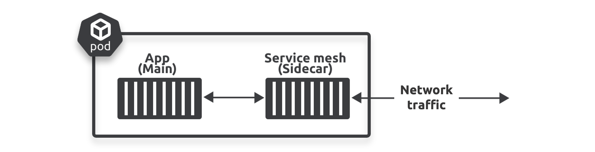
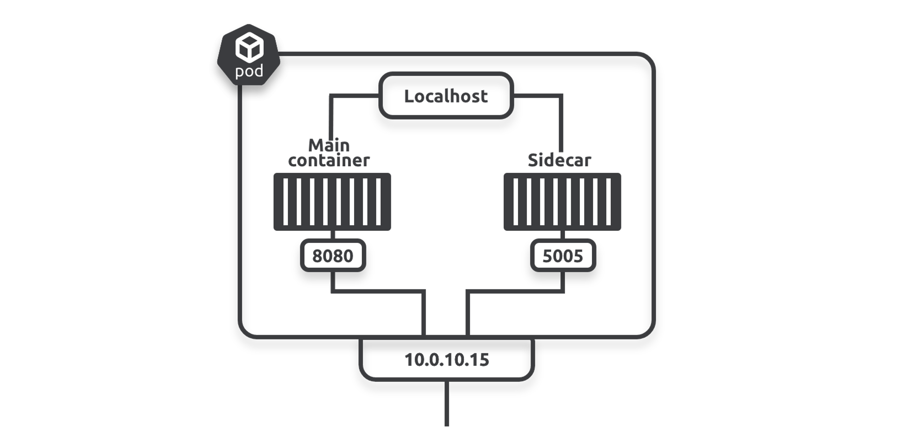
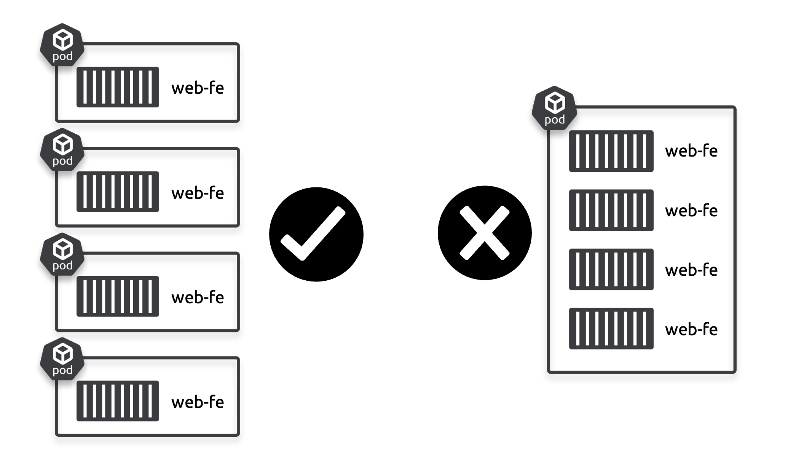
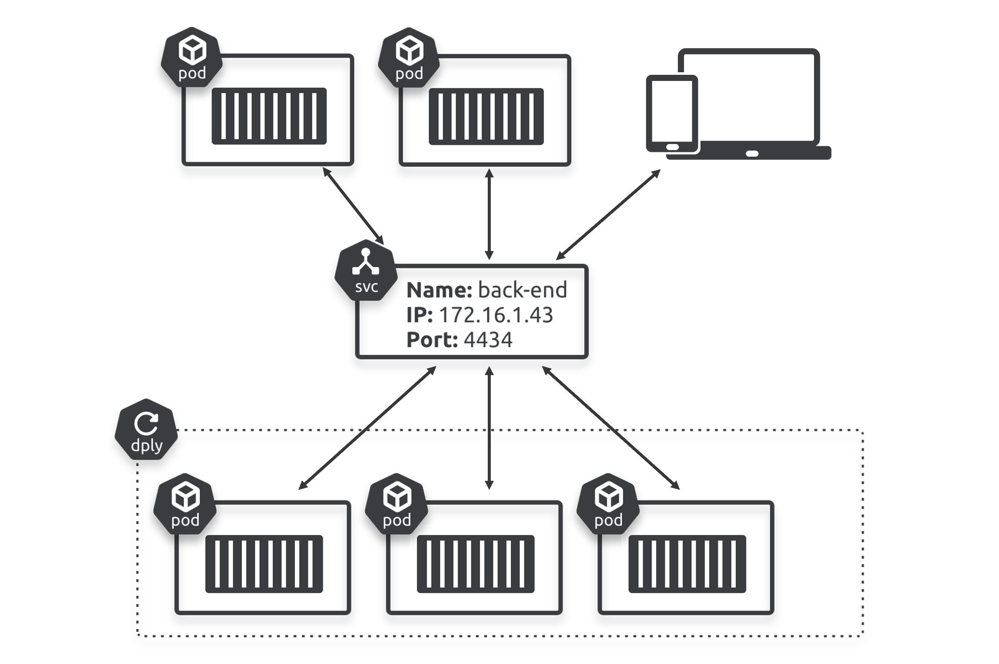

# 2: مبادئ تشغيل Kubernetes  

يُقدّم هذا الفصل التقنيات الأساسية في Kubernetes ويُعِدُّك للفصول القادمة. لا يُتوقع منك أن تكون خبيراً في نهاية هذا الفصل. سنغطي كل ما يلي:

سوف نغطى فى هذا الفصل المواضيع التالية 
- Kubernetes from 40K feet
- Control plane nodes and worker nodes
- Packaging apps for Kubernetes
- The declarative model and desired state
- Pods
- Deployments
- Service

## Kubernetes from 40K feet
Kubernetes هو كلا الأمرين التاليين:  
- **مجموعة (Cluster)**  
- **منسق (Orchestrator)**  

### Kubernetes: Cluster
يتكون Kubernetes cluster من Node واحدة او مجموعة من Nodes لكل node مجموعة من الموارد مثل ram , cpu وغيرهم من الموارد التى تستخدمهم التطبيقات 

يدعم kubernetes نوعين من Nodes

- control panel node
- worker node

من ممكن ايكون كلا النوعين من node عبارة عن physical servers او virtual machines او cloud instances وايضا يمكن ان يعمل كلاهما على معماريات معالج ARM او AMD64/x86-64  ولكن من حيث انظمة التشيغل هنا يقع الاختلاف تعمل فقط control plane nodes على linux ام worker nodes من الممكن ان تكون windows او linux

Control plane nodes هو الجزء الذكي من نظام kubernetes بمعني هو المسؤل عن عملية ادارة cluster  وايضا تقوم بعمل schdule للعمليات  ونشر (deploy) التطبيقات على worker nodes وايضا يمتد دورها الى مراقبة اداء وصحة النظام صحة النظام بمعنى هل النظام يؤدي عمله بشكل جيد 
- الذكاء فى kubernees 
يشمل تخطيط الموارد او توزيعه معرفة متى يجب تشغيل تطبيق معين واين يجب تشغيله وايضا كيفية التعامل مع الاخطاء السياسات التى يتبعه النظام فى حالة حدوث خطاء 
- يجب ان يكون فى كل cluster على الاقل control panel node واحدة فقط فى حالة فقدان كل control panel nodes فانك تفقد السيطرة على cluster ولن يعود cluster قادر على تنفيذ اي من سياساته يفضل بان يكون لديك 3 او 5 control panel nodes قد سبق وشرحنا لماذا فى swarm ويسمى هذا بـ high availability

من الشائع تشغيل تطبيقات المستخدمين على عقد التحكم (control plane nodes) في بيئات التطوير والاختبار. ومع ذلك، فإن العديد من بيئات الإنتاج تقيد تشغيل تطبيقات المستخدمين على عقد العمال (worker nodes) بحيث تركز control plane nodes  بشكل كامل على عمليات إدارة الكلاستر (cluster). يمكن control plane nodes  تشغيل تطبيقات المستخدمين أيضًا، ولكن من الأفضل في بيئات الإنتاج إجبار تطبيقات المستخدمين على التشغيل على worker nodes. هذا يسمح control plane nodes على إدارة الكلاستر.

## Kubernetes: Orchestrator
الأوركستريتور هو مصطلح تقني يشير إلى نظام يقوم deploys  و manages للـapps. هو industry-standard orchestrator ، حيث يمكنه  deploy التطبيقات بشكل ذكي عبر nodes وfailure zone لضمان الأداء الأمثل و availability. كما يمكنه إصلاح التطبيقات عند تعطلها، وتوسيع نطاقها عند تغير الطلب، وإدارة التحديثات في zero down time

> [!NOTE]
>
> ## الفرق بين   (Availability Zones)  , (Failure Zones)
>
> ### availbility zone (Availability Zones)
>
>  availbility zone هي مواقع مادية مستقلة داخل منطقة جغرافية أكبر تُستخدم في خدمات الحوسبة السحابية مثل AWS. كل منطقة توافر تحتوي على عدة مراكز بيانات، وكل مركز بيانات مزود بنظام طاقة وتبريد وشبكات مستقل، مما يقلل من تأثير الأعطال في المناطق الأخرى. الهدف الرئيسي من هذه التصميمات هو ضمان **التوفر العالي** و**الاستمرارية** في تقديم الخدمات حتى في حالة حدوث أعطال في أحد المراكز[1][4].
>
> ### **فشل النظام (Failure Zones)**
>
> فشل النظام يشير إلى المناطق أو الظروف او اجهزة التي يمكن أن تؤدي إلى انقطاع الخدمة أو تعطل النظام. هذه المناطق ليست مصممة بشكل خاص لتحمل الأعطال، بل تعكس نقاط الضعف المحتملة في النظام. على سبيل المثال، إذا كان نظام يعتمد على مركز بيانات واحد فقط او على server واحد ، فإن أي فشل في هذا المركز سيؤدي إلى توقف النظام بالكامل. الفشل هنا يعني عدم القدرة على تقديم الخدمة بسبب مشاكل مثل انقطاع الطاقة أو أعطال الأجهزة 

### **الاختلافات الرئيسية**

| **الميزة**          | ** availbility zone**                                     | **فشل النظام**                                  |
| ------------------- | ----------------------------------------------------- | ----------------------------------------------- |
| **التصميم**         | مصممة لضمان الاستمرارية والتوفر العالي                | تعكس نقاط الضعف المحتملة التي قد تؤدي إلى الفشل |
| **الاستجابة للفشل** | توفر آليات للتعافي السريع من الأعطال                  | لا توجد آليات مخصصة للتعافي                     |
| **المرونة**         | توفر مرونة عالية من خلال توزيع الموارد                | تعتمد على نقطة واحدة وقد تؤدي إلى توقف الخدمة   |
| **التطبيقات**       | تستخدم في التطبيقات الحيوية التي تحتاج إلى توفر مستمر | تتعلق بالمشكلات العامة التي قد تؤثر على الأداء  |

## الـ Control Plane و Worker Nodes
لقد ذكرنا سابقًا أن عنقود Kubernetes يتكون من عقد التحكم (Control Plane) وعقد العمل (Worker Nodes). يجب أن تكون Control Plane تعمل بنظام Linux، بينما يمكن أن تكون Worker Nodes إما Linux أو Windows.
غالبية (Cloud-Native Apps) تعمل على نظام Linux، وبالتالي ستعمل على عقد العمل التي تستخدم Linux. ومع ذلك، إذا كانت لديك Cloud-Native Apps تعمل على Windows، فستحتاج إلى واحدة أو أكثر من عقد العمل التي تعمل بنظام Windows.
لحسن الحظ، يمكن  Kubernetes cluster أن يحتوي على مزيج من Worker Nodes التي تعمل بنظام Linux و Windows، وKubernetes ذكي بما يكفي لتوزيع التطبيقات على الـnodes الصحيحة وفقًا للنظام الذي تحتاجه التطبيقات.

### Control Plane

The control plane  هي مجموعة من system services  التي تمثل عقل Kubernetes. تقوم هذه control plane nodes بتوفير  (API)، وتوزيع المهام، وتنفيذ عمليات self-healing ، وإدارة عمليات scaling ، وغيرها من الوظائف.
في أبسط الإعدادات، يمكن تشغيل node  واحدة من control plane، وهي مناسبة بشكل أفضل للاستخدام في labs وtests. ومع ذلك، كما تم ذكره سابقًا، يجب تشغيل ثلاث أو خمس  control plane nodes في بيئات الإنتاج وتوزيعها 
عبر (Availability Zones) لضمان high availability ، كما هو موضح في الشكل 

تقوم معظم clusters بتشغيل جميع خدمات control plane node  على كل node تحكم لضمان التوافر العالي (HA) من خلال عدة استراتيجيات.

> [!IMPORTANT]
>
> ### شرح النص والصورة بالتفصيل:
>
> 1. **ما هو Control Plane؟**
>
> - **Control Plane** في Kubernetes هو مجموعة من الخدمات النظامية التي تتحكم في العمليات الأساسية في النظام. هذه الخدمات تشمل:
>   - **API Server**: واجهة برمجية (API) تسمح بالتفاعل مع النظام وإرسال الطلبات.
>   - **Scheduler**: يقوم بتحديد الـnodes التي ستشغل التطبيقات.
>   - **Controller Manager**: يقوم بتنفيذ العمليات التلقائية مثل التعافي الذاتي (self-healing) عند فشل التطبيقات.
>   - **Etcd**: قاعدة بيانات تقوم بتخزين الحالة العامة للنظام.
>
> 2. **وظائف Control Plane الأساسية:**
>
> - **إدارة جداول المهام** (Task Scheduling): تعيين أي التطبيقات يجب أن تعمل وأين.
> - **التعافي الذاتي** (Self-healing): عند حدوث فشل في تطبيق ما، يقوم النظام بإعادة تشغيله أو نقله إلى عقدة أخرى.
> - **إدارة التوسع** (Scaling): يتعامل مع زيادة أو تقليل عدد نسخ التطبيقات بناءً على الطلبات.
>
> 3. **إعدادات Control Plane:**
>
> - **إعدادات بسيطة**: يتم تشغيل عقدة واحدة فقط في بيئات الاختبار والمختبرات. هذا النوع من الإعدادات يكون مناسبًا للتجربة ولكن ليس للإنتاج.
>
> - **إعدادات الإنتاج (Production Environments)**: يجب أن يتكون مستوى التحكم من 3 أو 5 عقد (Control Plane Nodes) موزعة عبر مناطق توفر مختلفة (Availability Zones) لضمان استمرارية العمل في حالة حدوث فشل في إحدى الـnodes.
>
> 4. **الصورة التي أرسلتها توضح نظام الإنتاج**:
>
> - كما هو موضح في الصورة، هناك **ثلاث عقد تحكم (Control Plane Nodes)**، كل واحدة موزعة في منطقة فشل (Fault Zone) منفصلة:
>   - **Ctl plane node 1** في **Fault zone A**.
>   - **Ctl plane node 2** في **Fault zone B**.
>   - **Ctl plane node 3** في **Fault zone C**.
>
> 5. **مفهوم التكرار والموثوقية (High Availability):**
>
> - في البيئات الإنتاجية، من المهم أن يكون النظام مستعدًا للتعامل مع أي فشل في control node واحدة. إذا تعطلت إحدى الـnodes يمكن للعقد الأخرى مواصلة العمل بدون مشاكل.
> - لهذا السبب يتم توزيع الـnodes في **failure zone مختلفة**، مما يعني أنه في حالة حدوث مشكلة في منطقة معينة (مثل انقطاع التيار الكهربائي أو تعطل الشبكة)، تبقى الـnodes الأخرى تعمل وتدير النظام.
>
> 6. **العمل على   (Worker Nodes):**
>
> - يتم تشغيل التطبيقات الخاصة بالمستخدمين على **  (Worker Nodes)**، مما يتيح لعقد **Control Plane** تخصيص جميع مواردها لإدارة العمليات المتعلقة بالمجموعة (cluster).
> - هذا يسمح للنظام بأن يكون أكثر كفاءة واستجابة للأحداث مثل التوسع التلقائي أو إعادة تشغيل التطبيقات الفاشلة.
>
> 7. **كيفية توزيع الخدمات في الإنتاج:**
>
> - في معظم الأنظمة الإنتاجية، يتم تشغيل كل خدمة من خدمات **Control Plane** على كل عقدة من الـnodes الثلاث لضمان التكرار والموثوقية. على سبيل المثال:
>   - **API Server** موجود على كل عقدة.
>   - **Scheduler** و **Controller Manager** كذلك موزعين على جميع الـnodes.
>
> 8. **أهمية هذا التوزيع:**
>
> - إذا فشلت أي control node (مثل **Ctl plane node 1** في **Fault zone A**)، سيستمر النظام في العمل بسلاسة لأن الـnodes الأخرى (**Ctl plane node 2** و **Ctl plane node 3**) ستقوم بتشغيل الخدمات المطلوبة.
>
>  الهدف الأساسي:
> هذا التصميم يضمن أن النظام يبقى متاحًا وredundancy في جميع الأوقات، حتى في حالة حدوث أعطال كبيرة في أحد أجزاء النظام. الفكرة هي أنه يمكن للنظام التعافي تلقائيًا وتوزيع المهام بين الـnodes المختلفة لضمان استمرارية العمل.
>
> ### 

### **مخزن الكلاستر (Cluster Store):**

- **Cluster Store** هو المكان الذي يحتفظ بالحالة المطلوبة لجميع التطبيقات ومكونات الكلاستر، وهو الجزء الوحيد الذي يتم تخزينه بشكل دائم في الـ **Control Plane**.
  
- يعتمد على قاعدة بيانات موزعة تُدعى **etcd**. في معظم إعدادات Kubernetes، يتم تشغيل نسخة مكررة من **etcd** على كل **Control Plane Node** لضمان التوافر العالي (**High Availability - HA**).

- مع ذلك، بالنسبة للكلاسترات الكبيرة التي تتعرض لتغييرات متكررة، قد يتم تشغيل مجموعة مستقلة من **etcd** لتحسين الأداء.

- من المهم أن تدرك أن توافر **Cluster Store** بشكل عالي لا يغني عن الحاجة إلى النسخ الاحتياطي والاستعادة. يجب دائمًا وجود آليات كافية لاستعادة **Cluster Store** عند حدوث أي مشكلة.

- (Split-Brain): يحدث عندما تتعطل الشبكة بين هذه الأجهزة (Nodes)، فتفقد القدرة على التواصل مع بعضها. في هذه الحالة، لا تعرف الأجهزة ما إذا كانت تمتلك الحق أو الأغلبية (quorum). هذا قد يؤدي إلى أن يحاول كل جزء العمل بشكل مستقل، مما يسبب تضاربًا في البيانات.

عدد النسخ الفردي: لتجنب مشكلة Split-Brain، يُفضل أن يكون عدد نسخ etcd فرديًا (مثل 3 أو 5). لماذا؟ لأنه عندما يحدث انقسام في الشبكة، سيكون من السهل تحديد أي جزء من الأجهزة يمتلك الأغلبية ويستمر في العمل، بينما الجزء الآخر يعرف أنه لا يمتلك الأغلبية فيتوقف عن العمل.

مثال بسيط:
تخيل أنك تملك 4 أجهزة لتخزين البيانات. إذا انقسمت الشبكة، فقد يتواجد جهازان في كل جانب. في هذه الحالة، كلا الجانبين يعتقد أنه قد يمتلك البيانات الصحيحة، وبالتالي يحدث تضارب (مشكلة Split-Brain).

لكن، إذا كان لديك 3 أجهزة فقط، وعندما يحدث انقسام في الشبكة، سيكون من السهل معرفة أن جانبًا واحدًا يمتلك الأغلبية (2 أجهزة مقابل 1)، فيستمر هذا الجانب في العمل بينما يتوقف الجهاز الآخر لأنه لا يمتلك الأغلبية.

الشكل فى :
الشكل يوضح حالتين:
الحالة الأولى (الكلاستر على اليسار) لديها 4 أجهزة، ويحدث الانقسام الدماغي حيث لا يستطيع أي جانب أن يعرف من الحق أو الأغلبية (quorum).
الحالة الثانية (الكلاستر على اليمين) لديها 3 أجهزة، ومع الانقسام تستطيع العقدتان B و C الاستمرار لأنهما يعرفان أنهما الأغلبية، بينما العقدة A تتوقف لأنها تعلم أنها الأقلية.

عندما يحدث الانقسام الدماغي (Split-Brain) في مجموعة etcd، تنتقل قاعدة بيانات etcd إلى الوضع للقراءة فقط، مما يمنع إجراء أي تحديثات على الكلاستر. وهذا يعني:

أن التطبيقات التي يستخدمها المستخدم ستستمر في العمل كالمعتاد.
لكن لن تتمكن من إجراء أي تحديثات على الكلاستر، مثل إضافة أو تعديل التطبيقات والخدمات.
يهدف هذا السلوك إلى الحفاظ على consisteny الخاصة بالبيانات حتى في حالة حدوث تقسيم في الشبكة.

لماذا الوضع للقراءة فقط؟
في حالة حدوث انقسام دماغي، يفقد الكلاستر القدرة على تحديد  (Quorum)، وبالتالي يجب إيقاف عمليات الكتابة لضمان عدم حدوث تعارض في البيانات.

أهمية consisteny في قواعد البيانات الموزعة:
كما هو الحال في جميع قواعد البيانات الموزعة، يعتبر consisteny الكتابات أمرًا حيويًا. على سبيل المثال، يجب التعامل مع الكتابات المتعددة للقيمة نفسها من مصادر مختلفة بطريقة صحيحة. يستخدم etcd خوارزمية الإجماع RAFT لضمان هذا consisteny .

عندما يحدث (Split-Brain) في nodes etcd، تنتقل قاعدة بيانات etcd إلى الوضع للقراءة فقط وهذا يحدث عندما لا يحدث اغلبية ، مما يمنع إجراء أي تحديثات على الكلاستر. وهذا يعني:
•	أن التطبيقات التي يستخدمها المستخدم ستستمر في العمل كالمعتاد.
•	لكن لن تتمكن من إجراء أي تحديثات على الكلاستر، مثل إضافة أو تعديل التطبيقات والخدمات.
يهدف هذا السلوك إلى الحفاظ على  consistency فى  البيانات حتى في حالة حدوث عطل في الشبكة.
لماذا الوضع للقراءة فقط؟
في حالة حدوث Split-Brain ، يفقد الكلاستر القدرة على تحديد الأغلبية  (Quorum)، وبالتالي يجب إيقاف عمليات الكتابة لضمان عدم حدوث تعارض في البيانات.
أهمية consistency  في قواعد البيانات الموزعة:
كما هو الحال في جميع قواعد البيانات الموزعة، يعتبر consistency  أمرًا حيويًا. على سبيل المثال، يجب التعامل مع الكتابات المتعددة للقيمة نفسها من مصادر مختلفة بطريقة صحيحة. يستخدم etcd خوارزمية RAFT لضمان هذا consistency  .

## Controllers و Controllers manager في Kubernetes
تستخدم Kubernetes  controllers  لتنفيذ الكثير من قدرات  الكلاستر. تعمل جميع controllers  على the control plane  ، وبعض controllers  الشائعة تشمل:

- The Deployment controller
  يقوم بإدارة عمليات deploy لتطبيقات المستخدم.
  يضمن أن عدد النسخ (Pods) المطلوب يعمل بشكل صحيح.
  يتعامل مع تحديثات التطبيقات لضمان سلاسة العمليات.

- The StatefulSet controller
مصمم لإدارة التطبيقات التي تحتاج إلى الحفاظ على Stable Identifiers مثل قواعد البيانات.
يضمن أن كل  container (Pod) تحتفظ بحالتها الخاصة حتى في حالة إعادة التشغيل.

- The ReplicaSet controller
يضمن أن عدد معين من نسخ الحاويات (Pods) يعمل في جميع الأوقات.
إذا تم حذف أحد النسخ، سيقوم المتحكم بإعادة إنشائه تلقائيًا.

هذا الكثير من المصطلحات التقنية، وسنتناولها بالتفصيل لاحقًا في الفصل. لكن في الوقت الحالي، يعني ذلك أن controllers تضمن أن الكلاستر يعمل كما طلبت منه. على سبيل المثال، إذا طلبت ثلاث نسخ من تطبيق، فإن controller سيضمن أن هناك ثلاث نسخ صحية تعمل، وسيقوم باتخاذ الإجراءات المناسبة إذا لم تكن كذلك.

تقوم Kubernetes أيضًا بتشغيل مدير Controllers (Controller Manager)، الذي يكون مسؤولًا عن إنشاء وإدارة individual controllers.
سنتعرف على الانواع الاخرى فى الفصول القادمة ولكن individual controllers هي controller ألاساسية التى ذكرناه فوق 

(Individual Controllers) في Kubernetes هي مكونات محددة تدير نوعًا معينًا من الموارد في الكلاستر. كل controler يعمل على تحقيق حالة معينة تتعلق بمورد محدد، ويقوم بالتأكد من أن هذه الحالة متطابقة مع الحالة المرغوبة التي قام المستخدم بتحديدها.

> [!NOTE]
>
> في Kubernetes، **الموارد (Resources)** تشير إلى الكائنات التي يتم إدارتها داخل الكلاستر. تمثل هذه الموارد مكونات مختلفة من التطبيقات والخدمات التي تعمل على النظام. فيما يلي بعض الأنواع الشائعة من الموارد في Kubernetes:
>
> 1. **Pods**
>
> - **الوصف**: وحدة العمل الأساسية في Kubernetes، يمكن أن تحتوي على  container واحدة أو أكثر.
> - **الوظيفة**: تعمل على تشغيل التطبيقات. يتمتع كل Pod ببيئة تشغيل خاصة به.
>
> 2. **Services**
>
> - **الوصف**: كائن يُستخدم لتجميع عدة Pods وتوفير واجهة ثابتة للتواصل بينها.
> - **الوظيفة**: تسمح بالوصول إلى التطبيقات وتوزيع الحمل على Pods المختلفة.
>
> 3. **Deployments**
>
> - **الوصف**: كائن يُستخدم لإدارة عدد من النسخ المتماثلة (Replicas) من Pods.
> - **الوظيفة**: يضمن تشغيل عدد معين من النسخ من التطبيق بشكل صحي، ويوفر آليات للتحديث والتراجع.
>
> 4. **ReplicaSets**
>
> - **الوصف**: يحافظ على عدد محدد من نسخ Pods في حالة تشغيل.
> - **الوظيفة**: يضمن عدم وجود نقص أو زيادة في عدد النسخ.
>
> 5. **StatefulSets**
>
> - **الوصف**: مشابه لـ ReplicaSets ولكن مخصص للتطبيقات التي تحتاج إلى stable identifiers مثل قواعد البيانات.
> - **الوظيفة**: يضمن أن كل Pod يحتفظ بحالته الخاصة.
>
> 6. **DaemonSets**
>
> - **الوصف**: يضمن أن هناك Pod واحد على الأقل يعمل على كل عقدة في الكلاستر.
> - **الوظيفة**: مثالي للتطبيقات التي تحتاج إلى تشغيل نسخة على كل عقدة، مثل أدوات المراقبة.
>
> 7. **Jobs**
>
> - **الوصف**: يُستخدم لتنفيذ عمليات لمرة واحدة في Pods.
> - **الوظيفة**: مثالي للمهام التي تحتاج إلى الانتهاء بعد تنفيذ معين.
>
> 8. **CronJobs**
>
> - **الوصف**: يشبه Jobs ولكن يُستخدم لتشغيل المهام بشكل دوري في أوقات محددة.
> - **الوظيفة**: مثالي للمهام المجدولة.
>
> 9. **Volumes**
>
> - **الوصف**: مساحة تخزين تُستخدم لتخزين البيانات التي تحتاجها Pods.
> - **الوظيفة**: تسمح بمشاركة البيانات بين Pods والحفاظ عليها عبر دورات حياة Pods.
>
> 10. **ConfigMaps و Secrets**
>
> - **ConfigMaps**: تخزن إعدادات التكوين لتطبيقات Pods.
> - **Secrets**: تُستخدم لتخزين المعلومات الحساسة مثل كلمات المرور وبيانات الاعتماد.
>
> 11. **Namespaces**
>
> - **الوصف**: تُستخدم لتقسيم الكلاستر إلى وحدات logival مما يسهل إدارة الموارد.
> - **الوظيفة**: يسمح بإدارة موارد متعددة في بيئات معزولة.

الشكل 2.4 يقدم نظرة عامة عالية المستوى عن controller manager وcontrollers.

Scheduler  يقوم بمراقبة API Server  في حالة كانت هناك في حالة وجود task  جديدة ويقوم بوضعه على worker nodes  الصالحة 

1. Watch the API server for new tasks
2. Identify capable nodes
3. Assign tasks to nodes
•	بعد العثور على المهام الجديدة، يجب على Scheduler  تحديد (Nodes) التي يمكنها تنفيذ هذه المهام. تشمل هذه العملية:
o	التحقق (Taints)  : التأكد من أن nodes  ليست عليها شروط معينة سنتطرق اليها للاحقا.
o	قواعد التوافق وعدم التوافق (Affinity and Anti-affinity rules): التأكد من أن task  او pods يمكن أن تعمل معاً على نفس العقد أو لا يمكن أن تعمل على عقد محددة.
o	توافر المنافذ الشبكية: التأكد من أن nodes لديها ports المطلوبة مفتوحة ومتاحة.
o	الموارد المتاحة (CPU و Memory): التحقق من أن العقد لديها الموارد الكافية لتشغيل المهام الجديدة.
وبناء على ذلك يقوم بانتقاء افضل nodes
إذا لم يتمكن Scheduler   من العثور على node مناسبة، يتم وضع علامة على المهام كـ "معلقة" (pending). إذا كان الكلاستر مُعدًا لتوسيع العقد تلقائيًا، فإن المهمة المعلقة تُفعّل حدث auto scalling الذي يضيف nodes جديدة ويجدول المهمة على nodes الجديدة.

### The cloud controller manager
إذا كان الكلاستر الخاص بك يعمل على public cloud ، مثل AWS أو Azure أو GCP أو Civo Cloud، فسوف يقوم بتشغيل  cloud controller manager الذي يدمج الكلاستر مع cloud services ، مثل instances ، و load balancers ، و storage. على سبيل المثال، إذا كنت تستخدم cloud  وقام تطبيق بطلب load balancer ، فإن  = cloud controller manager يقوم بتوقيري load balancers  من cloud services ويربطه بتطبيقك.

### ملخص (Control Plane)
تُعد Control Plane  بمثابة "العقل" المدبر لنظام Kubernetes، حيث تشمل مكونات مثل API (API Server)، (Scheduler)، ومخزن الكلاستر (Cluster Store). كما تقوم أيضًا بتنفيذ (Controllers) التي تضمن تشغيل الكلاستر وفقًا لما نطلبه.
يوضح الشكل 2.5 رؤية شاملة من  مستوى عالٍ control plane node في Kubernetes.

يُفضل تشغيل ثلاث أو خمس (Control Plane node) لضمان (High Availability). بالنسبة للكلاسترات الكبيرة والمزدحمة، قد يكون من الضروري تشغيل) etcd cluster (  منفصلة من Etcd لتحسين أداء cluster store.
خادم API هو واجهة Kubernetes الأمامية، حيث تمر جميع الاتصالات عبره.

### Worker nodes
عُقد الـWorker مخصصة لتشغيل التطبيقات الخاصة بالمستخدم، وتُظهر الشكل 2.6 كيفية عمل هذه nodes  .

لنلقِ نظرة على المكونات الرئيسية لعقدة العامل (worker node).

#### Kubelet
الكيوبيليت (kubelet) هو الوكيل الرئيسي في Kubernetes ويتولى جميع الاتصالات مع (cluster).

يقوم بالمهام الرئيسية التالية:
- مراقبة API server بحثًا عن مهام جديدة
- توجيه الأوامر الى  runtime االمناسبة لتنفيذ tasks
تشير إلى أن kubelet يقوم بإعطاء تعليمات لبيئة التشغيل التي تستخدمها Kubernetes (مثل Docker أو containerd) لتشغيل الحاويات (containers) المطلوبة
- إرسال حالة المهام إلى API server

إذا لم تعمل task، يقوم الكيوبيليت بإبلاغ API server بالمشكلة ويترك (control plane) اتخاذ الإجراءات المناسبة.

#### Runtime 

كل (worker node) تحتوي على runtime واحدة أو أكثر لتنفيذ المهام.  
تأتي معظم (clusters) الحديثة في Kubernetes مع **containerd** مُثبتة مسبقًا وتستخدمها لتنفيذ المهام. هذه المهام تشمل:
- سحب صور الحاويات (container images)
- إدارة عمليات دورة الحياة مثل بدء وإيقاف الحاويات

في cluster القديمة، كان يتم استخدام **Docker** rutnime لكن لم يعد هذا مدعومًا. أما  **RedHat OpenShift clusters** فتستخدم runtime **CRI-O**. وهناك العديد من runtime الأخرى، وكل واحدة لها مزايا وعيوب.

#### Kube-proxy

كل (worker node) تشغل **kube-proxy service**، والتي تنفذ الشبكات داخل (cluster) وتوزع الأحمال (load balancing) لحركة المرور المتجهة إلى المهام التي تعمل على node.
الآن بعد أن فهمت (control plane)  و(worker nodes)، دعنا ننتقل إلى كيفية تجهيز التطبيقات لتشغيلها على **Kubernetes**.

### تجهيز التطبيقات لـ Kubernetes

تشغل Kubernetes الحاويات (containers) والآلات الافتراضية (VMs) وتطبيقات **Wasm** والمزيد. ومع ذلك، يجب أن تكون جميعها مُغلفة في **Pods** لتعمل على Kubernetes.
سنتحدث عن **Pods** قريبًا، لكن في الوقت الحالي، يمكنك التفكير فيها كغلاف رقيق يُجسد abstracts)  (أنواع tasks المختلفة بحيث يمكنها العمل على Kubernetes. قد تساعدك تشبيه البريد في فهم ذلك.

تسمح لك خدمات البريد بشحن الكتب، والملابس، والطعام، والأجهزة الكهربائية، وغيرها، طالما أنك تستخدم التعبئة والتغليف والملصقات المعتمدة من قبلهم. بمجرد أن تقوم بتعبئة وتسمية بضائعك، تسلمها إلى خدمة البريد للتوصيل. ثم تتولى خدمة البريد إدارة اللوجستيات المعقدة المتعلقة بالطائرات والشاحنات التي يجب استخدامها، وتقديم التسليمات الآمنة إلى مراكز التسليم المحلية، والتسليم النهائي إلى العميل. كما تقدم خدمات لتتبع الطرود، وتغيير تفاصيل التسليم، والتأكيد على نجاح التسليم. كل ما عليك فعله هو تعبئة وتسمية البضائع.

تشغيل التطبيقات على Kubernetes مشابه لذلك. يمكن لـ Kubernetes تشغيل الحاويات (containers) والآلات الافتراضية (VMs) وتطبيقات Wasm والمزيد، طالما أنك تغلفها في Pods. بمجرد تغليف التطبيق في Pod، يمكنك تسليمه إلى Kubernetes، وستقوم Kubernetes بتشغيله.
يتضمن ذلك إدارة اللوجستيات المعقدة مثل اختيار العقد المناسبة، والانضمام إلى الشبكات، وإرفاق volumes، والمزيد. كما أن Kubernetes يتيح لك استعلام التطبيقات وإجراء تغييرات عليها.

مثال سريع
تخيل أنك كتبت تطبيقًا بلغة البرمجة المفضلة لديك، ثم قمت بتغليفه في  container (container) ودفعته إلى سجل (registry)، ولففته في Pod. في هذه المرحلة، يمكنك تسليم الـ Pod إلى Kubernetes، وستقوم Kubernetes بتشغيله.
ومع ذلك، في معظم الأوقات، ستستخدم higher-level controller  لاجل deploy و manage   Pods. للقيام بذلك، تقوم بتغليف الـ Pod داخل controller object  مثل Deployment.

لا داعي للقلق بشأن التفاصيل الآن، سنغطي كل شيء بمزيد من العمق والكثير من الأمثلة لاحقًا في الكتاب. في الوقت الحالي، تحتاج فقط إلى معرفة أمرين:
1. يجب أن تكون التطبيقات مُغلفة في Pods لتعمل على Kubernetes.
2. عادةً ما يتم تغليف Pods داخل higher-level controllers  لاجل الحصول على  ميزات متقدمة.
دعنا نعود بسرعة إلى تشبيه خدمات البريد لمساعدتنا في شرح دور controllers.

تقدم معظم خدمات البريد خدمات إضافية مثل التأمين على السلع التي تقوم بشحنها، والحصول على توقيع عند التسليم وإثبات تصويري، وخدمات التوصيل السريع، وغيرها. كل هذه الخدمات تضيف قيمة إلى الخدمة المقدمة.

مرة أخرى، Kubernetes مشابهة لذلك. فهو ينفذ controllers  تضيف قيمة، مثل ضمان صحة التطبيقات، و automatically scaling عندما تزداد الطلبات، وغيرها.

تظهر   container مغلفة داخل Pod، والذي بدوره مغلف داخل Deployment. لا داعي للقلق بشأن اعدادات YAML حتى الآن، فهو موجود فقط لإعطاء فكرة عن الموضوع.

الأمر المهم الذي يجب فهمه هو أن كل طبقة من التغليف تضيف شيئًا:

- **ال container** تغلف التطبيق وتوفر dependencies.
- **Pod** تغلف ال container بحيث يمكن تشغيلها على Kubernetes.
- **Deployment** تغلف الـ Pod وتضيف ميزات مثل self-healing  و auto scalling والمزيد.

تقوم بإرسال الـ Deployment (ملف YAML) إلى  API server كـــdesired state، وKubernetes ينفذها.

## Declarative Model and Desired state

declarative model و  desired state هما في صميم كيفية عمل Kubernetes. يعملان على ثلاثة مبادئ أساسية:
- (Observed State)تمثل الحالة الفعلية الحالية للتطبيقات والموارد داخل الكلاستر.
- (Desired State): تمثل الحالة التي ترغب في أن يكون عليها التطبيق أو الموارد، والتي تحددها من خلال الاعدادت (مثل ملفات YAML).
- (Reconciliation): هي العملية التي يقوم بها Kubernetes لمقارنة الحالة الملاحظة مع الحالة المرجوة، وعند اكتشاف أي اختلاف، يقوم بإجراء التعديلات اللازمة لتحقيق Desired State.

Observed state هي ما لديك حالياً، desired state هي ما تريد الوصول إليه، و reconciliation هي عملية الحفاظ على التزامن أي التأكد  Observed state تساوي desired state.
> **ملاحظة**
> المصطلحات: نستخدم المصطلحات ** actual state**، ** current state**، و** observed state** للإشارة إلى نفس الشيء — وهو أحدث حالة للـ(cluster).

### In Kubernetes, the declarative model يعمل بهذا الشكل:

- تقوم بتحديد desired state للتطبيق في ملف YAML.
- ترسل ملف YAML إلى API Server.
- يتم تخزين YML  في (cluster store)، وهو المكان الذي يحتفظ فيه Kubernetes بجميع الاعدادت والمعلومات الخاصة desired state 
- يلاحظ controllers أن current state للـcluster لا تتطابق مع desired state الجديدة.
- يقوم controller بإجراء التغييرات اللازمة  reconcile بين الاختلافات.
- يظل controller  العمل في background  ويتأكد من ان observed state  تطابق desired state

دعنا نلقي نظرة أقرب.
تكتب (manifest files) بتنسيق YAML التي تخبر Kubernetes كيف يجب أن يكون التطبيق. نسمي هذا **الحالة ** (desired state)، وعادةً ما تتضمن أشياء مثل أي الصور (images) يجب استخدامها، وعدد (replicas)، وأي منافذ الشبكة (network ports) يجب استخدامها.  

بمجرد أن تقوم بإنشاء manifest,، ترسله إلى خادم الـ API حيث يتم التحقق من صحته (authenticated) والتصريح به (authorized). الطريقة الأكثر شيوعًا لتنفيذYAML إلى Kubernetes هي استخدام أداة سطر الأوامر **kubectl**.

بمجرد التحقق  authenticated و authorized، يتم حفظ  configuration في  cluster store  كــrecord تشير إلى ما سيحدث.في هذه المرحلة، لا تتطابق observed state  للـcluster مع desired state  الجديدة.
سوف يلاحظ controller  هذا ويبدأ عملية reconciliation. ستتضمن هذه العملية إجراء جميع التغييرات المراده في ملف YAML، ومن المحتمل أن تشمل جدولة Pods جديدة، وسحب images، وبدء الحاويات، وإلحاقها بالشبكات، وبدء application processes

بمجرد الانتهاء من عملية reconciliation ، ستتطابق  observed state  مع desired state ، وسيكون كل شيء على ما يرام. ومع ذلك، تستمر  controllers في العمل في background ، جاهزة  reconciliation أي اختلافات مستقبلية.  

من المهم أن نفهم أن ما وصفناه يختلف كثيرًا عن النموذج التقليدي   **(imperative model):**

- **imperative model**  يتطلب كتابة سكريبتات معقدة تحتوي على أوامر محددة تعتمد على المنصة Platform-specific commands (مثل نظام التشغيل أو البيئة التي تعمل فيها). هذه السكريبتات يجب أن تُنفذ بشكل متسلسل لتحقيق الحالة النهائية المطلوبة. على سبيل المثال، قد تحتاج إلى كتابة أوامر معينة لنظام تشغيل معين، مما يجعل من الصعب نقل السكريبت إلى منصة أخرى.

- **(declarative model)** هو طريقة بسيطة ومستقلة platform-agnostic عن المنصة لوصف الحالة النهائية. بدلاً من تحديد كيفية الوصول إلى تلك الحالة، تقوم فقط بتعريف ما يجب أن تكون عليه الحالة النهائية. على سبيل المثال، يمكنك تحديد أن هناك تطبيقًا معينًا يجب أن يكون قيد التشغيل مع عدد محدد من النسخ (replicas)، ودع النظام (مثل Kubernetes) يتولى العملية من هناك. هذا يجعل من السهل نقل التعريفات بين البيئات المختلفة دون الحاجة إلى تعديل كبير.

يدعم Kubernetes كلا النموذجين، لكنه يفضل  declarative model . وذلك لأن  يتكامل مع أنظمة التحكم في الإصدارات ويمكّن من تنفيذ ميزات مثل self-healing ، و autoscaling ، و rolling updates.

لنأخذ بعض الأمثلة البسيطة عن declarative model : افترض أنك قمت  deployed تطبيق باستخدام ملف YAML يطلب تشغيل عشر نسخ (replicas). إذا تعطل أحد (nodes) التي تقوم بتشغيل نسختين من replicas ، فإن الحالة المرصودة ستنخفض إلى 8  replicas ولن  desired state الحالة المطلوبة وهي 10 نسخ. هذا ليس مشكلة، حيث سيلاحظ (controller) هذا الاختلاف ويقوم  schedule نسختين جديدتين لإعادة العدد الإجمالي إلى 10 replicas. 

إذا حاولت تنفيذ تحديث كهذا بطريقة ** ** (imperatively)، فستحتاج إلى كتابة سكربتات معقدة لإدارة ومراقبة وفحص صحة عملية التحديث بأكملها. أما إذا قمت بتنفيذه بطريقة **إعلانية** (declaratively)، فكل ما عليك فعله هو تغيير سطر واحد في ملف YAML، وستتولى Kubernetes باقي العملية.

**Pods**  
في عالم VMware، الوحدة الأساسية لجدولة الموارد هي ** ** virtual machine في عالم Docker، الوحدة الأساسية هي ** ** (container). أما في Kubernetes، فإن الوحدة الأساسية هي **Pod**.

نعم، Kubernetes يقوم بتشغيل **الحاويات** (containers)، **الآلات الافتراضية** (VMs)، **تطبيقات WebAssembly** (Wasm apps)، والمزيد. لكن كل هذه الموارد يجب أن تكون مغلفة داخل **Pods** لكي تعمل.

نعم، **Kubernetes** يقوم بتشغيل  (**containers**)،و  (**virtual machines**)،  `WebAssembly` (**Wasm apps**)، والمزيد. لكن كل هذه الموارد يجب أن تكون مغلفة داخل **Pods** لكي تعمل.

## Pods  و containers 
في أبسط configurations ، يتم تشغيل  container واحدة فقط لكل **Pod**، ولهذا السبب نستخدم أحيانًا مصطلحي **Pod** و** container ** بشكل متبادل. ومع ذلك، هناك حالات استخدام قوية لـ **Pods multi-container ** نعم تستطيع تشغيل اكثر من containers  في pods، بما في ذلك:
- (**Service meshes**)
- Helper services   تقوم بتهيئة بيئات التطبيقات
-  Apps تحتوي على وظائف مساعدة مرتبطة بشكل وثيق مثل أدوات (**log scrapers**)

**يوضح الشكل 2.8** **Pod multi-container**  تحتوي على container  تطبيق رئيسية و container مساعدة لشبكة الخدمة (**service mesh sidecar**). يُعد **sidecar** مصطلحًا يشير إلى  container مساعدة تعمل في نفس الـ **Pod** مع container  التطبيق الرئيسية وتقدم خدمات services. في الشكل 2.8، يقوم الـ **service mesh sidecar** بتشفير حركة مرور الشبكة الداخلة والخارجة من وإلى container  التطبيق الرئيسية ويوفر (**telemetry**). 

> [!TIP]
>
> Telemetry
>
> يشير إلى عملية جمع ونقل البيانات من مصادر بعيدة أو غير قابلة للوصول إلى نظام استقبال لأغراض monitoring and analysis
>
> 

تساعد Multi-container Pods  أيضًا في تطبيق single responsibility principle  ، حيث تقوم كل container  بمهمة بسيطة واحدة فقط. في الشكل 2.8، قد تكون container  الرئيسية للتطبيق تقدم message queue  أو ميزة أساسية أخرى للتطبيق. بدلاً من إضافة مسؤوليات أخرى مثل  التشفير و telemetry logic  إلى التطبيق الرئيسي، نحتفظ بالتطبيق بسيطًا وننفذ ذلك في service mesh container  التي تعمل بجانبها في نفس البود.

##### **تشريح الـ Pod**

كل Pod هو execution environment مشتركة لحاوية واحدة أو أكثر. تشم (network stack)، والتخزين (volumes)، والذاكرة المشتركة (shared memory)، وأكثر من ذلك.

**بيانات التنفيذ**

- **Single-container Pod**: تمتلك container بيئة التنفيذ الخاصة بها بالكامل.
- **Pod Multi-container**: تشترك containers في execution environment، على سبيل المثال، كما هو موضح في الشكل 2.9، يحتوي Pod Multi-container على حاويتين تشتركان في عنوان الـPod الخاص بالـ main application container. يمكن الوصول إليها من خارج الـPod على 10.0.10.15:8080، بينما الحاوية المساعدة (sidecar) يمكن الوصول إليها على 10.0.10.15:5005. إذا احتاجت container للتواصل مع بعضها، فيمكنها استخدام واجهة localhost الخاصة بالـPod.

**الشكل 2.9** Pod Multi-container يشترك في عنوان IP الـPod

### جدولة الـ Pod

جميع **containers** في الـ Pod دائمًا ما تُجدول على نفس node. وذلك لأن الـ Pods تمثل بيئة excuation enviromet، ومن الصعب مشاركة الذاكرة، والشبكات، والأحجام عبر العقد.

بدء الـ Pod هو أيضًا عملية ذرية يعني لا يمكن تجزئتها. هذا يعني أن Kubernetes لا يُعلم الـ Pod على أنه قيد التشغيل إلا عندما تبدأ جميع **containers** الخاصة به. على سبيل المثال، إذا كان الـ Pod يحتوي على **two containers** وبدأت واحدة فقط، فلن يكون الـ Pod جاهزًا.

### الـ Pods كحد أدنى للتوسع

تعتبر الـ Pods الحد الأدنى من وحدات الجدولة في Kubernetes. وبالتالي، فإن توسيع تطبيق ما يعني إضافة المزيد من الـ Pods، بينما تقليل الحجم يعني حذف الـ Pods. لا يمكنك توسيع الحجم عن طريق إضافة المزيد من **containers** إلى الـ Pods الحالية.

### دورة حياة الـ Pod

الـ Pods فانية — يتم إنشاؤها، تعيش، ثم تموت. في أي وقت يموت فيه أحدها، يقوم Kubernetes باستبداله بآخر جديد. حتى وإن كان الـ Pod الجديد يبدو، ويشعر، ويعمل مثل القديم، فإنه دائمًا يكون جديدًا مع (ID) جديد وعنوان IP جديد.

هذا يجبرك على تصميم التطبيقات لتكون ذات ترابط ضعيف ومحصنة ضد فشل أي Pod بشكل فردي.

> [!IMPORTANT]
>
> دورة حياة الـ Pod في Kubernetes تمثل نموذجًا يركز على القدرة على التكيف مع الفشل، حيث يتم التعامل مع الـ Pods باعتبارها كيانات فانية غير دائمة. هذا يعني أن الـ Pod يمكن أن يتم إنشاؤه، أن يعيش فترة قصيرة أو طويلة، ثم ينتهي عمره ويُستبدل بآخر. من المهم فهم ذلك عند تصميم التطبيقات الموزعة التي تعمل في بيئة Kubernetes.
>
> إليك شرح أكثر تفصيلًا:
>
> 1. **Ephemerality and Creation **: 
>    عندما يتم إنشاء Pod في Kubernetes، يتم تعيين (ID) فريد له، وكذلك عنوان IP خاص به. مع ذلك، يعتبر Kubernetes أن الـ Pods مؤقتة وغير دائمة، لذا إذا حدث أي خلل في أحدها (بسبب مشاكل في الأداء أو تعطل الخادم مثلاً)، فإنه يتم إنهاء الـ Pod واستبداله بواحد جديد. الـ Pod الجديد قد يحمل نفس الوظائف والمهام التي كان يؤديها الـ Pod القديم، لكنه سيكون كيانًا جديدًا بمواصفات جديدة (ID و IP جديد).
>
> 2. **Designing with Loose Coupling**:
>    يجب أن يتم تصميم التطبيقات التي تعمل في Kubernetes بشكل لا يعتمد فيه أي جزء على استمرارية الـ Pod الفردي. التطبيقات التي تعتمد على الـ Pods بشكل مباشر، مثل حفظ بيانات هامة داخل ذاكرة Pod أو افتراض أن عنوان IP ثابت، يمكن أن تفشل عندما يتم إنهاء الـ Pod واستبداله. الحل هو تصميم التطبيقات بحيث تكون **غير مترابطة بشكل مباشر مع الـ Pods**، بمعنى أن الخدمات يجب أن تعتمد على abstract layer مثل *Service* التي توفر الوصول إلى التطبيق بغض النظر عن الـ Pod الذي يشغله في أي وقت.
>
> 3. **Failure Recovery**:
>    Kubernetes يعزز من قوة النظام عبر استبدال الـ Pods الفاشلة أو المتوقفة بآخرى جديدة بشكل تلقائي. هذا يعني أنه إذا فشل أي Pod، فإن Kubernetes سيتولى استبداله في أسرع وقت ممكن ليضمن استمرارية عمل الخدمة. هذا يُعرف بـ **التحمل ضد الفشل** (Fault Tolerance)، وهو أحد العناصر الأساسية لتشغيل تطبيقات موزعة وموثوقة.
>
> 4. **Scaling and Adaptation**:
>    Kubernetes يسمح لك أيضًا بالتوسع أفقيًا عبر إنشاء المزيد من الـ Pods لتلبية الطلب المتزايد على التطبيق. وكل Pod يتم إنشاؤه في هذا السياق يكون أيضًا فانيًا ويمكن أن يتم استبداله عند الضرورة. بالتالي، تعتمد البنية التحتية للتطبيقات الموزعة على Kubernetes على افتراض أن كل مكون منها يمكن استبداله في أي لحظة دون التأثير على سير العمل.
>
> بالتالي، تصميم التطبيقات للعمل في Kubernetes يتطلب أخذ هذه الطبيعة الفانية في الاعتبار، وضمان أن التطبيقات تستطيع التعامل مع استبدال الـ Pods بشكل متكرر دون فقدان البيانات أو التسبب في انقطاع الخدمة.

### Pod immutability

الـ Pods غير قابلة للتغيير. هذا يعني أنك لا تغيرها أبدًا بعد تشغيلها. على سبيل المثال، إذا كنت بحاجة إلى تغيير أو تحديث Pod، يجب دائمًا استبداله بآخر جديد يعمل بالتحديثات المطلوبة. لا يجب أبدًا تسجيل الدخول إلى Pod وتعديله.

هذا يعني أن أي حديث عن "تحديث الـ Pods" يعني دائمًا حذف القديم واستبداله بجديد. قد يكون هذا تغييرًا كبيرًا في طريقة التفكير للبعض منا، ولكنه يتناسب بشكل رائع مع الأدوات الحديثة وأساليب العمل مثل GitOps.

## الـ Deployments

على الرغم من أن Kubernetes يعمل مع الـ Pods، إلا أنك ستقوم في معظم الأوقات بنشرها من خلال object  أعلى مستوى controller  مثل **Deployments**، **StatefulSets**، و**DaemonSets**. تعمل هذه الوحدات في الـ control plane وتعمل background watch loops، حيث تقوم reconciling الحالة المرصودة من cluster مع الحالة المطلوبة.

تضيف الـ Deployments ميزات مثل **self-healing**، scaling,، rolling updates، و versioned rollbacks to stateless apps.

يمكنك الرجوع إلى الشكل 2.7 لترى كيف تقوم الـ Deployments بتغليف الـ Pods.

### Service objects and stable networking

في بداية هذا الفصل، ذكرنا أن الـ Pods فانية ويمكن أن تموت. ومع ذلك، إذا كانت تدار بواسطة وحدة تحكم، فسيتم استبدالها بـ Pods جديدة مع  (IDs) جديدة وعناوين IP جديدة. يحدث الشيء نفسه مع عمليات rollouts and scaling operations:

- Rollouts يستبدل الـ Pods القديمة بأخرى جديدة مع عناوين IP جديدة.
- Scaling up يضيف المزيد من الـ Pods بعناوين IP جديدة.
- Scaling down يحذف الـ Pods الحالية.

تولِّد مثل هذه الأحداث  IP (IP churn) ، مما يجعل الـ Pods تكون unreliable.على سبيل المثال، لا يمكن للعملاء إنشاء اتصالات reliable مع الـ Pods بشكل احادي حيث لا يوجد ضمان لبقاء الـ Pods موجودة.

> [!IMPORTANT]
>
> يشير مصطلح **IP churn** إلى التغييرات المتكررة في عناوين IP الخاصة container أو seriver خلال فترات زمنية قصيرة. يحدث هذا عادة في بيئات مثل الحوسبة السحابية أو أنظمة containers(مثل Kubernetes) حيث يتم إنشاء containersأو إعادة جدولتها بانتظام. نتيجة لهذه التغييرات، تتغير عناوين IP الخاصة container بشكل مستمر، مما يجعل من الصعب الاعتماد على عنوان IP معين لفترة طويلة، مما قد يسبب مشاكل في الاتصالات المستمرة بين client و containers.

هنا تأتي Kubernetes services لتوفر reliable networking  لمجموعات الـ Pods.

الشكل 2.11 يُظهر كيفية اتصال العملاء الداخليين والخارجيين بمجموعات من الـ Pods عبر خدمة Kubernetes. Service
(capital “S” because it’s a Kubernetes API object) توفر اسمًا وعنوان IP ثابتًا، وتقوم بعمل load balances  بين الطلبات الموجهة إلى الـ Pods التي تديرها.

### فهم الـ Services

 

يجب أن تفكر في الـ **Services** على أنها تحتوي على  front end و back end. الــ front end تتضمن اسم **DNS**، عنوان **IP**، و ports الشبكة. أما back end  فتستخدم **labels** لـ load balance عبر مجموعة ديناميكية من الـ Pods.

تحافظ الـ **Services** على قائمة بالـ healthy Pods ، حيث إن أحداث scaling ، rollouts ، وفشل الـ Pods تؤدي إلى اختفاء وظهور الـ Pods باستمرار. هذا يعني أن  serviceستقوم دائمًا بـload labce  بين الـ active healthy Pods.

كما تضمن الـ Service أن الاسم، وعنوان الـ IP، و  portsفي الـ front end لن يتغيروا أبدًا، مما يوفر استقرارًا في عملية الاتصال.

