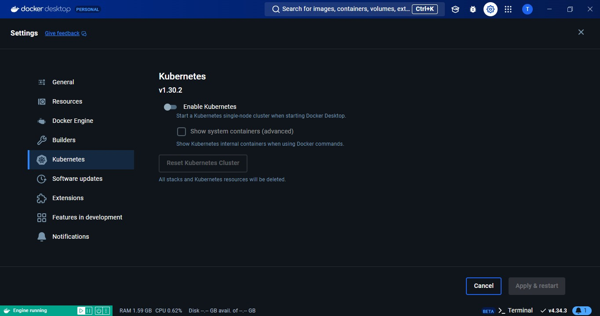
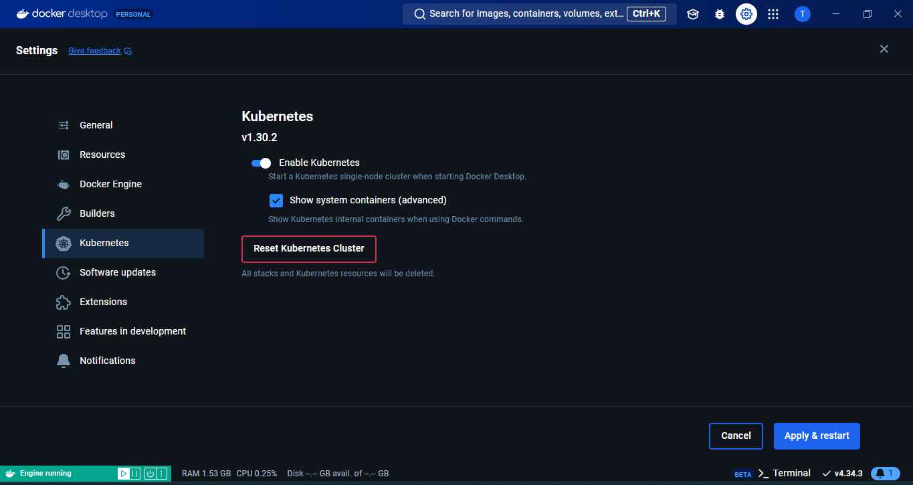

# الحصول على Kubernetes  
يعرض هذا الفصل بعض الطرق للحصول على *كلاستر* Kubernetes يمكنك استخدامه لمتابعة الأمثلة العملية طوال الكتاب.

ستتعلم كيف تقوم بما يلي:  
1. إنشاء *كلاستر* Kubernetes على جهازك الشخصي (مجاني).  
2. إنشاء *كلاستر* Kubernetes مستضاف في *cloud* (بتكلفة).  


هناك العديد من الطرق للحصول على Kubernetes، ولا يمكننا تغطيتها جميعًا. ومع ذلك، فقد اخترت اثنين من الخيارات السهلة التي ستتيح لك متابعة معظم الأمثلة في الكتاب. يمكنك استخدام *كلاستر* آخر، ولكن قد تحتوي بعض الأمثلة العملية على اختلافات صغيرة ودقيقة.

مثال الحاسوب الشخصي يقوم بإنشاء *كلاستر* Kubernetes مكوّن من *node* واحدة باستخدام Docker Desktop. أوصي بهذه الطريقة لمعظم القراء لأنها مجانية وتتيح متابعة جميع الأمثلة تقريبًا.

أما مثال *cloud*، فيقوم ببناء *كلاستر* Google Kubernetes Engine (GKE) بدرجة إنتاجية عالية في Google Cloud. هذا الخيار سهل البناء والاستخدام، لكنه يكلف مالًا! استخدم هذا الخيار فقط إذا كنت على استعداد لإنفاق المال.

## إنشاء *كلاستر* Kubernetes على جهازك الشخصي  
ستأخذك هذه القسم خطوة بخطوة لإنشاء *كلاستر* Kubernetes مكوّن من *node* واحدة باستخدام Docker Desktop.

ستكمل الخطوات التالية لإنشاء *الكلاستر*:  
- تثبيت Docker Desktop  
- تفعيل *كلاستر* Kubernetes المدمج في Docker Desktop  
- اختبار *الكلاستر* الخاص بك  

تثبيت Docker Desktop  
يُعد Docker Desktop أسهل طريقة للحصول على Docker وKubernetes وkubectl على جهازك الشخصي. كما يوفر واجهة مستخدم مريحة تُسهل التبديل بين *contexts* الخاصة بـ kubectl. *kubectl* هو أداة سطر الأوامر لـ Kubernetes، وستحتاج إليه لجميع الأمثلة في الكتاب.

*context* الخاص بـ kubectl هو مجموعة إعدادات تُحدد لـ kubectl أي *كلاستر* تُصدر الأوامر إليه وأي بيانات اعتماد تُستخدم لل authentication. ستتعرف على المزيد عنها لاحقًا.

اتبع الخطوات البسيطة التالية لتثبيت Docker Desktop:  
1. ابحث في الإنترنت عن Docker Desktop.  
2. قم بتنزيل المثبّت المناسب لنظامك (Linux، Mac، أو Windows).  
3. قم بتشغيل المثبّت واتبع التعليمات بالضغط على "التالي" حتى يتم التثبيت.

يجب على مستخدمي Windows تثبيت *WSL 2* عند الطلب. بعد التثبيت، قد تحتاج إلى بدء التطبيق يدويًا. يحصل مستخدمو Mac على أيقونة حوت في شريط القائمة في الأعلى عند التشغيل، بينما تظهر أيقونة الحوت في شريط النظام في الأسفل لمستخدمي Windows. بالنقر على أيقونة الحوت، يمكنك الوصول إلى بعض عناصر التحكم الأساسية ومعرفة ما إذا كان Docker Desktop يعمل.

افتح نافذة طرفية (Terminal) وقم بتشغيل الأوامر التالية للتأكد من تثبيت Docker وkubectl وأنهما يعملان بشكل صحيح.


```bash
docker --version
Docker version 25.0.2, build 29cf629
```


```bash
kubectl version --client=true -o yaml
clientVersion:
compiler: gc
gitVersion: v1.29.1
major: "1"
minor: "29"
platform: darwin/arm64

```

### تفعيل *كلاستر* Kubernetes المدمج في Docker Desktop 


انقر على أيقونة الحوت الخاصة بـ Docker في شريط القائمة أو في شريط النظام، ثم اختر خيار **Settings**.

حدد **Kubernetes** من شريط التنقل الأيسر، ثم قم بتفعيل خيار **Enable Kubernetes**، وانقر على **Apply & restart**.

سيستغرق الأمر دقيقة أو دقيقتين ليقوم Docker Desktop بتحميل الصور المطلوبة وتشغيل *الكلاستر*. ستتحول أيقونة Kubernetes في أسفل يسار نافذة Docker Desktop إلى اللون الأخضر عندما يصبح *الكلاستر* جاهزًا ويعمل.





اختبار *الكلاستر*  
قم بتشغيل الأمر التالي للتأكد من أن *الكلاستر* يعمل بشكل جيد وأن *kubectl context* الخاص بك مضبوط:

```bash
$ kubectl get nodes
```

ستظهر نتيجة مشابهة للتالي:

```
NAME              STATUS   ROLES           AGE    VERSION
docker-desktop    Ready    control-plane   93d    v1.29.1
```

مبروك! لقد قمت بإنشاء *كلاستر* Kubernetes على جهازك الشخصي يمكنك استخدامه لمعظم الأمثلة العملية في الكتاب. لن تتمكن من استخدامه لبعض أمثلة التخزين، حيث تستفيد من ميزات التخزين المتقدمة في Google Cloud. ستقوم أيضًا بإنشاء *كلاستر* مختلف لفصل WebAssembly.

إنشاء *كلاستر* Kubernetes مستضاف في السحابة  
هذه الخيار يكلف مالًا. تأكد من فهمك للتكاليف قبل إنشاء هذا *الكلاستر*. أوصي أيضًا بحذفه بمجرد الانتهاء من استخدامه. عادةً ما أقوم بحذفه كل ليلة وأقوم بإنشاء واحد جديد عندما أفتح الكتاب وأرغب في تجربة بعض التمارين العملية.

تقدم جميع المنصات السحابية الكبرى خدمة Kubernetes مستضافة. هذا هو نموذج حيث يقوم مزود الخدمة السحابية ببناء *الكلاستر* وإدارة أشياء مثل التوفر العالي (HA) والأداء والتحديثات.

ليست جميع خدمات Kubernetes المستضافة متساوية، لكنها عادةً ما تكون الأقرب إلى *كلاستر* Kubernetes جاهز للإنتاج بدون جهد. على سبيل المثال، تُعد Google Kubernetes Engine (GKE) خدمة مستضافة تقوم بإنشاء *كلاستر* عالي الأداء وعالي التوافر يتبع أفضل ممارسات الأمان بشكل افتراضي. كل ذلك بنقرات بسيطة قليلة وبيانات بطاقة ائتمانك.

تشمل خدمات Kubernetes المستضافة الشائعة الأخرى:  
- AWS: Elastic Kubernetes Service (EKS)  
- Azure: Azure Kubernetes Service (AKS)  
- Civo Cloud Kubernetes  
- DigitalOcean: DigitalOcean Kubernetes (DOKS)  
- Google Cloud Platform: Google Kubernetes Engine (GKE)  
- Linode: Linode Kubernetes Engine (LKE)  

سنقوم بإنشاء *كلاستر* GKE، وستكمل جميع الخطوات التالية:  
- المتطلبات الأساسية لـ GKE  
- إنشاء *كلاستر* GKE  
- اختبار *كلاستر* GKE  
### المتطلبات الأساسية لـ GKE  
GKE هو خدمة Kubernetes مستضافة على منصة Google Cloud (GCP). مثل معظم خدمات Kubernetes المستضافة، فإنه يوفر:  
- طريقة سريعة وسهلة للحصول على *كلاستر* جاهز للإنتاج  
- *Control Plane* مُدار  
- فواتير مفصلة  
- تكامل مع خدمات إضافية مثل موازنات التحميل (load balancers) والأحجام (volumes) وشبكات الخدمات (service meshes) والمزيد  

لإنشاء *كلاستر* GKE، ستحتاج إلى حساب Google Cloud مع تكوين الفواتير ومشروع فارغ. هذه الخطوات سهلة الإعداد، وستفترض بقية هذا القسم أنك قد أعددتهما بالفعل.

ستحتاج أيضًا إلى أداة سطر الأوامر **gcloud CLI**. اذهب إلى [https://cloud.google.com/sdk/](https://cloud.google.com/sdk/)، انقر على زر **Get started**، واتبع التعليمات لتثبيت النسخة المناسبة لنظامك.

سيقوم المثبت تلقائيًا بتثبيت أداة سطر الأوامر **kubectl**. كجزء من التثبيت، ستتم مطالبتك بتشغيل الأمر **gcloud auth login** لتفويض الوصول إلى مشروع Google Cloud الخاص بك. سيفتح ذلك جلسة متصفح، وسيتعين عليك اتباع التعليمات وقبول المطالبات.

### إنشاء *كلاستر* GKE  
بمجرد حصولك على مشروع جديد في Google Cloud وتثبيت **gcloud CLI**، أكمل الخطوات التالية لإنشاء *كلاستر* GKE جديد:

1. اذهب إلى [https://console.cloud.google.com/](https://console.cloud.google.com/) واختر **Kubernetes Engine > Clusters** من شريط التنقل على اليسار. قد تحتاج إلى النقر على الأشرطة الأفقية الثلاثة (hamburger) في الزاوية العلوية اليسرى لجعل شريط التنقل مرئيًا.
2. اختر الخيار لإنشاء *كلاستر* ثم اختر خيار **SWITCH TO STANDARD CLUSTER**. لا تقم بإنشاء *AutoPilot cluster*، حيث إن هذه لا تعمل حاليًا مع جميع الأمثلة. سيتم طلب تأكيد أنك تريد الانتقال من *autopilot* إلى *standard*.
3. أعطِ *كلاسترك* اسمًا ذا مغزى. ستستخدم الأمثلة في الكتاب **gke-tkb**.
4. اختر *Regional cluster* في نوع الموقع. بعض الأمثلة لاحقًا في الكتاب ستعمل فقط مع *regional clusters*.
5. اختر منطقة لـ *كلاسترك*.
6. انقر على **Release channel** واختر أحدث إصدار من القناة **Rapid**.
7. انقر على **default-pool** من قائمة التنقل على اليسار واضبط **Number of nodes (per zone)** إلى 1 في قسم **Size**.
8. يمكنك استكشاف الإعدادات الأخرى. ومع ذلك، لا تقم بتغيير أي منها لأنها قد تؤثر على الأمثلة لاحقًا في الكتاب.
9. بمجرد أن تكون راضيًا عن تكوينك والتكلفة الشهرية المقدرة، انقر على **Create**.

سيستغرق إنشاء *كلاسترك* بضع دقائق.

### اختبار *كلاستر* GKE  
تُظهر صفحة *الكلاسترز* في وحدة التحكم الخاصة بك على Google Cloud نظرة عامة عالية المستوى عن *كلاسترات* Kubernetes في مشروعك. لا تتردد في استكشاف بعض الإعدادات والتعرف عليها.

انقر على النقاط الثلاث إلى يمين *كلاسترك* الجديد لكشف خيار **Connect**. يقدم قسم الوصول عبر سطر الأوامر أمر **gcloud** طويل لتكوين **kubectl** للتواصل مع *كلاسترك*. انسخ الأمر إلى الحافظة الخاصة بك وقم بتشغيله في طرفية (terminal).

```bash
$ gcloud container clusters get-credentials gke-tkb --region...
```

ستظهر لك الرسالة التالية:
```
Fetching cluster endpoint and auth data.
kubeconfig entry generated for gke-tkb.
```

عند اكتمال الأمر، قم بتشغيل الأمر التالي باستخدام **kubectl** لعرض العقد (nodes) في *الكلاستر*.

```bash
$ kubectl get nodes
```

ستظهر لك قائمة بالعقد، مثل:

```
NAME                                STATUS   ROLES    VERSION
gke-gke-tkb-default...h2gp         Ready    <none>   v1.29.0-gke.1381000
gke-gke-tkb-default...l29b         Ready    <none>   v1.29.0-gke.1381000
gke-gke-tkb-default...qzv6         Ready    <none>   v1.29.0-gke.1381000
```

تأكد من أن أسماء العقد وإصدار Kubernetes تتعلق بـ *كلاسترك* GKE الذي أنشأته. لاحظ كيف أن جميع العقد تحمل القيمة `<none>` في عمود **ROLES**. وذلك لأن GKE هو منصة مستضافة ولا يسمح لك برؤية عقد *control plane*، حيث يقوم GKE بإدارة عقد *control plane* ويخفيها عنك.

إذا حصلت على تحذير بشأن إلغاء دعم المكون الإضافي للتوثيق (auth plugin)، فاتبع التعليمات في المقالة المرتبطة.

### تهانينا!  
لقد أنشأت *كلاستر* Kubernetes جاهز للإنتاج يمكنك استخدامه في معظم الأمثلة العملية. ستقوم بإنشاء *كلاستر* مختلف لفصل WebAssembly.


### تحذير  
تأكد من حذف *الكلاستر* بمجرد الانتهاء من استخدامه لتجنب التكاليف غير المرغوب فيها. أوصي بحذف *الكلاستر* يوميًا وإنشاء واحد جديد كلما بدأت في قراءة الكتاب وتحتاج إلى *كلاستر*. سيتسبب هذا بالطبع في حذف أي شيء تم إنشاؤه على *الكلاستر* الذي تحذفه.

**العمل مع kubectl**  
`kubectl` هو أداة الـ command-line لـ Kubernetes، وستستخدمه في جميع الأمثلة العملية. إذا اتبعت التعليمات لتثبيت أحد الـ clusters، فسيكون لديك `kubectl` بالفعل.

اكتب `kubectl` في نافذة terminal للتحقق مما إذا كان لديك. إذا لم يكن لديك، يمكنك البحث على الإنترنت عن "install kubectl" واتباع التعليمات حسب نظام التشغيل لديك.

من المهم أن تكون نسخة `kubectl` لديك لا تزيد أو تقل أكثر من إصدار فرعي واحد عن النسخة التي يشغلها الـ cluster. على سبيل المثال، إذا كان الـ cluster يعمل بنسخة Kubernetes 1.29.x، يجب أن تكون نسخة `kubectl` لديك بين 1.28.x و1.30.x.

على مستوى عالٍ، يقوم `kubectl` بتحويل الأوامر السهلة الاستخدام إلى طلبات HTTP REST ويرسلها إلى API server. خلف الكواليس، يقرأ ملف `kubeconfig` لمعرفة الـ cluster الذي يجب إرسال الأوامر إليه وبيانات الـ credentials التي يجب استخدامها.

يُعرف ملف `kubeconfig` باسم `config` ويقع في الـ hidden directory `.kube` في الـ home directory. يحتوي على definitions لـ:
- **Clusters**
- **Users** (credentials)
- **Contexts**

**Clusters** هو قائمة بـ Kubernetes clusters التي يعرفها `kubectl` ويسمح بتثبيت `kubectl` واحد لإدارة عدة clusters. يحتوي definitions  كل cluster على اسم، و certificate info، و endpoint الخاصة بـ API server.

> [!NOTE]
>
> في Kubernetes، **Clusters** هو مفهوم يُشير إلى مجموعة من الموارد (مثل العقد والـ Pods) التي تُدار معًا لتوفير بيئة تنفيذية موحدة. إليك شرحًا تفصيليًا لكل من مكونات تعريف الـ cluster المستخدمة في `kubectl`:
>
> 1. **اسم الـ Cluster (Name)**
>
>    - يُمثل اسم الـ cluster هوية فريدة تُستخدم للإشارة إلى هذا الـ cluster.
>    - يساعد الاسم في التمييز بين عدة clusters عندما يكون هناك أكثر من cluster مُدار بواسطة نفس نسخة `kubectl`.
>
> 2. **معلومات الشهادة (Certificate Info)**
>
>    - تحتوي على تفاصيل حول Certificate  المستخدمة لتأمين الاتصالات مع الـ API server.
>    - تتضمن معلومات حول **Certificate Authority (CA)** التي أصدرت الشهادة، مما يسمح بالتحقق من صحة الشهادة.
>    - Certificates تستخدم بروتوكولات مثل TLS لضمان أن البيانات المُرسلة والمُستقبلة بين client وAPI server مشفرة وآمنة.
>
> 3. ** بـ API Server (API Server Endpoint)**
>
>    - تُشير إلى عنوان URL الذي يتم من خلاله الوصول إلى API server للـ cluster.
>    - يتضمن عادةً عنوان IP أو اسم hostname مع  (port) لتمكين الاتصال.
>    - يسمح هذا endpoint لـ `kubectl` أو لأي عميل آخر بإرسال الطلبات إلى الـ API server لتنفيذ الأوامر أو استعلامات الحالة.
>
> مثال على تعريف Cluster
>
> إليك مثال على كيفية تعريف cluster في ملف kubeconfig:
>
> ```yaml
> clusters:
> - name: my-cluster
>   cluster:
>     server: https://192.168.1.77:8443
>     certificate-authority-data: LS0tLS1CRUdJTiBDRVJ...
> ```
>
> الشرح على المثال
>
> - **name: my-cluster**: يُمثل اسم الـ cluster المُعرف، وهو "my-cluster".
> - **server: https://192.168.1.77:8443**: يُشير إلى نقطة النهاية الخاصة بـ API server، حيث يمكن لـ `kubectl` التواصل مع هذا الـ cluster.
> - **certificate-authority-data: LS0tLS1CRUdJTiBDRVJ...**: يحتوي على بيانات الشهادة الخاصة بـ Certificate Authority، مما يتيح لـ `kubectl` التحقق من أن الاتصال آمن.
>
> ### أهمية هذا التعريف
>
> يُساعد تعريف الـ cluster في الـ kubeconfig على:
> - تمكين المستخدمين من إدارة الـ clusters المتعددة بسهولة.
> - توفير الأمان من خلال الشهادات.
> - تسهيل عملية التواصل مع API server للقيام بالعمليات المختلفة مثل نشر التطبيقات، إدارة الموارد، والمراقبة.

**Users** هو قائمة ببيانات credentials للمستخدمين. على سبيل المثال، قد يكون لديك مستخدم dev ومستخدم ops مع أذونات مختلفة. كل من هؤلاء يوجد في ملف `kubeconfig` وله اسم (friendly) ومجموعة من بيانات الـ credentials. إذا كنت تستخدم شهادات X.509، فإن اسم المستخدم والمجموعة التي يستخدمها Kubernetes تكون مضمنة في certificate.

> [!NOTE]
>
> في Kubernetes، **Users** يمثل مجموعة من بيانات الاعتماد (credentials) الخاصة بالمستخدمين الذين يمكنهم الوصول إلى الـ clusters وإجراء عمليات مختلفة على الموارد. إليك شرحًا تفصيليًا لمكونات **Users** في ملف `kubeconfig`:
>
> 1. **بيانات الاعتماد (Credentials)**
>
>    - بيانات الاعتماد تُستخدم للتحقق من هوية المستخدم وتحديد ما إذا كان لديه الأذونات المناسبة للوصول إلى الموارد.
>    - تشمل عادةً اسم المستخدم وكلمة المرور أو شهادة (مثل X.509) ومفتاح خاص.
>
> 2. **أمثلة على المستخدمين**
>
>    - **مستخدم dev**: قد يُمنح هذا المستخدم أذونات محدودة، مثل القدرة على تطوير ونشر التطبيقات، ولكن ليس لديه إمكانية الوصول إلى إعدادات النظام الأساسية.
>    - **مستخدم ops**: هذا المستخدم قد يكون لديه أذونات أكبر، مثل القدرة على إدارة موارد الـ cluster وصيانته، مما يجعله مسؤولًا عن التشغيل اليومي.
>
> 3. **الوصف (Friendly Name)**
>
>    - يُمثل اسم المستخدم في ملف `kubeconfig` اسمًا وصفيًا . هذا الاسم لا يُستخدم في Kubernetes، لكنه يُسهل الفهم.
>
> 4. ** certificate X.509**
>
>    - إذا كنت تستخدم certificates X.509، يتم تضمين اسم المستخدم والمجموعة المستخدمة في الشهادة نفسها.
>    - هذا يعني أن Kubernetes يمكنه التحقق من هوية المستخدم من خلال certificate دون الحاجة إلى إدخال اسم المستخدم وكلمة المرور بشكل صريح.
>
> مثال على تعريف المستخدم في ملف kubeconfig
>
> ```yaml
> users:
> - name: dev-user
>   user:
>     client-certificate-data: LS0tLS1CRUdJTiBDRVJ...
>     client-key-data: LS0tLS1CRUdJTiBFQyB...
> - name: ops-user
>   user:
>     username: ops
>     password: mypassword
> ```
>
> الشرح على المثال
>
> - **name: dev-user**: يُمثل اسم المستخدم، في هذه الحالة هو "dev-user".
> - **client-certificate-data**: يحتوي على بيانات certificate  الخاصة بالمستخدم، مما يتيح التحقق من هوية المستخدم.
> - **client-key-data**: يحتوي على المفتاح الخاص المستخدم مع certificate .
> - **name: ops-user**: اسم مستخدم آخر يُظهر كيفية تعريف مستخدم مختلف.
> - **username** و **password**: تمثل بيانات credentials بسيطة تُستخدم للتحقق من هوية المستخدم.
>
> أهمية تعريف المستخدمين
>
> - يسمح بتحديد أذونات كل مستخدم، مما يُسهم في تعزيز الأمان داخل الـ cluster.
> - يسهل إدارة الوصول إلى الموارد ويضمن أن المستخدمين لديهم فقط الأذونات اللازمة لأداء مهامهم.
> - يضمن أن كل العمليات تتم بواسطة مستخدمين مصرح لهم، مما يقلل من المخاطر الأمنية.

**Contexts** هي الطريقة التي يقوم بها `kubectl` بتجميع clusters و users تحت اسم friendly

فيما يلي ملف `kubeconfig` بسيط يحتوي على cluster واحد يسمى shield، ومستخدم واحد يسمى coulson، وسياق واحد يسمى director. يجمع سياق director بين المستخدم coulson و cluster shield، كما تم تعيينه كـContext افتراضي.

```yaml
apiVersion: v1
kind: Config
clusters:                     # Cluster definitions in this block
- name: shield               # Friendly name for a cluster
  cluster:
    server: https://192.168.1.77:8443   # Cluster's API endpoint
    certificate-authority-data: LS0tLS1CRUdJTiBDRVJ # Cluster's certificate
users:                        # User definitions in this block
- name: coulson               # Friendly name not used by Kubernetes
  user:
    client-certificate-data: LS0tLS1CRUdJTiBDRV...  # User certificate
    client-key-data: LS0tLS1CRUdJTiBFQyB            # User private key
contexts:                     # Contexts in this block
- context:
    name: director            # Context called "director"
    cluster: shield           # Send commands to this cluster
    user: coulson             # Authenticate as this user
current-context: director     # kubectl will use this context
```

يمكنك تشغيل أمر `kubectl config view` لعرض ملف `kubeconfig` الخاص بك. سيقوم الأمر بإخفاء البيانات الحساسة.  
يمكنك رؤية السياق الحالي الخاص بك باستخدام أمر `kubectl config current-context`.  
المثال التالي يوضح نظامًا تم اعداد `kubectl` فيه لاستخدام الـ cluster والمستخدم المحددين في `docker-desktop context`:  

```bash
$ kubectl config current-context
docker-desktop
```

يمكنك تغيير context الحالي عن طريق تشغيل أمر `kubectl config use-context`. الأمر التالي يحدد context الحالي إلى `hpa-test`. سيفيدك ذلك فقط إذا كان ملف `kubeconfig` الخاص بك يحتوي على سياق صالح يسمى `hpa-test`.  

```bash
$ kubectl config use-context hpa-test
Switched to context "hpa-test".
$ kubectl config current-context
hpa-test
```

إذا قمت بتثبيت Docker Desktop، يمكنك بسهولة التبديل بين  `kubectl contexts` عن طريق النقر على حوت Docker واختيار خيار **Kubernetes Context**.