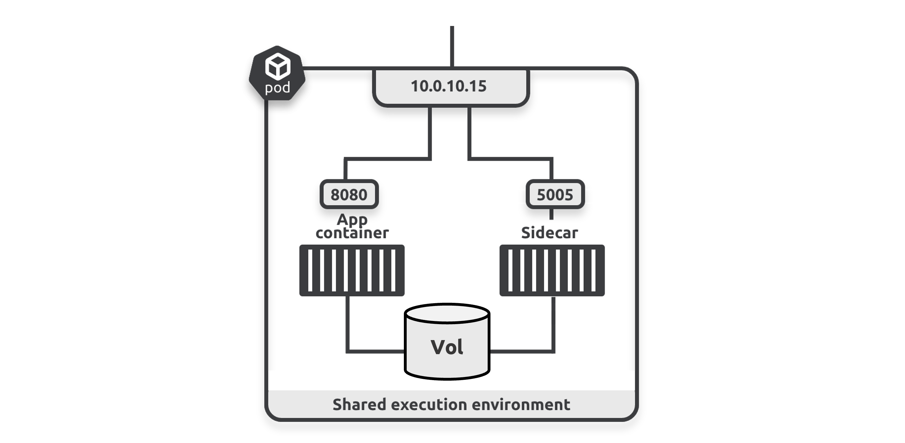

- [ ] # ** 4: العمل مع Pods**  

كل تطبيق على Kubernetes يعمل داخل Pod.  
• • When you deploy an app, you deploy it in a Pod
• When you terminate an app, you terminate its Pod
• When you scale an app up, you add more Pods
• When you scale an app down, you remove Pods
• When you update an app, you deploy new Pods
هذا يجعل Pods مهمة، وهو السبب وراء تفصيل هذا الفصل.  
يتكون الفصل من جزئين رئيسيين:  
• نظرية Pod  
• العمل العملي مع Pods  
إذا كان بعض المحتوى الذي نحن على وشك تغطيته يبدو مألوفًا، فذلك لأننا نبني على بعض المفاهيم التي تم تقديمها في الفصل 2.  
كما سنكتشف أيضًا أن Kubernetes يستخدم Pods لتشغيل أنواع مختلفة من work loads. ومع ذلك، في معظم الأحيان، تعمل Pods على تشغيل الحاويات، لذا سنشير إلى الحاويات في معظم الأمثلة.  

1. يركز kubernetes على كيفية عمل deploy و عمل Manage  للــpods  بدون ما تراعي ما بداخل pods 
2. الاحمال غير المتجانسة (Heterogenous workloads) أي من تطبيقات مختلفة تسطيع العمل بجانب بعضها البعض وفى نفس cluster وتستفيد من kubernetes API (وتعني انه يقدم api تسمح للمستخدمين بتحديد desired  state الخاصة بالــkubernetes وبأدارت التغييرات المطلوبة  مثل auto scalling و أيضا rolling update غيرها )  وتحصل عل جميع فوائد pods

تعمل **Containers** و**Wasm** apps مع **standard Pods** و**standard workload controllers** و**standard runtimes**. ومع ذلك، تحتاج **serverless functions** و**VMs** إلى بعض المساعدة الإضافية بمعنى قد تستخدم بعض الادوات الاضافية والاعدادت.

تعمل **Serverless functions** داخل standard Pods ولكنها تتطلب تطبيقات مثل **Knative**  لاجل extend  للـ  API باستخدام موارد و controllers مخصصة. **VMs** مشابهة، حيث تحتاج إلى تطبيقات مثل **KubeVirt** لاجل extend  للـ  API  الخاصة به .

يوضح الشكل 4.1 أربعة أحمال عمل مختلفة تعمل على نفس **cluster**. يتم تغليف كل workload داخل **Pod**، ويتم إدارته بواسطة **controller**، ويستخدم standard runtime . تعمل أحمال عمل **VM** داخل **VirtualMachineInstance (VMI)** بدلاً من **Pod**، ولكن **VMIs** تشبه إلى حد كبير **Pods** وتستفيد من العديد من ميزات **Pods**.


الـ Pods  تعزيز او تحسن workload بعدة طرق


كيفية تعزيز Pods للأحمال:

1. **مشاركة الموارد (Resource sharing)**:
   - **ماذا يعني؟**: يمكن للحاويات (containers) الموجودة داخل نفس Pod أن تشارك نفس الموارد، مثل الذاكرة (RAM) ووحدة المعالجة المركزية (CPU).
   - **الفائدة**: يساعد ذلك في استخدام الموارد بشكل أفضل، حيث يمكن أن تعمل الحاويات معًا بشكل أكثر كفاءة.

2. **جدولة متقدمة (Advanced scheduling)**:
   - **ماذا يعني؟**: تقوم Kubernetes بتوزيع Pods على العقد (nodes) في الـ cluster بشكل ذكي.
   - **الفائدة**: يضمن ذلك أن تكون الموارد متاحة وأن تعمل التطبيقات بسلاسة دون أي مشاكل في الأداء.

3. **فحوصات صحة التطبيق (Application health probes)**:
   - **ماذا يعني؟**: توفر Kubernetes طرقًا لفحص صحة containers داخل Pods. 
   - **الفائدة**: إذا كانت container غير سليمة أو تحتاج إلى إعادة تشغيل، يمكن للنظام اكتشاف ذلك وإعادة تشغيل container تلقائيًا.

4. **سياسات إعادة التشغيل (Restart policies)**:
   - **ماذا يعني؟**: تحدد كيفية تعامل Kubernetes مع الحاويات عند حدوث خطأ.
   - **الفائدة**: إذا تعطل تطبيق، يمكن لـ Kubernetes إعادة تشغيله تلقائيًا، مما يقلل من الوقت الذي يكون فيه التطبيق غير متاح.

5. **سياسات الأمان (Security policies)**:
   - **ماذا يعني؟**: تُستخدم سياسات مختلفة لحماية Pods.
   - **الفائدة**: تضمن هذه السياسات أن التطبيقات آمنة وتتحكم في من يمكنه الوصول إليها.

6. **التحكم في الإنهاء (Termination control)**:
   - **ماذا يعني؟**: يُعطى التحكم في كيفية إنهاء Pods.
   - **الفائدة**: يضمن ذلك عدم فقدان البيانات عند إيقاف تشغيل التطبيقات.

7. **(Volumes)**:
   - **ماذا يعني؟**: يمكن لـ Pods استخدام Volumes لتخزين البيانات.
   - **الفائدة**: يتيح ذلك للحاويات داخل Pod مشاركة البيانات بسهولة.

يمكنك معرفة attribute ألخاصة بـpods من خلال الامر التالي يظهر كل attr الخاصة بـpods  وساسية اعادة التشغيل

```bash
$ kubectl explain pods --recursive
```


- **ماذا يفعل؟**: يُظهر تفاصيل شاملة حول جميع خصائص Pods تظهر خصائص كثيرة تصل فوق 1000 سطر.
- **الفائدة**: يساعد المطورين على فهم كيفية عمل Pods وخصائصها.
```bash
$ kubectl explain pod.spec.restartPolicy
```
   - **ماذا يفعل؟**: يوضح كيفية ضبط سياسة إعادة التشغيل containers داخل Pod.
   - **الفائدة**: يساعد في تحديد ما يحدث عند تعطل تطبيق، سواء سيتم إعادة تشغيله دائمًا، أو عدم إعادة تشغيله، أو إعادة تشغيله عند حدوث فشل.

تمكن Pods من مشاركة الموارد.  
تشغل Pods واحداً أو أكثر من  container، وتشارك جميع  containers في نفس Pod بيئة التنفيذ الخاصة بالـ Pod. وهذا يشمل: 
• Shared filesystem and volumes (mnt namespace)
• Shared network stack (net namespace)
• Shared memory (IPC namespace)
• Shared process tree (pid namespace)
• Shared hostname (uts namespace)

تظهر الصورة 4.2  multi containers Pod  حيث تشارك كلا الحاويتين نفس volume و أيضا شبكة Pod .



يمكن للتطبيقات والعملاء الآخرين الوصول إلى containers عبر عنوان IP الخاص بالـ Pod 10.0.10.15 — حيث يتوفر container  التطبيق الرئيسية على المنفذ 8080 وContainer الـ sidecar على المنفذ 5005. يمكنهم استخدام  localhost الخاص بالـ Pod إذا كانوا بحاجة للتواصل مع بعضهم داخل الـ Pod. كما أن كلا  containers يقومان بعمل   mount على نفس volume وأي   Pod ويمكنهما استخدامه لمشاركة البيانات. على سبيل المثال، قد يقوم container الـ sidecar بمزامنة المحتوى الثابت من  Git repo بعيد وتخزينه في volume حيث تقوم main containers بقراءته وتقديمه كصفحة ويب.

### Pods and scheduling
تضمن Kubernetes  ان  يحدث scheduling  لجميع containers في نفس الـ Pod على نفس الـ cluster. على الرغم من ذلك، يجب عليك وضع containers في نفس الـ Pod فقط إذا كانت تحتاج لمشاركة الموارد مثل main memory، و volumes، والشبكات. إذا كان متطلبك الوحيد هو scheduling   الـ containers على نفس cluster، فيجب عليك وضعهما في Pods منفصلة واستخدام أحد الخيارات التالية لجدولتهما معًا.

> [!TIP]
>
> قبل المتابعة، تذكر أن **nodes** هي host server يمكن أن تكون physical server، أو VM، أو   cloud instances  فى النهاية. **Pods** تغلف **containers** وتنفذ على **nodes**.


توفر Pods العديد من ميزات **scheduling** المتقدمة، بما في ذلك جميع الميزات التالية:
- **nodeSelectors**

- **Affinity** و **anti-affinity**

- **Topology spread constraints**

   **(resource requests and resource limits)**

تعد **nodeSelectors** الطريقة الأبسط لتشغيل Pods على **nodes** محددة. يمكنك إعطاء **nodeSelector** قائمة من **labels**، وسيتولى **scheduler** تعيين **Pod** إلى **node** التي تحتوي على جميع **labels**.

تشبه قواعد **affinity** و **anti-affinity** **nodeSelector** لكنها أكثر قوة. 

وكما يوضح الاسمان ، فهي تدعم قواعد **affinity** و **anti-affinity**، وأيضًا تدعم  **(hard rules)** و (soft rules)**، ويمكنها الاختيار بين **nodes** و **Pods**:

> [!TIP]
>
> ويمكنها الاختيار بين **nodes** و **Pods**: معنى هذة الجملة 
>
> بمعنى آخر، يمكنك استخدام **affinity** و **anti-affinity** لتحديد أين يجب أن يتم توزيع **Pods** بالنسبة لبعضها البعض أو بالنسبة لمجموعة معينة من **nodes**، وذلك من خلال إنشاء قواعد تجعل **Pods**:
>
> - تُفضل أو تبتعد عن بعضها البعض داخل نفس **node**.
> - تنتشر على **nodes** معينة أو تتجنبها.


- Affinity rules attract
- • Anti-affinity rules repel
- • Hard rules must be obeyed
- • Soft rules are only suggestions

اختيار **nodes** أمر شائع ويعمل مثل **nodeSelector** حيث تقدم قائمة من **labels**، ويقوم **scheduler** بتعيين **Pod** إلى **nodes** التي تمتلك هذه **labels**.

للاختيار بناءً على **Pods**، يستخدم **scheduler** قائمة مشابهة من **labels** ويقوم بجدولة **Pod** على **nodes** التي تشغل **Pods** أخرى تمتلك نفس **labels** بحثيث انني اجعل Pod تعمل بجانب Pod أخرى 

اعتبر بعض الأمثلة.  
 hard node affinity rule  التي تحدد **label** **project=qsk** تخبر **scheduler** بأنه يمكنه تشغيل **Pod** فقط على **nodes** التي تحمل **label** **project=qsk**. إذا لم يتمكن من العثور على **node** بهذا **label**، فلن يقوم بـschedule  الـ **Pod** وستكون pending . إذا كانت soft rule، فسيحاول **scheduler** العثور على **node** بالـ **label**، ولكن إذا لم يجد واحدة، فسيقوم بجدولته على أي node . إذا كانت قاعدة **anti-affinity**، فسيبحث **scheduler** عن **nodes** التي لا تمتلك **label**. وبنفس المنطق السابق لكل  Pod-based rules


أيضا نشر Pods طبقا للـtopology الخاص بك فيمكنك عمل deploy  للـ pods بذكاء على infrustructure  من اجل الحصول availability و افضل performance و أو طبقا للـlocality بحيث اختار الأقرب لمكان معين او لاي متطلبات اخرى 


### Deploy pods

يتضمن   (deploy pods) الخطوات التالية:

1. تحديد موصفات الـpods فى ملف yaml minifest 

2. ارسال ملف الـyaml الى API server

3. يحدث لطلب authenticated و authorized

4. التحقق من pod spec

    > [!TIP]
    >
    > هذه الخطوة تتضمن التأكد من أن مواصفات الـ Pod في ملف الـ YAML تلتزم بالقواعد والقيود التي يفرضها الـ Kubernetes
    >
    > الخطوة رقم 4 في عملية نشر الـ Pod هي (Pod spec validation). هذه الخطوة تتضمن التأكد من أن مواصفات الـ Pod في ملف الـ YAML تلتزم بالقواعد والقيود التي يفرضها الـ Kubernetes. 
    >
    > بالتفصيل:
    >
    > - **التأكد من صحة الصيغة**: يتم أولاً التحقق من أن ملف الـ YAML مكتوب بشكل صحيح وفقًا للـ API schema الخاص بالـ Kubernetes. إذا كان هناك أي خطأ في البنية أو التنسيق، سيتم رفض الـ Pod ولن يتم deploy له.
    >
    > - **التحقق من الخصائص**: يتم التحقق من صحة الخصائص المحددة في الـ Pod spec. على سبيل المثال، يتم التأكد من أن الحقول مثل `containers`, `resources`, `volumes`, و `labels` تم تعريفها بشكل صحيح، وأن القيم المدخلة ضمن الحدود المسموح بها.
    >
    > - **التحقق من القيود**: يقوم Kubernetes بالتحقق من القيود التي قد تكون محددة في الـ Pod spec، مثل:
    >   - **حدود الذاكرة والمعالج**: إذا كانت الموارد المحددة للـ Pod تتجاوز الحدود المسموح بها على الـ node.
    >   - **المتطلبات الخاصة بالحجم**: مثل حجم التخزين أو نوعه.
    >
    > إذا كانت المواصفات لا تلتزم بالمعايير، سيتم إرجاع خطأ ولن يتم متابعة النشر إلى الخطوات التالية.

    

5. **يقوم scheduler بعمل filter:** يقوم Kubernetes (Scheduler) بتصفية (Nodes) المتاحة بناءً على عدة عوامل، بما في ذلك:

    * nodeSelectors
    *  (affinity and anti-affinity rules)
    * **(topology spread constraints):** .
    *  (resource requirements and limits):

6. يتم تعيين او وضع الـpods على healthy node والذي يحققوا كل requirments

7. يراقب  kubelet، الذي يعمل على كل node، يقوم نقدر نقول watches او ينتظر أوامر من API server  عندما يلاحظ kubelet  تعيين او وضع pod على node الخاصة به 

8. يقوم kubelet بتنزيل pod spec من API Server ويطلب من  (Local Runtime) مثل Docker أو containerd  تشغيل container  داخل pod.

9.  kubelet  يقوم بمراقبة pod status باستمرار ويُبلغ API Server بأي تغييرات في status، مثل بدء التشغيل، أو التوقف، أو الفشل.

اذا لم يجد scheduler اي node مناسبة يتم وضع pod في حالة pending

Deploying a Pod عبارة عن عملية atomic operation  وهذا يعني ان pod تبدأ العمل او استقبال الطلبات عند تكون كل container فى حالة up و running

### Pod lifecycle

pods مصممة لتكون  mortal و أيضا immutable.

Mortal  تعني أنه عند إنشاء pod، تقوم بتنفيذ مهمة ثم ينتهي. بمجرد أن يكمل البود مهمته، يتم حذفه ولا يمكن إعادة تشغيله. نفس الشيء إذا فشل البود، حيث يتم حذفه ولا يمكن إعادة تشغيله.  

Immutable تعني أنه لا يمكن تعديل Pods بعد deployed. قد يكون هذا تغييرًا كبيرًا في التفكير إذا كنت تأتي من خلفية تقليدية حيث تقوم عادة بتحديث او تعديل على server  بشكل مباشر  وتسجيل الدخول إليها لإجراء إصلاحات وتغييرات في الأعدادت. إذا كنت بحاجة إلى تغيير pod، يجب عليك إنشاء بود جديد بالتغييرات، وحذف البود القديم واستبداله بالجديد. إذا كان البود يحتاج إلى تخزين البيانات، يجب عليك تخزين فى volume عن طريق عمل attach للـ volume على pods لان أي بيانات سيتم حفظها داخل الـ Pod سيتم حذفها عند توقف او حذف الـpod الا اذا كانت على volume

لنلقِ نظرة على typical Pod lifecycle
أنت تعرف البود عبارة عن object فى  YAML  تقوم ارساله  إلى API Server. يدخل pod في مرحلة الانتظار (pending) بينما يبحث scheduler  عن nodes لتشغيله عليها. إذا تم العثور على node، يتم scheduling الـpod، ثم يقوم kubelet المحلي بإصدار تعليمات او ألاوامر  للـ runtime لبدء containers الخاصة به. بمجرد تشغيل جميع containers، يدخل pod في مرحلة التشغيل (running). يظل البود في مرحلة التشغيل إلى أجل غير مسمى إذا كان long live pod، مثل web server.

أما إذا كان short-lived Pod، مثل  (batch job)، فإنه يدخل حالة "تم النجاح" (succeeded) بمجرد أن تكمل جميع الحاويات مهامها. يتم عرض هذا في الشكل 4.3.


> [!NOTE]
>
> ملاحظة سريعة حول تشغيل (VMs) على Kubernetes.  
> VMs مصممة كـobjects قابلة للتعديل وغير mortal او فنية. على سبيل المثال، يمكنك إعادة تشغيلها، تغيير configurations,، وحتى migrate (ترحيلها). هذا يختلف تمامًا عن أهداف التصميم الخاصة pods، ولهذا السبب يقوم KubeVirt بتغليف VMs في pod معدّل يسمى VirtualMachineInstance (VMI) ويديرها باستخدام   controllers مخصصة لذلك..

### Restart Policies

ذكرنا سابقًا أن  (Pods) تضيف سياسات إعادة التشغيل للـapps. لكن هذه السياسات تُطبق على containers بشكل فردي وليس على الـPod نفسها.

**لنفكر في بعض السيناريوهات:** 

عند استخدام Deployment controller لكي يقوم بعملية schedule لي pod وعلي node وعند حدوث خطاء فى node يلاحظ Deployment controller هذا الفشل node فيقوم بحذف الـpod ويقوم بعمل schedule  لـpod جديدة ويقوم بوضعه على Node وعلى الرغم ان pod الجديدة لديها نفس pod spec ولكن يكون له uid جديد و ip جديد ولن تحتوي على أي state سابقة (أي أن البيانات المؤقتة المخزنة داخل الContainer الأصلية ستُفقد) (الContainer القديمة).

هذا ما يحدث عندما يحدث ترحيل للـpods من node الى node اخرى ويحدث هذا  فى حالة صيانة node

عند استخدام  (Deployment Controller) ي بعملية scheduleعلى Pod على node، ثم فشل تلك node، تلاحظ Deployment controller  هذا الفشل وتقوم بحذف الـPod وتستبدلها بواحدة جديدة على عقدة أخرى. على الرغم من أن الـPod الجديدة تستند إلى نفس المواصفات، إلا أن لديها معرف UID جديد، وعنوان IP جديد، ولا تحتوي على حالة سابقة. 

يحدث الشيء نفسه عندما تقوم العقد بإخلاء الـPods أثناء صيانة العقدة أو بسبب تخصيص الموارد؛ يتم حذف الـPod المُخلى عنها واستبدالها بواحدة جديدة على عقدة أخرى.

ويحدث نفس الشئ عندما تحدث عمليات scaling و updates و rollbacks force و

> [!TIP]
>
> (scaling down deletes Pods, and scaling up always adds new Pods.)


النقطة الأساسية هنا هي أنه في كل مرة نقول إننا نقوم بتحديث أو إعادة تشغيل الـPods، فإننا نعني فعليًا استبدالها بجديدة.

على الرغم من أن Kubernetes لا يمكنه إعادة تشغيل الـPods نفسها، إلا أنه يمكنه بالتأكيد إعادة تشغيل individuals containers داخلها. يتم ذلك دائمًا بواسطة kubelet  الموجود على worker nodeويتحكم فيه قيمة spec.restartPolicy، والتي يمكن أن تكون أي من الخيارات التالية:

في Kubernetes، عندما نتحدث عن إعادة التشغيل، فإن المقصود هو القدرة على إعادة تشغيل الحاويات (**Containers**) الفردية داخل الـ**Pods** وليس إعادة تشغيل الـ**Pod** نفسها. **Kubernetes** لا يقوم بإعادة تشغيل **Pod** كاملة عند حدوث خطأ، بل يُنشئ **Pod** جديدة إذا لزم الأمر. ولكن يمكن للنظام إعادة تشغيل الحاويات داخل **Pod** عندما يكون ذلك مناسبًا.

يتحكم **kubelet**، وهو مكون يعمل على كل عقدة من عقد **Kubernetes**، في عملية إعادة تشغيل الحاويات ويقوم بذلك بناءً على قيمة **spec.restartPolicy** في تعريف الـ**Pod**. تتضمن **restartPolicy** ثلاثة خيارات:

1. **دائمًا (Always)**: تعني أن container ستتم إعادة تشغيلها دائمًا عند توقفها لأي سبب. يُستخدم هذا الخيار بشكل شائع في الحاويات التي تحتاج إلى التشغيل باستمرار، مثل خدمات الويب.

2. **عند الفشل (OnFailure)**: تعني أن container ستتم إعادة تشغيلها فقط إذا توقفت بسبب خطأ (خروج غير ناجح أو برمز خطأ). هذا الخيار مناسب للعمليات التي من المفترض أن تتوقف عند إتمامها بنجاح، ولكن يُراد إعادة تشغيلها إذا فشلت.

3. **أبدًا (Never)**: تعني أن الContainer لن يتم إعادة تشغيلها إطلاقًا بعد توقفها. يُستخدم هذا الخيار غالبًا للمهام التي يُفترض أن تُنفذ مرة واحدة فقط، ولا يُراد إعادة تشغيلها بعد انتهائها.

 هذه السياسات تُطبق على مستوى الـ**Pod** بالكامل، مما يعني أنها تنطبق على جميع containers داخل الـ**Pod** باستثناء 
 (**init containers**). سنناقش تلك containers

السياسة التي تختارها تعتمد على طبيعة التطبيق long live container or a short-living container.

long live container تستضيف تطبيقات مثل خوادم الويب، قواعد البيانات، و message queues التي تعمل بشكل مستمر وغير محدد. إذا فشلت هذه containers، فغالبًا ما تريد إعادة تشغيلها، لذا عادةً ما تختار سياسة **Always** لإعادة التشغيل.

 short-living container تختلف، حيث تُنفذ غالبًا تنفذ مهام في هيئة دفع ثم تنتهم منها وما يسمى batch-style workloads. في معظم الأحيان، تكون سعيدًا عند إكمالها المهمة، وترغب فقط في إعادة تشغيلها إذا فشلت. لذلك، من المحتمل أن تعطيها سياسة **OnFailure** لإعادة التشغيل. أما إذا لم تكن تهتم إذا فشلت، فاختر سياسة **Never**.

باختصار، لا يقوم **Kubernetes** أبدًا بإعادة تشغيل الـ**Pods** — عندما تفشل، يتم scal up or down، أو update، يقوم **Kubernetes** دائمًا بحذف الـ**Pods** القديمة وإنشاء أخرى جديدة. ومع ذلك، يستطيع **Kubernetes** إعادة تشغيل individual container على نفس node.

### Static Pods vs controllers

هناك طريقتين لعمل deploy للـ pods

1. Directly via a Pod manifest (rare) .
2.  Indirectly via a workload resource and controller (most common)

Deploying directly من خلال pod manifest    يؤدي الى انشاء static pod  وهذة النوعية من الـpod 
 لا يمكنها استخدام self-heal او scale او تأدية rolling updates  السبب هو ان هذو Pods تدار فقط بواسطة kubelet الموجود على node  التى تعمل عليها وتقتصر مهمة kubelet  على اعادة تشغيل containers  فقط على نفس Node وفى حالة فشل node يفشل معها kubelet والتالي لايمكنه القيام بأي شئ لمساعدته 

أما عند Pods deployed via workload resources مثل (مثل **Deployment** أو **StatefulSet**) تحصل pods على مزايا اضافية لانها تدار بوسطة  highly available controller  ويمكن لهذه controller اعادة تشغيل pods على nodes اخرى وعمل scale عند الحاجة والقيام بعمليات متقدمة مثل  Rolling Updates وأيضا versioned rollbacks وبالنسبة local kubelet 

وفي حين أن **local kubelet **  إعادة تشغيل container الفاشلة على node نفسها، إلا أنه في حال فشلت  node  أو تم إخلاؤها، يمكن لوحدة controller  ادارة عملية  نقل **Pod** إلى node أخرى لاستمرار التشغيل.

مثال على استخدام controller
```yaml
apiVersion: apps/v1
kind: Deployment
metadata:
  name: web-server-deployment
  labels:
    app: web
spec:
  replicas: 3  # عدد الـPods التي سيتم نشرها
  selector:
    matchLabels:
      app: web
  template:
    metadata:
      labels:
        app: web
    spec:
      containers:
        - name: web-server
          image: nginx:latest
          ports:
            - containerPort: 80

```


مثال على pod minifest

```yaml
apiVersion: v1
kind: Pod
metadata:
  name: static-web-server
  labels:
    app: web
spec:
  containers:
    - name: web-server
      image: nginx:latest
      ports:
        - containerPort: 80

```

تجدر الإشارة إلى أنه عندما نقول "إعادة تشغيل الـ**Pod**" فإننا نعني استبدالها بواحدة جديدة وليس إعادة تشغيلها كما هي.

### شرح network للـPods

كل  kubernetes cluster يقوم بتشغيل شبكة خاصة بالـ Pods وتوصل جميع الـ Pods إليها تلقائيًا. تكون هذه الشبكة عادةً شبكة  flat layer 2 overlay، حيث تمتد عبر جميع  (Cluster Nodes)، مما يسمح لكل Pod بالتواصل مباشرة مع أي Pod آخر، حتى لو كان الـ Pod الآخر موجودًا على node مختلفة داخل cluster.

pod network  يتم تنفيذها من خلال  third-party plugin  وهي التى تتعامل مع kubernetes وهي التى تقوم باعداد الشبكة من خلال container network interface (CNI)

> [!TIP]
>
> ما هو CNI
>
> CNI (Container Network Interface) هو مشروع تحت مؤسسة CNCF (Cloud Native Computing Foundation)، ويقدم مواصفات أساسية لربط  containers  بشبكات، بالإضافة إلى  library تسهل دمج CNI مع التطبيقات المختلفة. كما يتضمن أداة سطر أوامر تُسمى **cnitool** لانشاء واختبار plugin  وأيضا plugin الاساسية
>
> CNI (container network interface) تركز على توفير الاتصال الشبكي بين container، بالإضافة إلى تنظيف وإطلاق الموارد التي تم تخصيصها لها عندما يتم تدمير الContainer. بسبب هذا التركيز البسيط، تظل CNI سهلة الفهم والاستخدام وتحظى بدعم واسع على الرغم من النمو السريع في تقنيات containers.
>
> عند استخدام container (مثل Docker أو Kubernetes)، يتم تخصيص موارد معينة لكل container، مثل  IP، و network interface، والموارد الأخرى اللازمة لعمل container بشكل صحيح. عندما يتم تدمير c ontainer أو إيقافها، يجب "تنظيف" هذه الموارد، أي إلغاء تخصيصها وإعادتها للنظام حتى لا تظل محجوزة أو تسبب مشاكل في المستقبل.
>
> CNI Specification
>
> 
>
> #  The CNI specification covers the following parts:
>
> ## Network configuration file format 
>
> وهو عبار عن ملف اعدادت الشبكة وهذا الملف يحتوي على تفاصيل حول الشبكة التي سيتم إنشاؤها، مثل اسم الشبكة و  IPs  التي تستخدمها container كما يحدد الإضافات (plugins) التي سيتم استخدامها, قد تشمل هذه plugins  إنشاء network (مثل إضافة ** bridge network**)، أو تخصيص إعدادات الشبكة مثل تخصيص العناوين (IPAM). IP Address management
> مثال
>
> ```json
> {
>   "cniVersion": "0.4.0",
>   "name": "my_network",
>   "plugins": [
>     {
>       "type": "bridge",
>       "bridge": "br0",
>       "isDefaultGateway": true,
>       "ipMasq": true,
>       "ipam": {
>         "type": "host-local",
>         "subnet": "10.0.0.0/24",
>         "rangeStart": "10.0.0.10",
>         "rangeEnd": "10.0.0.20",
>         "gateway": "10.0.0.1"
>       }
>     }
>   ]
> }
> 
> ```
>
> مثال اخر
>
> ```json
> {
>   "cniVersion": "0.4.0",
>   "name": "app_network",
>   "plugins": [
>     {
>       "type": "bridge",
>       "bridge": "br1",
>       "isDefaultGateway": false, # can not use getway
>       "ipMasq": true, # enable nat
>       "ipam": {
>         "type": "dhcp"
>       }
>     },
>     {
>       "type": "tuning",
>       "mtu": 1500
>     }
>   ]
> }
> 
> ```
>
> في Kubernetes، تُعرف الإضافات المستخدمة لإدارة الشبكات عبر CNI باسم **إضافات CNI** أو **CNI Plugins**.
>
> إضافات CNI (Plugins) تنقسم بشكل عام إلى نوعين:
>
> 1. **إضافات الواجهة (Interface Plugins):**
>    هذه الإضافات تستخدم لإنشاء network interface للـcontainers. بمعنى آخر، هي المسؤولة عن configuration الخاص
>       network interface  التي سيتصل بها container بالشبكة. على سبيل المثال، في المثال السابق، الإضافة `bridge` تستخدم لإنشاء ( network bridge) يربط container بالشبكة.
>
> 2. ** (Chained Plugins):**
>    هذه الإضافات تستخدم لتعديل أو ضبط network interfaces  الموجودة بالفعل. بدلاً من إنشاء interface جديدة، تقوم هذه plugins بعمل configure settings  الـinterface ـ التي تم إنشاؤها سابقًا. على سبيل المثال، في المثال، الإضافة التي تتعامل مع **التعديل (tuning)** على network interface، مثل تعديل network properties  مثل الـ MTU أو bridge settings، تعتبر من chained plugin
>
>    
>
> ## البروتوكول للتفاعل بين Container Runtime  و network plugins
>
> يوفر **CNI** أربعة عمليات أساسية لـــcontainer runtime  
>
> - **ADD**: لإضافة Container إلى الشبكة أو تعديل configuration.
>
>   ```bash
>   $ cni-plugin ADD <container-id> <network-name> <network-namespace>
>   ```
>
> - **DEL**: لإزالة الContainer من الشبكة أو إلغاء configuration.
>
>   ```bash
>   $ cni-plugin DEL <container-id> <network-name> <network-namespace>
>   ```
>
>   
>
> - **CHECK**: للتحقق مما إذا كانت container network تعمل بشكل صحيح وإرجاع خطأ في حال وجود مشاكل.
>
>   ```bash
>   $ cni-plugin CHECK <container-id> <network-name> <network-namespace>
>   ```
>
> - **VERSION**: لعرض إصدار الإضافة (Plugin) (CNI)
>
> تحدد المواصفات محتوى الإدخال والإخراج لهذه العمليات. تتضمن الحقول الرئيسية ما يلي:
>
> - **CNI_COMMAND**: واحدة من العمليات الأربع المذكورة أعلاه.
> - **CNI_CONTAINERID**: معرف الContainer.
> - **CNI_NETNS**: نطاق العزل للContainer. إذا تم استخدام مساحات أسماء الشبكة، فإن هذه القيمة تكون عنوان مساحة الأسماء.
> - **CNI_IFNAME**: اسم الواجهة التي سيتم إنشاؤها داخل الContainer، مثل eth0.
> - **CNI_ARGS**: الـargument الإضافية التي يتم تمريرها أثناء التنفيذ.
> - **CNI_PATH**: مسار الملف التنفيذي للإضافة (Plugin).
>
> ## 
>
> 1. **CNI_COMMAND**:
>
>   \- هذا الحقل يحتوي على واحدة من العمليات الأربع المذكورة في المواصفات: `ADD` أو `DEL` أو `CHECK` أو `VERSION`.
>
>   \- يحدد نوع العملية التي يجب تنفيذها. على سبيل المثال:
>
>    \- **ADD**: لإضافة Container إلى الشبكة.
>
>    \- **DEL**: لإزالة الContainer من الشبكة.
>
>    \- **CHECK**: للتحقق من أن الشبكة تعمل بشكل صحيح.
>
>    \- **VERSION**: لعرض إصدار الإضافة.
>
> 2. **CNI_CONTAINERID**:
>
>   \- هذا الحقل يحتوي على(Container ID) التي يتم تخصيص الشبكة لها.
>
> 3. **CNI_NETNS**:
>
>   \- يحدد هذا الحقل(Network Namespace) للـcontainer
>
> **CNI_IFNAME   .4**:
>
> - هذا الحقل يحتوي على **network interface name** التي سيتم إنشاؤها داخل container.
> - على سبيل المثال: `eth0` هو اسم الواجهة الشبكية التي قد تُنشأ داخل continer لتسمح لها بالتواصل مع الشبكة.
>
> 5. **CNI_ARGS**:
>
>   \- يحتوي هذا الحقل على **المعلمات الإضافية** التي يتم تمريرها أثناء تنفيذ الامر.
>
>   \- قد تتضمن هذه المعلمات معلومات إضافية حول أعدادت  الشبكة مثل  IP .
>
> امثلة 
>
> ```json
> {
> "CNI_ARGS": "IP=192.168.1.100",
> "CNI_ARGS": "route=0.0.0.0/0 gateway=192.168.1.1",
> "CNI_ARGS": "dns-search=example.com dns-servers=8.8.8.8,8.8.4.4",
> "CNI_ARGS": "encryption=true",
> "CNI_ARGS": "mtu=1500",
> 
>     
> }
> ```
>
> **CNI_PATH**:
>
> - هذا الحقل يحتوي على **مسار الملف التنفيذي ** (Plugin Executable Path).
> - يحدد مكان وجود الإضافة التي سيتم تنفيذها. إذا كان لديك عدة إضافات مُثبتة، يساعد هذا الحقل في تحديد أي الإضافات يجب استخدامها في الامر.
>
> ```json
> {
>   "CNI_COMMAND": "ADD",
>   "CNI_CONTAINERID": "container-1234",
>   "CNI_NETNS": "/var/run/netns/container-1234",
>   "CNI_IFNAME": "eth0",
>   "CNI_ARGS": "some-additional-arguments",
>   "CNI_PATH": "/opt/cni/bin/bridge"
> }
> 
> ```
>
> ### 3. Plugin Execution Flow
>
> CNI تعتبر Network configuration opertion مثل `ADD`, `DELETE` و `cheak`كا مرفقات (attachments)
>
> تتطلب network configruation opertion التعاون بين واحد او اكثر من plugin وبالتالي فأن plugin لها ترتيب معين فى التنفيذ على سبيل المثال وتحديد المثال الاول والثاني يجب انشاء network interface الخاصبة بالcontiner التى هي `bridge`قبل ان يتم تحديد مثلا mtu او ip  وبذلك يجب انشاء network interface قبل ضبط اعدادتها
>
> تتطلب العمليات الخاصة بـnetwork configuration  للcontainer  التعاون بين واحد أو أكثر من plugins، وبالتالي فإن plugins لها ترتيب معين في التنفيذ. على سبيل المثال، في configuration الذي تم شرحه سابقًا، يجب إنشاء interface  أولاً قبل أن يتم ضبطها بشكل دقيق.
>
> أخذ العملية (ADD) كمثال، يكون الترتيب العام للتنفيذ هو أولاً تنفيذ `interface plugin` ثم تنفيذ الإضافة chained plugin. يتم استخدام الناتج (PrevResult) من plugin السابقة و configuration الـplugin التالية كمدخلات للـplugin التالية. إذا كانت plugin هي الأولى، فإن configuration الخاص بالشبكة سيكون جزءًا من المدخلات. يمكن للـplugin استخدام (PrevResult) من الإضافة السابقة كإخراج لها أو دمجه مع عملياتها الخاصة لتحديث (PrevResult). يتم إرجاع الناتج (PrevResult) لـplugin  الأخيرة كنتيجة تنفيذ CNI إلى بيئة التشغيل الخاصة بالContainer، وستقوم بيئة التشغيل بحفظ هذه النتيجة واستخدامها كمدخلات للعمليات الأخرى.
>
> العملية التي يتم تنفيذها عند استخدام عملية `ADD` في CNI (Container Network Interface) تعتمد على تنفيذ سلسلة من (Plugins) بطريقة معينة. إليك شرحاً للترتيب العام لتنفيذ العملية:
>
> 1. **تنفيذ  plugin الأولى**: أولاً، يتم تنفيذ الـ `interface plugin`. هذا هو المكون الأول في السلسلة الذي يعالج الشبكة أو أي جانب آخر من عملية الاتصال بالشبكة.
>
> 2. **تمرير النتيجة إلى plugin التالية**: يتم أخذ النتيجة **PrevResult** من plugin السابقة (أو نتيجة أول عملية إذا كانت هذه هي الأولى) واستخدامها كإدخال plugin التالية.
>
> 3. **التفاعل مع plugin التالية**: في حالة أن plugin التالية تحتاج إلى إجراء عمليات إضافية على النتيجة السابقة أو تعديلها، يمكنها استخدام الـ **PrevResult** الناتج عن الإضافة السابقة وتحديثه وفقًا لعملياتها الخاصة.
>
> 4. **النتيجة النهائية**: في نهاية السلسلة، يتم إخراج النتيجة النهائية من آخر plugin (الـ **PrevResult**)، وتُعتبر هذه هي النتيجة النهائية التي تُرجعها CNI إلى الـ **container runtime**.
>
> 5. **استخدام النتيجة في عمليات أخرى**: الـ **container runtime** سيحفظ هذه النتيجة ويستخدمها كإدخال لعمليات أخرى قد تحدث في المستقبل.
>
> باختصار، يتم استخدام الـ `PrevResult` في كل plugin، ويتم تحديثه وتعديله عبر سلسلة من plugins، مما يساهم في تحقيق النتيجة النهائية التي ستستخدمها container runtime  لتنفيذ العمليات الأخرى المتعلقة بالشبكة.
>
> أما بالنسبة لعملية الحذف (DELETE)، فإن ترتيب التنفيذ يكون عكس عملية الإضافة (ADD)، حيث يتم إزالة configuration من interface  أو تحرير عناوين الـ IP المخصصة قبل حذف network interface  الخاصة بالـ container. 
>
> 
>
> يوضح هذا المخطط execution flow  الخاص بألـ plugin التابع لـCNI  داخل container runtime environment . يبيّن التدفق كيفية تمرير configuration  الشبكة عبر مراحل مختلفة تتضمن إضافات interface  و chained plugins::
>
> 1. **بيئة تشغيل الContainer (Container Runtime):**
>    تبدأ بيئة تشغيل الContainer عملية تكوين الشبكة. وتقوم بإرسال التكوين الأولي للشبكة وتكوين الإضافات إلى **إضافة الواجهة**.
> 2. **تكوين التنفيذ (Execution Configuration):**
>    يتضمن هذا القسم إعدادات تكوين الشبكة التي تحدد كيفية إعداد واجهة الشبكة، بالإضافة إلى التكوين الخاص بكل إضافة يتم استخدامها في العملية.
> 3. **إضافة الواجهة (Interface Plugin):**
>    الإضافة الأولى في السلسلة هي **إضافة الواجهة**، وهي المسؤولة عن إنشاء واجهة الشبكة للContainer. تستقبل هذه الإضافة التكوين الأولي من بيئة التشغيل وتقوم بمعالجته لإنتاج **الناتج السابق (PrevResult)**، والذي يحتوي على إعدادات الشبكة المطبقة حتى الآن.
> 4. **الإضافة المتسلسلة (Chained Plugin):**
>    يتم تمرير الناتج السابق **(PrevResult)** من إضافة الواجهة، مع تكوين إضافي (Plugin Config)، إلى الإضافة التالية في التسلسل، المعروفة بـ **Chained Plugin)**. تقوم هذه الإضافة بتعديل أو ضبط واجهة الشبكة الموجودة حسب الحاجة، وقد تقوم بتحديث  (PrevResult) بإضافات جديدة.
> 5. **الناتج النهائي:**
>    يتم إرجاع **الناتج السابق (PrevResult)** النهائي من الإضافة المتسلسلة إلى بيئة تشغيل الContainer. يشمل هذا الناتج التكوين الكامل للشبكة ويتم حفظه بواسطة بيئة التشغيل لاستخدامه في المستقبل، مثل عملية الحذف.
>
> يعتمد كل خطوة على ناتج الإضافة السابقة (PrevResult) للمتابعة في المعالجة، مما يسمح لكل إضافة بالبناء على التكوين الذي طبقته الإضافة السابقة. يضمن ترتيب التنفيذ وتمرير التكوينات إعدادًا وتفكيكًا سلسًا لواجهات الشبكة الخاصة بالحاويات.
>
>  the configuration applied by the previous one. The execution order and configuration passing ensure smooth setup and teardown of the container network interfaces.
>
> ### أمثلة على إضافات تعمل على CNI الشهيرة:
> 
>- **Calico**: تُستخدم لتأمين الشبكة وتقديم ميزات الأمان والتوجيه.
> - **Flannel**: خيار بسيط يوفر شبكة أساسية بين الحاويات.
> - **Weave Net**: توفر اتصالاً آمنًا بين الحاويات مع ميزات إضافية.
>- **Cilium**: تعتمد على eBPF لتوفير سياسات أمان متقدمة وأداء عالي.
> - **Canal**: يجمع بين Calico و Flannel، ويقدم حلاً هجينًا للشبكات.
> 
>كل هذه الإضافات تتبع مواصفات **CNI** وتتكامل مع Kubernetes لضبط الشبكات الخاصة بالحاويات وضمان الاتصال بينها بطريقة مرنة وقابلة للتخصيص.
> 
> #### خصائص شبكة الـPods:
>
> 1. **التواصل المباشر بين الـPods**:
>    - تسمح شبكة الـ**Pod** لكل **Pod** بالتواصل مباشرة مع أي **Pod** آخر في الكلاستر. حتى لو كان **Pod** موجودًا على  (node) مختلفة، فإنه يمكنه التواصل مع **Pods** أخرى كما لو كانوا جميعًا على نفس العقدة.
>
> 2. **التنقل بين nodes**:
>   - هذه الشبكة تمتد عبر جميع node في الكلاستر، مما يتيح للـ**Pods** من nodes المختلفة أن تتواصل معًا دون أي مشاكل. 
> 
>3. **التنفيذ عبر thired party plugin**:
>    - التنفيذ عبر ** (third-party plugin)** يعني أن إعداد شبكة الـ **Pod** في Kubernetes لا يتم بواسطة Kubernetes نفسها مباشرة، وإنما يتم عبر إضافة (Plugin) خارجية مصممة خصيصًا لإدارة شبكات الحاوياتCNI.
> 
> 4. **الشبكة لا تشمل nodes**:
>    - شبكة الـ**Pod** تخص فقط الـ**Pods** وليس  (nodes) نفسها. يعني أن العقد يمكن أن تكون متصلة بشبكات مختلفة، بينما شبكة الـ**Pod** هي واحدة وتغطي جميع nodes المتاحة في الكلاستر.
> 
>5. **استخدام الإضافات**:
>    - هناك العديد من الإضافات المتاحة التي توفر شبكات مختلفة للـ**Pods**. يتم اختيار الإضافة المناسبة في وقت بناء الكلاستر، ويتم تكوين الشبكة بواسطة هذه الإضافة. بعض هذه الإضافات توفر ميزات متقدمة مثل الأمان والمراقبة. مثال على إضافة مشهورة هي **Cilium**، التي تقدم ميزات متقدمة مثل الأمان والقدرة على مراقبة حركة البيانات بين الـ**Pods**. 
>
> ### الفائدة من شبكة الـPods:
>
> شبكة الـ**Pod** تسهم في تبسيط تصميم التطبيقات في **Kubernetes**، حيث يمكن لكل **Pod** التواصل مع أي **Pod** آخر، بغض النظر عن مكان تواجده في الكلاستر. هذه الخاصية ضرورية لتنفيذ تطبيقات موزعة معتمدة على التواصل المستمر بين الوحدات المختلفة.
> 
>


### **Multi-container Pods**  

Multi-container Pods هي نمط قوي وشائع جدًا في العالم الواقعي.  
وفقًا لأنماط تصميم **microservices**، يجب أن يكون لكل Container مسؤولية محددة بوضوح. على سبيل المثال، تطبيق يقوم بمزامنة المحتوى من repository ويقدمه كصفحة ويب لديه مسؤوليتان متميزتان:  

1. مزامنة المحتوى  
2. تقديم صفحة الويب  

ينبغي تصميم هذا التطبيق باستخدام **microservices** اثنين، مع تخصيص لكل منهما لContainer خاصة بهContainer مسؤولة عن مزامنة المحتوى، وContainer أخرى مسؤولة عن تقديم المحتوى. يُطلق على هذا النهج مبدأ (**Separation of Concerns**) أو مبدأ المسؤولية الواحدة (**Single Responsibility Principle**)، وهو يحافظ على صغر container وبساطتها، ويشجع على إعادة الاستخدام، ويسهّل عمليات استكشاف الأخطاء وإصلاحها.  

في معظم الأحيان، ستضع application container في **Pods** مستقلة وتتواصل فيما بينها عبر الشبكة. ومع ذلك، في بعض الحالات، يكون من المفيد وضعها في نفس **Pod**.  
باستخدام مثال المزامنة وتقديم صفحة الويب، وضع الحاويات في نفس **Pod** يتيح للContainer المسؤولة عن المزامنة سحب المحتوى من النظام البعيد وتخزينه في **Shared Volume** يمكن للContainer المسؤولة عن التقديم قراءته وتقديمه. يوضح الشكل 4.5 هذه البنية.  


يمتلك Kubernetes نمطين رئيسيين للتعامل مع الحاويات المتعددة داخل Pod واحد: الحاويات التمهيدية (Init Containers) وحاويات المرافقة (Sidecar Containers). دعنا نشرح كل منهما بسرعة وبوضوح.

#### multicontainer داخل Pods: الحاويات التمهيدية (Init Containers)  

Init containers هي نوع خاص من الحاويات تحدد من خلال  Kubernetes API. يتم تشغيلها داخل نفس الـ Pod مع containers الرئيسية لتطبيقك، لكن Kubernetes يضمن أنها ستبدأ وتُكمل عملها **قبل** بدء تشغيل main container. كما يضمن أنها تُشغَّل **مرة واحدة فقط**.  

##### الغرض من init containers :  
إعداد وتهيئة البيئة لتكون جاهزة لتشغيل الحاويات الرئيسية للتطبيق.

##### أمثلة عملية:  
1. **التحقق من جاهزية API خارجي**:  
   لديك تطبيق يجب أن يبدأ فقط عندما يكون API خارجي جاهزًا لقبول الاتصالات.  
   بدلًا من تعقيد الكود الرئيسي للتطبيق بإضافة جزء لفحص جاهزية الـ API، يمكن تشغيل هذا الجزء داخل init container داخل نفس الـ Pod.  
   عند deploy الـ Pod، يتم تشغيل init container أولًا، حيث ترسل طلبات إلى الـ API وتنتظر استجابته. أثناء ذلك، لا يمكن للحاوية الرئيسية للتطبيق أن تبدأ. بمجرد أن يُصبح الـ API جاهزًا، تُكمل الـinit container عملها، وتبدأ main container في العمل.  

2. **clone of a remote repository**:  
   لديك تطبيق يحتاج إلى سحب الكود من  remote repository مرة واحدة فقط قبل بدء تشغيله.  
   بدلًا من زيادة تعقيد الكود الرئيسي للتطبيق بعمل clone وتعقيد الكود بـ (مثل معرفة عنوان الخادم، certificates,، auth,، file sync protocol,، التحقق من سلامة البيانات، إلخ)، يمكنك تنفيذ هذه المهام داخل init container. تضمن init container إتمام المهمة قبل بدء تشغيل الحاوية الرئيسية للتطبيق.  

##### عيب init containers:  
تقتصر على تنفيذ المهام **قبل** بدء الحاوية الرئيسية للتطبيق.  
للحالات التي تحتاج إلى تشغيل مهام بجانب الحاوية الرئيسية أثناء عملها، ستحتاج إلى استخدام **حاوية مرافقة (Sidecar Container)**.

### الحاويات المتعددة داخل Pods: الحاويات المرافقة (Sidecar Containers)  

Sidecar containers هي container عادية تعمل بالتزامن مع الحاويات الرئيسية للتطبيق خلال دورة حياة الـ Pod بالكامل.  

#### الفرق عن init containers and sidecar :  
على عكس الحاويات التمهيدية، **الحاويات المرافقة ليست موردًا مستقلًا** في  Kubernetes API. في الوقت الحالي، يتم استخدام regular container لتطبيق نمط الحاويات المرافقة (sidecar). هناك جهود جارية لتضمين هذا النمط كجزء رسمي من API، لكنه حاليًا في مراحل مبكرة (ألفا).  

> [!TIP]
>
> العبارة "ليست موردًا مستقلًا في واجهة Kubernetes API" تعني أن Kubernetes **لا يقدم مفهوم الحاوية المرافقة (Sidecar Container) كميزة أو كيان رسمي ضمن موارد API الخاصة به**. أي أن Kubernetes لا يميز بين الحاويات الرئيسية وحاويات المرافقة بشكل صريح. بدلاً من ذلك، يتم تطبيق نمط الحاوية المرافقة باستخدام الحاويات العادية الموجودة داخل نفس الـ Pod.
>
> ### توضيح الفكرة:
> - **الحاويات العادية:** عندما تقوم بإنشاء Pod، يمكنك تعريف عدة حاويات ضمن مواصفات الـ Pod (في حقل `containers`).
> - **عدم وجود تمييز رسمي:** في Kubernetes API، لا توجد خاصية أو تعريف يُحدد أن هذه الحاوية "مرافقة" أو "رئيسية". جميع الحاويات داخل الـ Pod تُعامل بنفس الطريقة.
> - **النمط الحالي:** يُعتبر نمط الحاوية المرافقة مجرد طريقة لاستخدام الحاويات العادية لتحقيق وظائف مساعدة بجانب الحاوية الرئيسية للتطبيق.
>
> ### ما الذي ينقص Kubernetes؟
> في الوقت الحالي:
> - لا توجد خصائص تُحدد بشكل صريح وظيفة الحاوية المرافقة.
> - لا توجد آليات رسمية لإدارة سلوك الحاويات المرافقة بشكل منفصل (مثل البدء التلقائي، الأولوية، أو الاتصال بالحاوية الرئيسية).
>
> ### التقدم المستقبلي:
> Kubernetes تعمل على **إضافة دعم رسمي لنمط container sidecar** في API الخاص بها، مما سيُسهل تمييزها وإدارتها بشكل أفضل. ولكن في الوقت الحالي (وقت كتابة هذا النص)، لا تزال هذه الميزة في المراحل الأولية (ألفا).


#### وظيفة الحاويات المرافقة:  
إضافة وظائف للتطبيق دون الحاجة إلى تضمين هذه الوظائف في الكود الأساسي للتطبيق.  

#### أمثلة شائعة:
1. **إدارة السجلات (Logs):**  
   حاويات مرافقة تقوم بجمع ومعالجة سجلات التطبيق الرئيسي.
2. **مزامنة المحتوى عن بُعد:**  
   تنزيل أو تحديث الملفات والمحتوى المطلوب بشكل دوري.
3. **وسيط اتصالات (Connection Broker):**  
   إدارة الاتصالات بين التطبيق وخدمات خارجية.
4. **تعديل البيانات (Data Munging):**  
   معالجة البيانات وتنسيقها قبل تسليمها.
5. **خدمات الشبكات (Service Meshes):**  
   يتم استخدام الحاويات المرافقة لاعتراض حركة المرور الشبكية، توفير التشفير/فك التشفير، وإرسال بيانات القياس (Telemetry) إلى لوحة التحكم الخاصة بـ Service Mesh.

#### مثال عملي:  
**Pod يحتوي على حاوية تطبيق رئيسية وحاوية مرافقة خاصة بشبكة الخدمة (Service Mesh):**  

- تقوم the sidecaar باعتراض جميع حركة المرور الشبكية الخاصة بالحاوية الرئيسية.  
- تضيف التشفير/فك التشفير لحركة البيانات.  
- تُرسل بيانات telemetry data إلى لوحة التحكم الخاصة بالشبكة (Control Plane).  

بهذا، تسهل الحاويات المرافقة إضافة وظائف متعددة دون الحاجة إلى تعديل التطبيق نفسه.


### ملخص نظرية الـ Pods في Kubernetes

الـ **Pods** هي atomic unit في جدولة العمل داخل Kubernetes، حيث توفر abstract لتفاصيل الأحمال التشغيلية (workloads) داخلها. كما أنها تدعم ميزات متقدمة في الجدولة والعديد من الوظائف الأخرى.

عادةً ما تحتوي العديد من الـ Pods على container واحدة فقط، لكن الـ Pods التي تحتوي على
 multi-container  توفر قدرات أقوى. يمكنك استخدام الـ Pods  multi-container لربط الأحمال التشغيلية التي تحتاج إلى مشاركة الموارد مثل الذاكرة ووحدات التخزين. كما يمكنك استخدام الـ Pods  multi-container لتوسيع التطبيقات (sidecar pattern) وتهيئة بيئة التنفيذ (init container).

يتم تعريف الـ Pods باستخدام كائنات **YAML** بشكل **declarative**، لكن عادة ما يتم نشرها عبر **higherlevel workload controllers ** (مثل الـ Deployments و StatefulSets) التي تضيف لها قدرات مثل ** (self-healing)** و ** (autoscaling)** وغيرها.


### العمل العملي مع الـ Pods

إذا كنت تتبع الدرس، قم **باستنساخ** مستودع الكتاب من GitHub وتشغيل جميع الأوامر من مجلد الـ Pods.

```bash
$ git clone https://github.com/nigelpoulton/TheK8sBook.git
Cloning into 'TheK8sBook'...
$ cd TheK8sBook/pods
```

### ملفات تعريف الـ Pod

لنلقِ نظرة على أول ملف تعريف لـ Pod. هذا هو ملف `pod.yml` من مجلد الـ Pods:

```yaml
kind: Pod
apiVersion: v1
metadata:
  name: hello-pod
  labels:
    zone: prod
    version: v1
spec:
  containers:
    - name: hello-ctr
      image: nigelpoulton/k8sbook:1.0
      ports:
        - containerPort: 8080
      resources:
        limits:
          memory: 128Mi
          cpu: 0.5
```

### شرح الملف:
- **kind**: يحدد نوع الكائن الذي تقوم بتعريفه. في هذا المثال، هو **Pod**، وإذا كنت تعرف **Deployment**، سيكون الحقل `kind` هو `Deployment`.
- **apiVersion**: يحدد الإصدار الذي يستخدمه Kubernetes عند إنشاء الكائن. في هذا المثال، يتم استخدام الإصدار `v1`.
- **metadata**: يحتوي على بيانات تعريفية مثل اسم الـ Pod (`hello-pod`) وبعض  (labels). ستستخدم هذه التسميات في فصول لاحقة لربط الـ Pod مع خدمة (Service) من أجل الشبكات.
- **spec**: يحتوي على تفاصيل حول الحاويات التي سيتم تشغيلها في الـ Pod. في هذا المثال، يوجد حاوية واحدة فقط:
  - **name**: اسم الحاوية (`hello-ctr`).
  - **image**: صورة الحاوية (`nigelpoulton/k8sbook:1.0`).
  - **ports**: يحدد رقم المنفذ الذي تستمع عليه الحاوية (في هذه الحالة، `8080`).
  - **resources**: يحدد الموارد التي يحتاجها الـ Pod، مثل الذاكرة (`128Mi`) ووحدة المعالجة المركزية (`0.5`).

### إنشاء multicontainer pod:
إذا أردت إنشاء **multicontainer pod**، فقط أضف المزيد من الحاويات تحت قسم `spec.containers`.