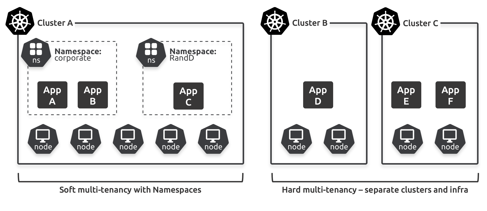

# 5: الكلاستر الافتراضي باستخدام الـ Namespaces

الـ **Namespaces** هي وسيلة لتقسيم الكلاستر في Kubernetes إلى عدة كلاسترات افتراضية. يضع هذا الفصل الأساس لفهم الـ Namespaces، ويساعدك على التعرّف على كيفية إنشائها وإدارتها، ويعرض بعض حالات الاستخدام لها. ستراها في العمل في الفصول القادمة.

تم تقسيم الفصل كما يلي:

- مقدمة عن الـ Namespaces
- حالات استخدام الـ Namespaces
- الـ Namespaces الافتراضية
- إنشاء وإدارة الـ Namespaces
- نشر التطبيقات إلى الـ Namespaces

## مقدمة عن الـ Namespaces

أول شيء يجب أن تعرفه هو أن **Kubernetes Namespaces** ليست هي نفسها الـ **kernel namespaces**:

- **Kernel namespaces**: تقوم بتقسيم أنظمة التشغيل إلى أنظمة تشغيل افتراضية تُسمى الحاويات (Containers).
- **Kubernetes Namespaces**: تقوم بتقسيم الكلاسترات في Kubernetes إلى كلاسترات افتراضية تُسمى الـ **Namespaces**.

**ملاحظة**: سنستخدم الحروف الكبيرة لكلمة "Namespace" عند الإشارة إلى Kubernetes Namespaces. هذا يتبع نمط كتابة كائنات API الخاصة بـ Kubernetes بالحروف الكبيرة، لتوضيح أننا نشير إلى Kubernetes Namespaces وليس الـ kernel namespaces.

من المهم أيضًا أن تعرف أن الـ **Namespaces** هي شكل من أشكال العزل "الناعم" (soft isolation) وتمكّن من **التعددية الناعمة (soft multi-tenancy)**. على سبيل المثال، يمكنك إنشاء Namespaces لبيئات التطوير (dev) والاختبار (test) والجودة (QA) وتطبيق حصص (quotas) وسياسات مختلفة على كل منها. ومع ذلك، لن تمنع الـ Namespaces الأعباء المخترقة في Namespace واحد من التأثير على الأعباء في الـ Namespaces الأخرى.

> [!NOTE]
>
> الـ **Namespaces** في Kubernetes توفر **logical isolation** بين الكائنات المختلفة في الكلاستر، مثل البودات (Pods) والخدمات (Services) والموارد الأخرى. هذا يعني أنه يمكن تقسيم الكلاستر إلى بيئات مختلفة، مثل بيئة التطوير (dev) وبيئة الاختبار (test) وبيئة الإنتاج (prod)، مع إمكانية تطبيق سياسات وقيود مختلفة على كل بيئة.
>
> لكن يجب أن تعرف أن هذا العزل هو **عزل منطقي وليس عزلًا صلبًا (Hard Isolation)**. بمعنى آخر، إذا كان لديك **بود** أو **خدمة** معرضة للخطر (مثل تطبيق تم اختراقه أو استغلاله في أحد الـ Namespaces)، فهذا لا يعني بالضرورة أن هذا البود سيؤثر فقط على الكائنات داخل نفس الـ Namespace. يمكن للأعباء المخترقة للخطر في **Namespace** معين أن تؤثر أيضًا على **الكائنات في الـ Namespaces الأخرى** إذا كانت هناك ثغرات أو نقاط ضعف في الأمان.
>
> على سبيل المثال:
>
> - يمكن للبودات في **Namespace** واحد التواصل مع البودات في **Namespace** آخر إذا كان هناك اتصال شبكي (Networking) بينهما. هذا يعني أنه إذا تم اختراق أحد البودات في الـ **Namespace** الأول، فقد يتمكن المهاجم من الوصول إلى البودات في الـ **Namespace** الثاني.
> - كما أن الثغرات الأمنية في **الـ Node** أو في موارد مشتركة مثل **Persistent Volumes** يمكن أن تؤثر على عدة **Namespaces** في نفس الكلاستر.
>
> الـ **Namespaces** توفر فقط عزلًا في مستوى **التسمية (Labeling)** والقيود المطبقة على الكائنات داخل كل Namespace، لكنها لا توفر حماية كاملة ضد الهجمات أو التأثيرات التي قد تمتد عبر الكلاستر بأكمله.

يُظهر الأمر التالي ما إذا كانت الكائنات تستخدم الـ Namespaces أم لا. كما ترى، معظم الكائنات تستخدم الـ Namespaces، مما يعني أنه يمكنك نشرها إلى Namespace معين مع سياسات وحصص مخصصة. أما الكائنات التي لا تستخدم الـ Namespaces مثل الـ Nodes و الـ PersistentVolumes فهي كائنات على مستوى الكلاستر ولا يمكن عزلها إلى الـ Namespaces.

```bash
$ kubectl api-resources
NAME                        SHORTNAMES  ...   NAMESPACED   KIND
nodes                       no          false         Node
persistentvolumeclaims       pvc         true          PersistentVolumeClaim
persistentvolumes            pv          false         PersistentVolume
pods                         po          true          Pod
podtemplates                           true          PodTemplate
replicationcontrollers       rc          true          ReplicationController
resourcequotas              quota       true          ResourceQuota
secrets                                 true          Secret
serviceaccounts              sa          true          ServiceAccount
services                     svc         true          Service
<Snip>
```

إلا إذا تم تحديد خلاف ذلك، يقوم Kubernetes بنشر الكائنات إلى الـ **Namespace** default.

## حالات استخدام الـ Namespaces

الـ **Namespaces** هي وسيلة لتمكين العديد من المستخدمين أو الفرق من مشاركة نفس الكلاستر. مصطلح "المستأجر" (tenant) هو مصطلح مرن ويمكن أن يشير إلى التطبيقات الفردية أو الفرق أو الأقسام المختلفة، وحتى العملاء الخارجيين. كيفية تنفيذ الـ **Namespaces** وما تعتبره مستأجرين هو أمر متروك لك، ولكن من الأكثر شيوعًا استخدام الـ **Namespaces** لتقسيم الكلاسترات لاستخدامها من قبل المستأجرين داخل نفس المنظمة. على سبيل المثال، يمكنك تقسيم الكلاستر الإنتاجي إلى الـ **Namespaces** التالية لتتوافق مع هيكل المنظمة الخاص بك:

- **finance** (المالية)
- **hr** (الموارد البشرية)
- **corporate-ops** (العمليات المؤسسية)

يمكنك نشر التطبيقات الخاصة بالمالية في الـ **Namespace** الخاص بالـ **finance**، والتطبيقات الخاصة بالموارد البشرية في الـ **Namespace** الخاص بالـ **hr**، والتطبيقات الخاصة بالعمليات المؤسسية في الـ **Namespace** الخاص بـ **corporate-ops**. كل **Namespace** يمكن أن يحتوي على مستخدمين وصلاحيات وقيود للموارد وسياسات خاصة به.

استخدام الـ **Namespaces** لتقسيم الكلاستر بين المستأجرين الخارجيين ليس شائعًا بنفس القدر. وذلك لأن الـ **Namespaces** توفر **عزلًا ناعمًا** فقط ولا يمكنها منع الأعباء المخترقة في Namespace واحد من التأثير على الأعباء في الـ **Namespaces** الأخرى. في الوقت الحالي، الطريقة الوحيدة لعزل المستأجرين بشكل قوي هي تشغيلهم على كلاسترات وأجهزة مخصصة لهم.

الشكل 5.1 يظهر الكلاستر على اليسار باستخدام الـ **Namespaces** لتحقيق التعددية الناعمة للمستأجرين. جميع التطبيقات على هذا الكلاستر تشترك في نفس العقدة (nodes) وخطة التحكم (control plane)، ويمكن أن تؤثر الأعباء المخترقة للخطر على كلا الـ **Namespaces**. بينما الكلاسترات الموجودة على اليمين توفر عزلًا قويًا من خلال تنفيذ كلاسترين منفصلين، كل منهما على أجهزة مخصصة.


الـ **Namespaces** خفيفة الوزن وسهلة الإدارة، لكنها توفر **soft isolation** فقط. أما تشغيل عدة كلاسترات فيكلف أكثر ويزيد من عبء الإدارة، لكنه يوفر **عزلًا قويًا**.

### **Namespaces default**

كل **Kubernetes cluster** يحتوي على مجموعة من الـ **Namespaces** المُنشأة مسبقًا. لتنفيذ الأمر التالي لعرضها:

```bash
$ kubectl get namespaces
```

النتيجة ستكون كالتالي:

| الحالة | العمر  | الاسم           |
| ------ | ------ | --------------- |
| نشط    | 2 أيام | default         |
| نشط    | 2 أيام | kube-system     |
| نشط    | 2 أيام | kube-public     |
| نشط    | 2 أيام | kube-node-lease |

- **default**: هو الـ **Namespace** الافتراضي، حيث يتم إضافة الكائنات الجديدة إذا لم تحدد **Namespace** عند إنشائها.
- **kube-system**: هو المكان الذي تعمل فيه مكونات **control plane** مثل خدمة DNS الداخلية و **metrics server**.
- **kube-public**: يستخدم للكائنات التي يجب أن تكون قابلة للقراءة من قبل الجميع.
- **kube-node-lease**: يُستخدم لمراقبة حالة clusterوإدارته.

لتفقد تفاصيل أحد الـ **Namespaces** في الكلاستر، يمكنك تنفيذ الأمر:

```bash
$ kubectl describe ns default
```

النتيجة ستكون مشابهة لهذه:

```
Name: default
Labels: kubernetes.io/metadata.name=default
Annotations: <none>
Status: Active
No resource quota.
No LimitRange resource.
```

يمكنك أيضًا إضافة `-n` أو `--namespace` إلى أوامر **kubectl** لتصفية النتائج حسب **Namespace** معين. على سبيل المثال، لعرض جميع الكائنات من نوع **Service** في **Namespace** **kube-system**:

```bash
$ kubectl get svc --namespace kube-system
```

النتيجة قد تكون مشابهة لهذه:

| الاسم              | النوع        | IP cluster   | IP الخارجي | البورتات                |
| ------------------ | ------------ | ------------ | ---------- | ----------------------- |
| kube-dns           | ClusterIP    | 10.43.0.10   |            | 53/UDP, 53/TCP, 9153... |
| metrics-server     | ClusterIP    | 10.43.4.203  |            | 443/TCP                 |
| traefik-prometheus | ClusterIP    | 10.43.49.213 |            | 9100/TCP                |
| traefik            | LoadBalancer | 10.43.222.75 |            | 80:31716/TCP, 443:31... |

كما يمكنك استخدام العلم `--all-namespaces` لعرض الكائنات من جميع الـ **Namespaces**.

## **إنشاء وإدارة الـ Namespaces**

في هذا القسم، ستتعلم كيفية إنشاء الـ **Namespaces** وفحصها وحذفها.

1. أولاً، إذا كنت تريد متابعة الشرح، ستحتاج إلى استنساخ مستودع GitHub للكتاب:

```bash
$ git clone https://github.com/nigelpoulton/TheK8sBook.git
```

1. يجب عليك تنفيذ جميع الأوامر من داخل المجلد `TheK8sBook/namespaces`.

الـ **Namespaces** هي موارد أساسية في مجموعة **API v1**، مما يعني أنها مستقرة، مفهومة جيدًا، وتُستخدم منذ فترة طويلة. كما يمكنك التعامل معها بطرق **إجرائية** (imperative) و **إعلانية** (declarative). سنقوم بكلا الطريقتين.

#### **إنشاء Namespace باستخدام الأمر الإجرائي**

لإنشاء **Namespace** جديد يسمى `hydra` باستخدام أمر إجرائي، يمكنك تنفيذ:

```bash
$ kubectl create ns hydra
```

النتيجة ستكون:

```
namespace/hydra created
```

#### **إنشاء Namespace باستخدام YAML**

يمكنك أيضًا إنشاء **Namespace** بطريقة إعلانية باستخدام ملف YAML يسمى `shield-ns.yml`. الملف يحتوي على تعريف بسيط لـ **Namespace** يسمى `shield` مع إضافة **label**:

```yaml
kind: Namespace
apiVersion: v1
metadata:
  name: shield
  labels:
    env: marvel
```

لإنشائه، استخدم الأمر التالي:

```bash
$ kubectl apply -f shield-ns.yml
```

النتيجة ستكون:

```
namespace/shield created
```

#### **عرض الـ Namespaces**

لرؤية الـ **Namespaces** التي أنشأتها، استخدم الأمر:

```bash
$ kubectl get ns
```

النتيجة ستكون كالتالي:

```
NAME     STATUS  AGE
<Snip>
hydra    Active  49s
shield   Active  3s
```

#### **حذف Namespace**

إذا كنت ترغب في حذف الـ **Namespace** `hydra`، يمكنك تنفيذ الأمر:

```bash
$ kubectl delete ns hydra
```

النتيجة ستكون:

```
namespace "hydra" deleted
```

### **اعداد kubectl لNamespace محدد**

عند العمل مع **Namespaces**، ستجد أنه من المزعج إضافة الخيار `-n` أو `--namespace` في كل أمر من أوامر `kubectl`. الطريقة الأفضل هي اعداد ملف **kubeconfig** لتشغيل الأوامر تلقائيًا على **Namespace** معين.

#### **إعداد kubeconfig لNamespace محدد**

لإعداد `kubectl` لتشغيل جميع الأوامر في الـ **Namespace** `shield`، يمكنك تنفيذ الأمر التالي:

```bash
$ kubectl config set-context --current --namespace shield
```

النتيجة ستكون:

```
Context "tkb" modified.
```

#### **اختبار الاعدادات**

لتأكد من أن التكوين يعمل، يمكنك تشغيل بعض الأوامر البسيطة مثل:

```bash
$ kubectl get pods
```

بما أن الـ **Namespace** `shield` فارغ، فإن الأوامر التي ستنفذها لن تُرجع أي كائنات، ولكن ذلك يوضح أن الأوامر تعمل الآن ضد الـ **Namespace** المحدد بشكل افتراضي.

او عن طريق context

> [!TIP]
>
> أفهم الآن أنك تقصد ملف **context** في **kubeconfig** بشكل محدد. عند العمل مع **kubectl**، يتم تخزين الإعدادات المختلفة مثل **cluster** و **namespace** و **user** في ملف **kubeconfig**. هذا الملف يمكن أن يحتوي على عدة **contexts**، حيث يمثل كل **context** مجموعة من الإعدادات التي يمكن أن تتغير بينها بسهولة.
>
> ### **هيكل ملف kubeconfig**
>
> ملف **kubeconfig** يحتوي على ثلاث أجزاء رئيسية:
>
> 1. **clusters**: التي تحتوي على إعدادات الـ **cluster**.
> 2. **users**: التي تحتوي على إعدادات المستخدم.
> 3. **contexts**: التي تربط بين **cluster** و **user** و **namespace** معًا.
>
> يمكنك تعديل ملف **context** لتحديد **namespace** معين كما يلي.
>
> ### **تحديد Namespace في ملف context**:
>
> عند تعديل **context** في ملف **kubeconfig**، يمكنك تحديد الـ **namespace** الذي سيتم استخدامه بشكل افتراضي عند تنفيذ أوامر `kubectl`.
>
> #### **مثال على ملف kubeconfig مع context محدد**:
>
> ```yaml
> apiVersion: v1
> clusters:
> - cluster:
>     server: https://example.com
>   name: example-cluster
> contexts:
> - context:
>     cluster: example-cluster
>     user: example-user
>     namespace: shield # تحديد الـ Namespace هنا
>   name: shield-context
> - context:
>     cluster: example-cluster
>     user: example-user
>     namespace: finance # يمكن إضافة سياقات مختلفة لمجموعة من الـ namespaces
>   name: finance-context
> current-context: shield-context
> kind: Config
> preferences: {}
> users:
> - name: example-user
>   user:
>     token: example-token
> ```
>
> ### **شرح الملف**:
>
> - في هذا المثال، يوجد **context** اسمه `shield-context` الذي يربط بين **cluster** و **user** مع **namespace** يسمى `shield`.
> - يمكنك إضافة سياقات إضافية مثل `finance-context` مع **namespace** مختلف.
>
> ### **تغيير \**context\** في kubeconfig**:
>
> إذا كنت تريد تغيير **namespace** في **context** الحالي أو أي **context** آخر، يمكنك استخدام الأمر التالي:
>
> ```bash
> kubectl config set-context shield-context --namespace=your-namespace
> ```
>
> هذا سيتأكد من أن جميع الأوامر التي تستخدم **shield-context** ستعمل ضد الـ **namespace** الذي حددته.
>
> ### **عرض معلومات context الحالية**:
>
> لعرض **context** الحالي في **kubeconfig**:
>
> ```bash
> kubectl config current-context
> ```
>
> لعرض جميع **contexts** المتاحة في الملف:
>
> ```bash
> kubectl config get-contexts
> ```
>
> ### **تبديل بين الـ Contexts**:
>
> لتبديل إلى **context** آخر:
>
> ```bash
> kubectl config use-context finance-context
> ```
>
> ### **ملاحظة**:
>
> إذا كنت تعدل ملف **kubeconfig** يدويًا، تأكد من أن التعديلات تلتزم بالبنية الصحيحة لملف YAML، حيث أن أي خطأ في التنسيق قد يؤدي إلى مشكلات في الاتصال بـ Kubernetes.

### deploy الكائنات إلى الـ **Namespaces**

كما تم ذكره سابقًا، معظم الكائنات في **Kubernetes** تكون موجهة إلى **Namespaces**، وإذا لم تحدد غير ذلك، فإن **Kubernetes** ينشر الكائنات الجديدة إلى **الـ Namespace الافتراضي**.

هناك طريقتان لنشر الكائنات إلى **Namespaces** معينة:

1. (Imperatively)
2. (Declaratively)

#### 1. النشر Imperatively:

في هذه الطريقة، تضيف **العلامة -n** أو **--namespace** عند تنفيذ الأوامر باستخدام **kubectl** لتحديد الـ **namespace** المستهدف.

#### 2. النشر Declaratively:

في الطريقة الإعلانية، تحدد الـ **namespace** داخل ملف **YAML** الذي يحتوي على الكائنات.

### مثال على نشر تطبيق إلى الـ **shield Namespace** باستخدام الطريقة الإعلانية:

نفترض أن لدينا ملف **app.yml** يحتوي على ثلاث كائنات: **ServiceAccount**، **Service**، و **Pod**. يتم استهداف جميع الكائنات إلى **Namespace** يسمى **shield**.

**مقتطف YAML** يظهر جميع الكائنات المستهدفة في **shield Namespace**:

```yaml
apiVersion: v1
kind: ServiceAccount
metadata:
  namespace: shield  # <<==== Namespace
  name: default
---
apiVersion: v1
kind: Service
metadata:
  namespace: shield  # <<==== Namespace
  name: the-bus
spec:
  type: LoadBalancer
  ports:
    - port: 8080
      targetPort: 8080
  selector:
    env: marvel
---
apiVersion: v1
kind: Pod
metadata:
  namespace: shield  # <<==== Namespace
  name: triskelion
```

في هذا المثال، يتم تعريف ثلاثة كائنات مستهدفة جميعها إلى الـ **shield Namespace**.

### نشر الكائنات باستخدام أمر `kubectl`

لتنفيذ التطبيق، استخدم الأمر التالي. لا تقلق إذا حصلت على تحذير حول فقدان التعليق التوضيحي لـ **ServiceAccount**.

```bash
$ kubectl apply -f app.yml
serviceaccount/default configured
service/the-bus configured
pod/triskelion created
```

### التحقق من نشر الكائنات في الـ **Namespace** المستهدف:

يمكنك التحقق من أن الكائنات تم نشرها بشكل صحيح في الـ **shield Namespace** عبر تنفيذ الأوامر التالية. إذا قمت بتكوين **kubectl** لربط الأوامر تلقائيًا بالـ **shield Namespace**، فلن تحتاج إلى إضافة علامة `-n shield`:

```bash
$ kubectl get pods -n shield
NAME         READY   STATUS    RESTARTS   AGE
triskelion    1/1     Running   0          48s
$ kubectl get svc -n shield
NAME         TYPE           CLUSTER-IP      EXTERNAL-IP   PORT(S)              AGE
the-bus      LoadBalancer   10.43.30.174    localhost      8080:31112/TCP       52s
```

### الاتصال بالتطبيق:

بعد deploy التطبيق، استخدم **curl** أو متصفحك للاتصال به. ببساطة، اذهب إلى **EXTERNAL-IP** في العمود في **المنافذ** (في هذا المثال، **localhost:8080**).

```bash
$ curl localhost:8080
<!DOCTYPE html>
<html>
<head>
<title>AOS</title>
<Snip>
```

### الخلاصة:

تهانينا! لقد قمت بإنشاء **Namespace** ونشرت تطبيقًا داخله. الاتصال بالتطبيق في الـ **Namespace** لا يختلف عن الاتصال بتطبيق في الـ **Namespace** الافتراضي.

### التنظيف

لإزالة الموارد التي أنشأتها ولإرجاع **kubeconfig** لاستخدام **Namespace** الافتراضي، قم بتشغيل الأوامر التالية:

1. **حذف الـ Namespace:**

```bash
$ kubectl delete ns shield
namespace "shield" deleted
```

سيؤدي هذا إلى حذف الـ **Namespace** المسمى "shield"، والذي سيؤدي أيضًا إلى حذف **Pod** و **Service** و **ServiceAccount** المرتبطة به.

1. **إعادة تعيين \**kubeconfig\** لاستخدام الـ Namespace الافتراضي:**

```bash
$ kubectl config set-context --current --namespace default
Context "tkb" modified.
```

سيؤدي هذا إلى إعادة تعيين **kubeconfig** بحيث يتم استخدام **Namespace** الافتراضي في المستقبل. إذا لم تقم بذلك، فإن الأوامر المستقبلية ستعمل ضد الـ **Namespace** المحذوف "shield" ولن تعود بأي نتائج.