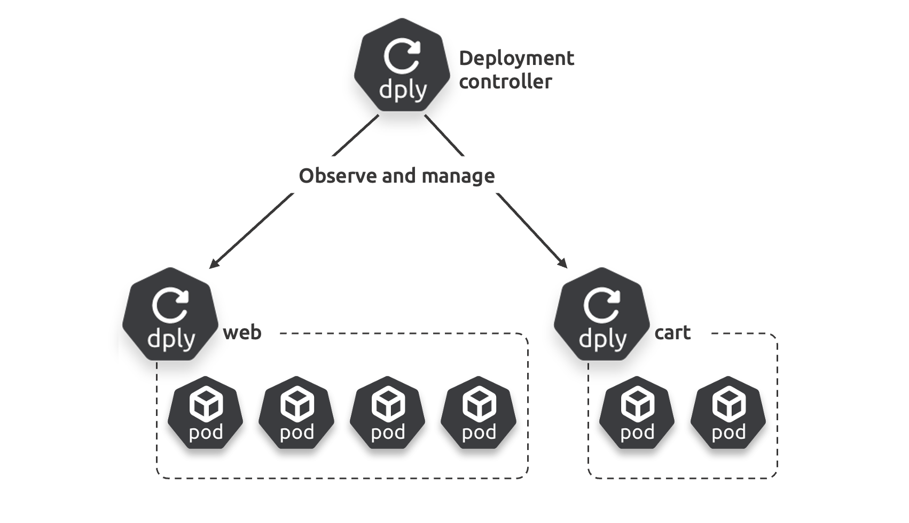
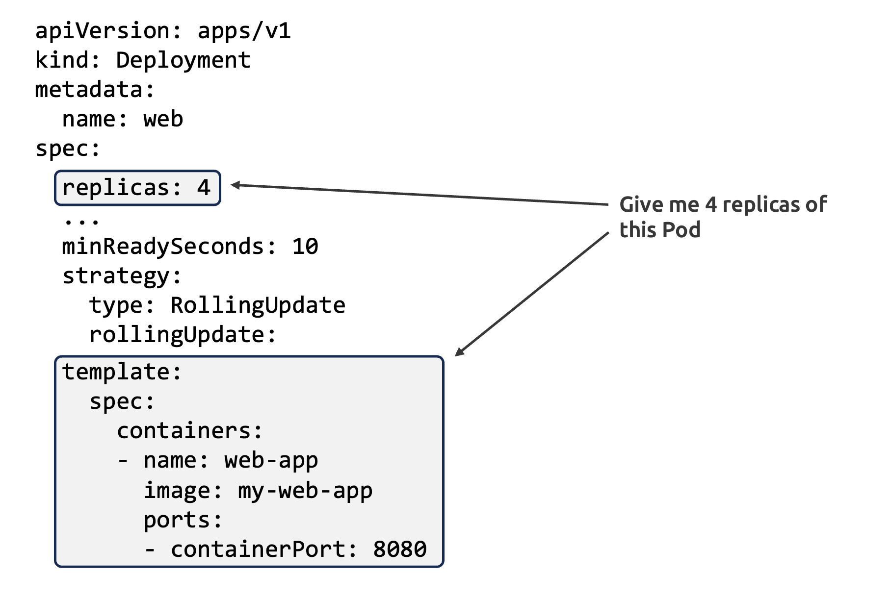

# **6: Kubernetes Deployments**

 يوضح هذا الفصل كيفية استخدام الـ Deployments لإضافة ميزات سحابية أصلية مثل الـ self-healing، الـ scaling، الـ rolling updates، و الـ versioned rollbacks للتطبيقات (stateless) على Kubernetes.
 ينقسم الفصل إلى ما يلي:
 • نظرية الـ Deployment
 • إنشاء الـ Deployment
 • توسيع التطبيق يدويًا
 • إجراء الـ rollout
 • إجراء الـ rollback

## **نظرية الـ Deployment**

تعد الـ Deployments الطريقة الأكثر شيوعًا لتشغيل التطبيقات غير الحالة (stateless apps) على Kubernetes. فهي تضيف ميزات مثل *الشفاء الذاتي* (self-healing)، *التوسع* (scaling)، *التحديثات المتدرجة* (rollouts)، و *الاستعادة* (rollbacks).

لنأخذ مثالًا سريعًا:

افترض أن لديك متطلبات لتطبيق ويب يحتاج إلى أن يكون مقاومًا للأعطال، وقابلًا للتوسع عند الحاجة، ويتم تحديثه بشكل متكرر. تقوم بكتابة التطبيق، وتغليفه في حاوية (container)، وتعريفه داخل YAML خاص بـ Pod حتى يمكن تشغيله على Kubernetes. بعد ذلك، تقوم بتغليف الـ Pod داخل الـ Deployment ثم تقوم بنشره على Kubernetes حيث يقوم الـ Deployment controller بنشر الـ Pod. في هذه المرحلة، سيكون لديك Deployment واحد يدير Pod واحد.

إذا فشل الـ Pod، فإن الـ Deployment controller يستبدله بآخر جديد. إذا زاد الطلب، يمكن للـ Deployment controller نشر المزيد من الـ Pods المتطابقة. عندما تقوم بتحديث التطبيق، يقوم الـ Deployment controller بحذف الـ Pods القديمة واستبدالها بـ Pods جديدة.

افترض أن التطبيق يحتوي على خدمة ميكروسيرفيس أخرى غير حالية، مثل عربة التسوق. تقوم بتغليف هذه الخدمة، وتضعها في الـ Pod الخاص بها، ثم تغلف الـ Pod في الـ Deployment الخاص بها، وتقوم بنشرها على الكلاستر.

في هذه الحالة، سيكون لديك Deployments متعددة تدير ميكروسيرفيسات مختلفة. يظهر الشكل 6.1 هذا الإعداد حيث يقوم الـ Deployment controller بمراقبة وإدارة كلا الـ Deployments. الـ Web Deployment يدير أربعة Pods متطابقة لخوادم الويب، والـ Cart Deployment يدير اثنين من Pods المتطابقة لعربة التسوق.

**Under the hood، تتبع الـ Deployments بنية standard Kubernetes architecture comprising:**

1. **المورد (Resource):**
     Resource تقوم بانشاء  الكائنات (objects) في Kubernetes.
2. **التحكم (Controller):**
    يدير Controller الكائنات المنشاءة بواسطة المورد.

في أعلى مستوى، تقوم الموارد  بأنشاء الكائنات، بينما يدير Controller  هذه الكائنات.

**The Deployment resource** موجود في واجهة الـ API `apps/v1` ويُعرّف جميع الخصائص والقدرات المدعومة.

**تحكم الـ Deployment** يعمل في الـ control plane، ويقوم بمراقبة الـ Deployments ومقارنة الحالة الحالية (observed state) مع الحالة المطلوبة (desired state)، ثم يلتزم بإجراء reconcilesاللازمة لتحقيق التوافق بين الحالتين.

**الشكل 6.2** يظهر ملف YAML لـ **Deployment** يطلب أربعة نسخ (replicas) من **Pod** واحد. إذا قمت بزيادة عدد النسخ إلى ستة، فسيتم نشر وإدارة اثنين من **Pods** الإضافية المتطابقة.

> [!NOTE]
>
> كيف تم تعريف **Pod spec** في قالب (template) مدمج داخل ملف YAML الخاص بـ **Deployment**.

**Deployments وReplicaSets**

لقد ذكرنا مرارًا أن =(Deployments) تضيف ميزات مثل التكرار الذاتي (self-healing)، =(scaling)، =(rollouts)، و(rollbacks). ولكن خلف الكواليس، هناك مورد مختلف يسمى **ReplicaSet** هو الذي يوفر التكرار الذاتي و scaling.

**الشكل 6.3** يظهر الهيكل العام للحاويات (**containers**)، الـ **Pods**، **ReplicaSets**، و**Deployments**. كما يوضح كيفية ارتباطهم في ملف YAML الخاص بـ **Deployment**.

إرسال هذا الملف YAML الخاص بـ **Deployment** إلى الكلاستر سيؤدي إلى إنشاء **Deployment**، و**ReplicaSet**، و**Pod**ين متطابقين يعملان مع حاويات متطابقة. يتم إدارة الـ **Pods** بواسطة **ReplicaSet**، الذي يُدار بدوره بواسطة **Deployment**. يجب عليك بعد ذلك إدارة كل شيء عبر **Deployment** فقط، وألا تدير **ReplicaSet** أو **Pods** بشكل مباشر.

كلمة سريعة عن التوسع
 من الممكن توسيع تطبيقاتك يدويًا، وسنرى كيف نفعل ذلك قريبًا. ومع ذلك، يوجد في **Kubernetes** العديد من أدوات التوسع التلقائي التي تقوم بتوسيع تطبيقاتك والبنية التحتية تلقائيًا. بعض هذه الأدوات تشمل:

- **Horizontal Pod Autoscaler**
- **Vertical Pod Autoscaler**
- **Cluster Autoscaler**

**The Horizontal Pod Autoscaler (HPA)**:
 يضيف الـ HPA ويزيل الـ Pods لتلبية الطلب الحالي. يقوم بتعديل عدد الـ Pods بناءً على المقاييس المرصودة مثل استهلاك المعالج (CPU) أو المقاييس المخصصة. إذا زاد الطلب، يضيف الـ HPA المزيد من الـ Pods للتعامل مع الحمل المتزايد. وإذا قل الطلب، يزيل بعض الـ Pods لتوفير الموارد. هذا يُستخدم على نطاق واسع ويُثبت بشكل افتراضي في معظم الـ Kubernetes clusters.

**The Cluster Autoscaler (CA)**:
 الـ CA يضيف ويزيل العقد (nodes) في الـ cluster بحيث يكون لديك دائمًا ما يكفي من العقد لتشغيل جميع الـ Pods المجدولة. إذا كانت العقد الحالية غير كافية لتشغيل جميع الـ Pods، سيقوم الـ CA بتوسيع الـ cluster عن طريق إضافة عقد جديدة. أما إذا كانت العقد تحت الاستخدام، فيمكن للـ CA إزالة بعض العقد. هذا أيضًا يُستخدم على نطاق واسع ويتم تثبيته بشكل افتراضي في العديد من الـ clusters.

**The Vertical Pod Autoscaler (VPA)**:
 الـ VPA يضيف ويقلل من طلبات وقيود الموارد (مثل الـ CPU والـ memory) لـ Pods التي تعمل بناءً على الاستخدام المرصود لها. إذا كان أحد الـ Pods يعاني من نقص في الموارد، يمكن للـ VPA زيادة الموارد المخصصة له. وإذا كان الـ Pod يحتوي على موارد أكثر من الحاجة، يمكن تقليل الموارد المخصصة له. على عكس الـ HPA والـ CA، الـ VPA ليس مثبتًا بشكل افتراضي ويُستخدم بشكل أقل. من بين القيود الرئيسية لـ VPA أنه يسبب انقطاعًا للـ Pods الجارية عن طريق حذف الـ Pod الحالي واستبداله بـ Pod جديد، مما قد يؤدي إلى إعادة جدولة الـ Pod على  node مختلفة. ومع ذلك، هناك جهود جارية للسماح بالتحديثات في المكان دون الحاجة إلى استبدال الـ Pods.

**المشاريع المجتمعية مثل karmada**
 تأخذ الأمور إلى أبعد من ذلك من خلال السماح لك بتوسيع التطبيقات عبر عدة clusters.

لنأخذ مثالاً سريعاً باستخدام **HPA** و **CA**.
 أنت تقوم بنشر تطبيق على الـ cluster الخاص بك وتقوم باعداد **HPA** ليقوم بتوسيع عدد الـ Pods بين اثنين وعشرة. مع زيادة الطلب، يطلب **HPA** من الـ scheduler زيادة عدد الـ Pods من اثنين إلى أربعة. هذا يعمل بشكل جيد، لكن الطلب يظل في ازدياد، فيطلب **HPA** من الـ scheduler إضافة اثنين آخرين. ولكن، لا يستطيع الـ scheduler العثور على nodes تحتوي على موارد كافية في هذه المرة، وبالتالي يضع الـ Pods الجديدة في حالة "pending" (معلقة). يلاحظ **CA** الـ Pods المعلقة ويضيف node جديدة إلى الـ cluster بشكل ديناميكي. حالما تنضم nodes إلى الـ cluster، يقوم الـ scheduler بتخصيص الـ Pods المعلقة لها.

يعمل نفس الشيء عند توسيع الـ cluster إلى أسفل. على سبيل المثال، يقوم **HPA** بتقليص عدد الـ Pods عندما ينخفض الطلب. هذا قد يؤدي إلى طلب **CA** تقليص عدد العقد في الـ cluster. عند إزالة عقدة من الـ cluster، يجب على **Kubernetes** إجلاء جميع الـ Pods من العقدة واستبدالها بـ Pods جديدة على node المتبقية.

ستسمع أحيانًا بعض الأشخاص يشيرون إلى "multi-dimensional autoscaling.". هذا هو مصطلح يستخدم للإشارة إلى دمج عدة طرق للتوسيع — توسيع الـ Pods والعقد، أو توسيع التطبيقات أفقيًا (عن طريق إضافة المزيد من الـ Pods) وعموديًا (عن طريق إضافة المزيد من الموارد للـ Pods الحالية).

**كل شيء يتعلق بالحالة**
 قبل المضي قدمًا، من الضروري فهم المفاهيم التالية. إذا كنت تعرفها مسبقًا، يمكنك تخطي هذا القسم والانتقال مباشرة إلى قسم **Rolling updates with Deployments**:

- **Desired state** (الحالة المرغوبة)
- **Observed state** (الحالة الملحوظة) وتسمى أحيانًا **actual state** أو **current state**
- **Reconciliation** (المصالحة)

**Desired state** هي الحالة التي ترغب فيها، بينما **Observed state** هي الحالة الفعلية أو الحالية التي لديك. الهدف دائمًا هو جعل هاتين الحالتين متطابقتين. عندما لا تتطابقان، يبدأ الـ **controller** عملية **Reconciliation** لإعادة **Observed state** إلى التزامن مع **Desired state**.

نموذج **Declarative model** هو الطريقة التي نعلن بها عن **Desired state** لـ Kubernetes دون الحاجة إلى تحديد كيفية تنفيذ ذلك. الطريقة نفسها تُترك لـ Kubernetes لتدبيرها.

### **النموذج Declarative vs Imperative**

**النموذج Declarative** يصف الهدف النهائي - تخبر Kubernetes بما تريد تحقيقه.
 بينما **النموذج Imperative** يتطلب سلسلة طويلة من الأوامر التي تخبر Kubernetes بكيفية تحقيق الهدف النهائي.

#### **تشبيه لتوضيح الفرق**:

- **Declarative**: أريد كعكة شوكولاتة تكفي عشرة أشخاص.

- Imperative

  :

  1. اذهب إلى المتجر.
  2. اشترِ البيض، الحليب، الطحين، مسحوق الكاكاو...
  3. عد إلى المنزل.
  4. قم بتسخين الفرن مسبقًا.
  5. اخلط المكونات.
  6. ضع الخليط في قالب الكعك.
  7. إذا كان الفرن بمروحة، اترك الكعكة لمدة 30 دقيقة.
  8. إذا لم يكن بمروحة، اترك الكعكة لمدة 40 دقيقة.
  9. اضبط المؤقت.
  10. أخرج الكعكة من الفرن عند انتهاء المؤقت وأطفئ الفرن.
  11. اترك الكعكة لتبرد.
  12. أضف التزيين.

النموذج **Declarative** أبسط، حيث يترك عملية التنفيذ نفسها لـ Kubernetes.
 بينما النموذج **Imperative** أكثر تعقيدًا لأنه يتطلب تحديد جميع الخطوات والتعليمات للوصول إلى الهدف، مما يزيد من فرصة الوقوع في الأخطاء.

------

#### **مثال عملي**:

لديك تطبيق يتكون من خدمتين مصغرتين - **front-end** و **back-end**.
 تحتاج إلى خمسة نسخ من **front-end** ونسختين من **back-end**.

1. **Declarative**:
    تكتب ملف YAML بسيط يطلب:
   - خمسة Pods لـ **front-end** تستمع خارجيًا على المنفذ 80.
   - نسختين من Pods لـ **back-end** تستمع داخليًا على المنفذ 27017.
      ثم تسلم الملف لـ Kubernetes، وهي تتولى التنفيذ بالكامل.
2. **Imperative**:
    يتطلب قائمة طويلة ومعقدة من الأوامر لتنفيذ الخطوات يدويًا.
   - على سبيل المثال، الأوامر لسحب وتشغيل حاويات **containerd** تختلف عن الأوامر المستخدمة مع **CRI-O**.
   - هذا يؤدي إلى عمل إضافي، وغياب مفهوم **desired state**، مما يعني عدم وجود، مما يجعل الإدارة أكثر عرضة للأخطاء.

------

#### **التفضيل في Kubernetes**:

على الرغم من أن Kubernetes يدعم كلا النموذجين، إلا أنها تفضل بقوة النموذج **Declarative** بسبب بساطته وقدرته على ضمان التطابق بين **desired state** و **observed state** بشكل تلقائي.

> [!NOTE]
>  كل من **containerd** و **CRI-O** هما CRI runtimes يعملان على Kubernetes workers، ويؤديان مهام منخفضة المستوى مثل تشغيل وإيقاف الحاويات.
>
> - **containerd**: Runtime شائع تم تطويره كجزء من مشروع Docker ثم فصل لاحقًا ليصبح مستقلاً ومتكاملاً مع Kubernetes.
> - **CRI-O**: Runtime خفيف الوزن مصمم خصيصًا لـ Kubernetes ويوفر توافقًا مع CRI (Container Runtime Interface).
>
> كلاهما يتيح Kubernetes التحكم في الحاويات من خلال واجهة موحدة.

### **Controllers and Reconciliation**

تُعد **Reconciliation** جوهر مفهوم desired state في Kubernetes.

على سبيل المثال، يتم تنفيذ **ReplicaSets** كـ **controller** يعمل في الخلفية داخل **reconciliation loop**، مما يضمن دائمًا وجود العدد الصحيح من نسخ الـ Pods:

- إذا كان هناك نقص في Pods، يقوم بإضافة المزيد.
- إذا كان العدد زائدًا عن المطلوب، يقوم بإنهاء البعض.

#### **سيناريو توضيحي:**

إذا كان desired state يتطلب وجود 10 نسخ **replicas**، لكن العدد الحالي **observed state** هو 8 فقط:

- لا يهم إذا كان السبب هو فشل بعض الـ Pods أو إذا كان autoscaler قد طلب زيادة في العدد.
- يقوم **ReplicaSet controller** بإنشاء نسختين إضافيتين تلقائيًا لمزامنة **observed state** مع **desired state**.

#### **الميزة الرائعة؟**

يقوم Kubernetes بذلك دون الحاجة إلى أي تدخل منك!

#### **كيف يفيد هذا؟**

نفس عملية **reconciliation** تدعم ميزات مثل:

- **Self-healing** (التعافي الذاتي)
- **Scaling** (التوسع)
- **Rollouts** (التحديثات التدريجية)
- **Rollbacks** (التراجع عن التحديثات)

**لنأخذ نظرة أقرب على Rolling Updates وRollbacks.**

### **Rolling Updates with Deployments**

تعد **Deployments** رائعة في (rollouts) بدون zero-downtime. ولكنها تعمل بشكل أفضل إذا قمت بتصميم تطبيقاتك لتكون:

1. Loosely coupled   عبر **APIs**.
2. متوافقة مع الإصدارات السابقة والتالية.

كلاهما من السمات المميزة لتطبيقات **cloud-native microservices** الحديثة وتعمل كما يلي:

يجب أن تكون خدماتك المصغرة دائمًا مفككة بشكل غير محكم وتقتصر على الاتصال عبر **APIs** معرفة جيدًا. من خلال القيام بذلك، يمكنك تحديث وتصحيح أي خدمة مصغرة دون القلق بشأن التأثير على الخدمات الأخرى — حيث أن جميع الاتصالات تتم عبر **APIs** موثقة تعرض الواجهات وتخفي التفاصيل.

ضمان توافق الإصدارات السابقة والتالية يعني أنه يمكنك إجراء التحديثات بشكل مستقل دون القلق بشأن أي إصدارات من العملاء يستخدمون الخدمة.

تشبيه بسيط غير تقني هو السيارة. السيارات تعرض **API** قياسية تتضمن عجلة القيادة ودواسات القدم. طالما أنك لا تغير هذه **API**، يمكنك إعادة برمجة المحرك، تغيير العادم، والحصول على مكابح أكبر، كل ذلك دون أن يضطر السائق إلى تعلم مهارات جديدة.

مع أخذ هذه النقاط في الاعتبار، تعمل التحديثات التدريجية بدون توقف (rollouts) كما يلي.